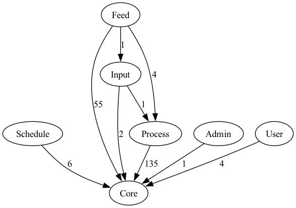

# Assignment 2 (Wong Soon Jit 22004857)

## Call Graph
### 1. Login
- Entry (login_block.php): The process is triggered by the login() function within the UI component.
- Routing (user_controller.php): The request is passed to the user_controller().
- Authentication (user_model.php): The login() method performs the primary credential validation (username and password).
- Token Management (rememberme_model.php):  
#### Case 1: No cookie 
- getCookieValues() invokes setCookie to clear the cookie 
#### Case 2: Cookie Found 
1. TRIPLET_INVALID: findTriplet() invokes setCookie() to clear the cookie
2. TRIPLET_NOT_FOUND: findTriplet() invokes setCookie() to clear the cooker
3. TRIPLET_FOUND: 
- findTriplet() invokes createToken()
- createToken() invokes storeTriplet()
- storeTriplet() invokes setCookie()

  

### 2. Registration
- Entry Point (login_block.php): The process is triggered by the register() function within the UI component.
- Routing (user_controller.php): The request is passed to the user_controller().
- Core Logic (user_model.php): The flow moves to the model layer, where the register() method performs data validation, password hashing, and database insertion.
- Activation (user_model.php): Finally, the verify_email() method is invoked (or prepared) to manage account validation and security.

  

## Program Dependency Graph
- Diagram below shows the dependency between cores and the modules.
- Count of dependencies is annotated in each dependency arrow.

  

