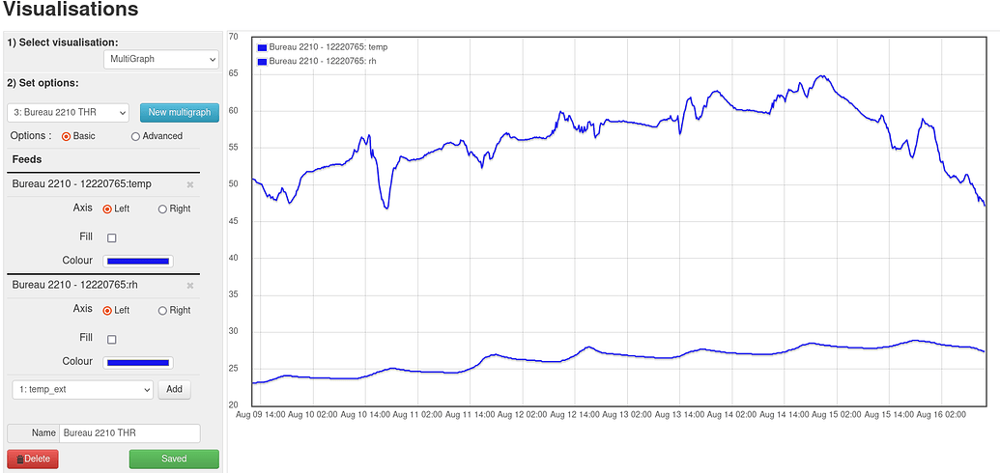
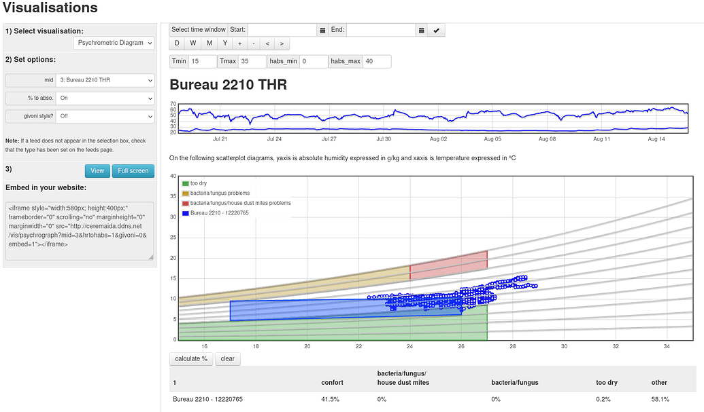

# Visualisation tools

The visualisation toolbox deals with two type of objects : feeds and/or multigraphs

## vis controller routes

The route /vis/list gives access to the visualisation control panel in order for users to create new visualisations

It uses the [/Modules/vis/Views/vis_main_view.php](/Modules/vis/Views/vis_main_view.php) to render the toolbox....

When vis objects are integrated in dashboards or external website or viewed through standalone visualisations, 
the followed route looks like <b>/vis/visualisation_key</b>, where visualisation_key can be multigraph, bargraph 
(cf [/Modules/vis/vis_object.php](/Modules/vis/vis_object.php) to find all existing vis objects)

The route must include either : 
  - the mid parameter when dealing with a multigraph
  - the feedid parameter when dealing with a feed

Minimal vis routes can be : `/vis/multigraph?mid=1` or `/vis/graph?feedid=1`

An embed parameter can be used : 
  - full screen view / integration into dashboard : `/vis/multigraph?mid=1&embed=1`
  - within the 'main' viewport of emoncms : `/vis/multigraph?mid=1&embed=0`

For visitors or usage outside of emoncms, the read_only apikey can also be given as a parameter : 
`/vis/multigraph?mid=1&embed=0&apikey=32_chars_apikey_read`

## vis objects

The different visualisations source codes are stored in  [/Modules/vis/visualisations](/Modules/vis/visualisations)

Each php file includes specific instructions to catch the url parameters in order to cope with the various usages previously described.
That's why the script section of each individual vis object generally begins by extracting 
from the url the value of feedid/mid, embed, apikey  .....

## Edition facilities

The EditDaily and EditRealtime vis objects permits to edit respectively PhpTimeSeries and PhpFina feeds 

To achieve the edition function, please note they must be run in full screen mode

## Psychrometric diagrams

Psychrographic diagrams are a way to appreciate the thermal comfort of a house. All you need is a simple sensor of temperature and relative humidity. The principle is to represent the absolute humidity as a function of temperature.

The graph is initially populated by 10 curves of iso relative humidity, represented in light gray. The lower curve corresponds to a relative humidity of 10%, the upper one to a relative humidity of 100%.

We then materialize the zones where it’s not good to be:

- the too dry part (green) is the one below the curve of 40% iso humidity curve.
- the parts that are too humid (red/orange) are between the saturation curve (100%) and the 80% iso humidity curve, in which the risks of development of moisture and fungi are high. The graph is ready to receive the measured values. The calculation of absolute humidity for a pressure of 101325 pa (the atmospheric pressure at sea level) is relatively [simple](https://github.com/emoncms/emoncms/blob/master/Modules/vis/visualisations/psychrograph.php#L146).

From a practical point of view, you just have to build multigraphs in emoncms and use them in the pshychrographic visualization to appreciate the comfort level of your home.

More details on [1](https://sustainabilityworkshop.venturewell.org/node/1195.html) and [2](https://sustainabilityworkshop.venturewell.org/node/1195.html)

