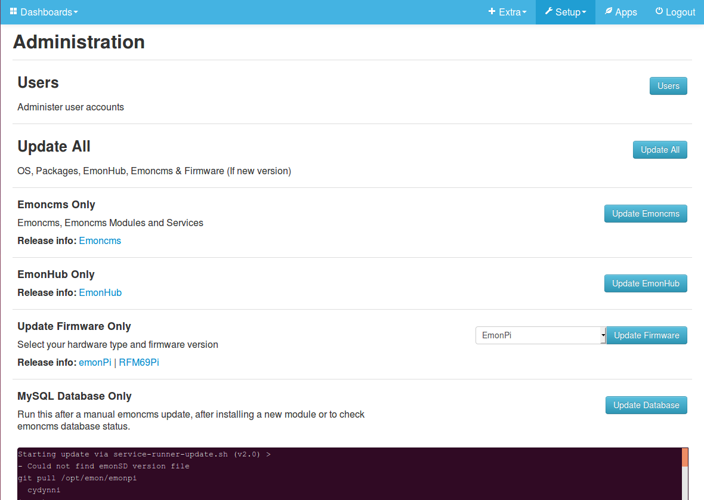

# Updating Emoncms

The latest version of the emoncms master branch (todo: link stable release here) includes an automated update procedure that aims to be compatible with any standard debian based installation. The update process has been tested so far on raspbian stretch and Ubuntu 16.04 LTS. The update procedure requires that the emoncms service-runner and 'emonpi' repository is installed, see installation details below.

Click on Update Emoncms to start an update of emoncms core and associated emoncms modules.

### Installation of service-runner

The service-runner is a background process that is used to launch a variety of emoncms related scripts, it is used to launch the update script here.

[Manual installation of service-runner](https://github.com/emoncms/emoncms/blob/master/scripts/services/install-service-runner-update.md)

### Installation of emonpi repository

The 'emonpi' repository currently contains the emoncms and wider system installation and update scripts. Ignore the repository name for now as these scripts are designed for use on any debian based system. Install the emonpi repository in your installation's base directory. The new recommended location for this is /opt/emon.

To create this directory from new:

    sudo mkdir /opt/emon
    sudo chown USER:USER /opt/emon
    cd /opt/emon
    git clone https://github.com/openenergymonitor/emonpi.git

Tell your emoncms installation where to find the base directory, open /var/www/emoncms/settings.php

    $homedir = "/opt/emon";
    
Install or move existing symlinked emoncms modules such as postprocess, backup and sync to:

    /opt/emon/modules
    
The update process is also compatible with a base directory at the user folder level e.g:

    /home/USER
    
With symlinked modules installed at either /home/USER/modules/modulename or /home/USER/modulename.
