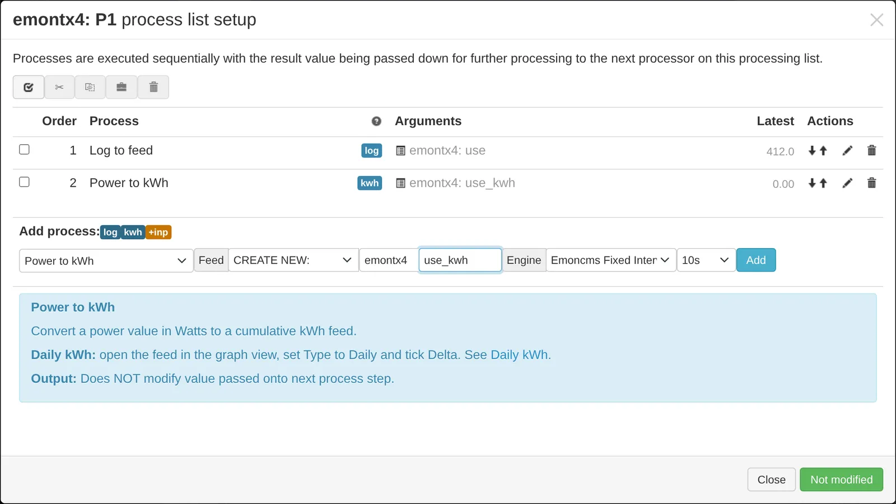
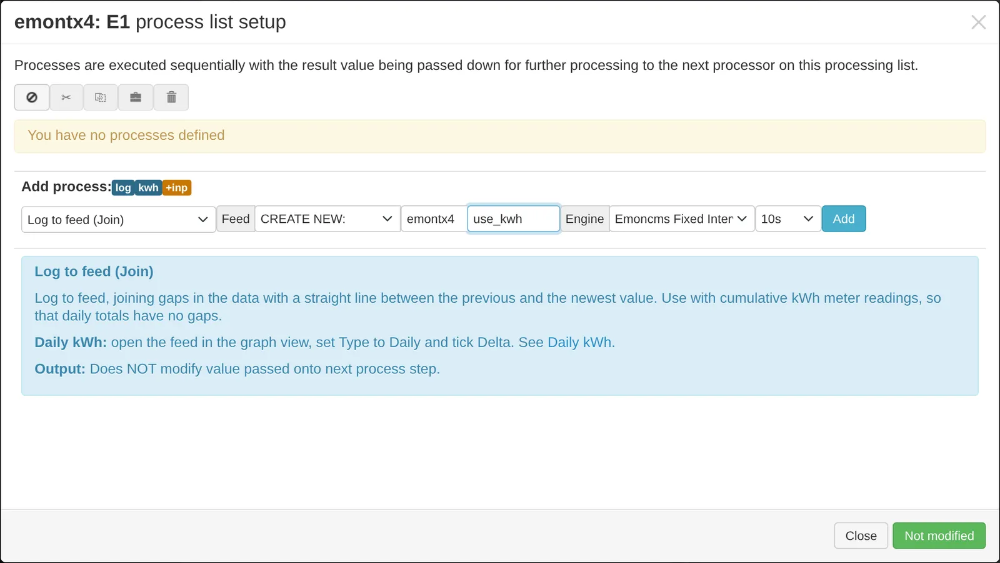
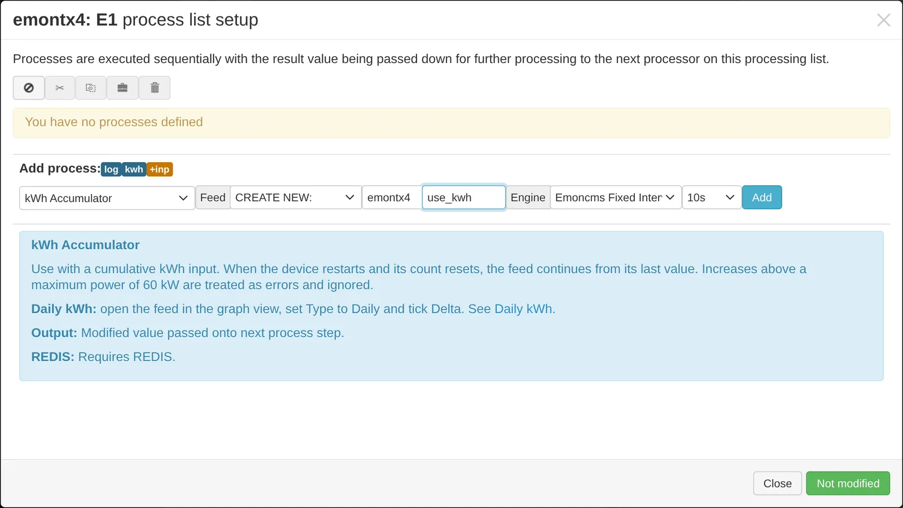
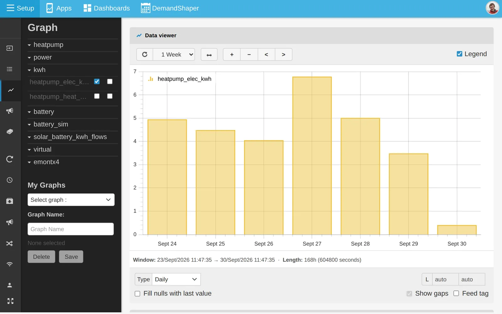

# Daily kWh

Daily, weekly and monthly kWh totals come from a cumulative kWh feed. This page shows how to create that feed from different input types, and how to view daily totals.

| Input type | Example | Input process |
|---|---|---|
| Power in watts | emonTx and emonPi CT channels | **Power to kWh** |
| Energy that does not reset | Energy meter reading | **Log to feed (Join)** |
| Energy that resets on power cycle | emonTx and emonPi energy and pulse count | **kWh Accumulator** or **Wh Accumulator** |

Newer emonTx and emonPi firmware reports cumulative energy for each CT channel. Use those inputs where available, in place of **Power to kWh**.

## From a power input

1. On the **Inputs** page, click the spanner icon on the power input.
2. Select **Power to kWh**.
3. Under **Feed**, choose **CREATE NEW** and enter a name ending in `_kwh`, for example `use_kwh`.
4. Select an interval. Match the post rate, for example 10s, or choose a longer interval up to 1h to save disk space.
5. Click **Add**, then **Changed, press to save**.

## From an energy meter reading

An energy meter reading does not reset. Gaps in the data would show as spikes or gaps in a daily bar graph. **Log to feed (Join)** joins across gaps with a straight line.

1. On the **Inputs** page, click the spanner icon on the input.
2. If the input is in Wh, add a **x** process with value `0.001` to convert to kWh.
3. Add **Log to feed (Join)** and create a new feed as above.

## From an input that resets

emonTx and emonPi energy and pulse count inputs reset to zero when the unit restarts. **kWh Accumulator** removes the resets and joins across gaps. **Wh Accumulator** does the same for Wh inputs.

1. On the **Inputs** page, click the spanner icon on the input.
2. For a kWh input, add **kWh Accumulator** and create a new feed as above.
3. For a Wh input, add **Wh Accumulator**, or scale by `0.001` and add **kWh Accumulator**.

## View daily kWh

You need at least two days of data.

1. Open the cumulative kWh feed in the [graph view](graphs.md).
2. Set **Type** to **Daily**.
3. In **Feed Config**, set the feed **Type** to **Bars** and tick **Delta**.

Each bar is the kWh at the end of the day minus the kWh at the start. Choose **Weekly**, **Monthly** or **Annual** for longer periods.

Dashboards and apps also show daily kWh from the same feed. See [Dashboards](dashboards.md) and [Apps](apps.md).

## Fix an existing feed

To create a cumulative kWh feed from a power feed you already have, or to rebuild one, use the [post process module](postprocess.md).
