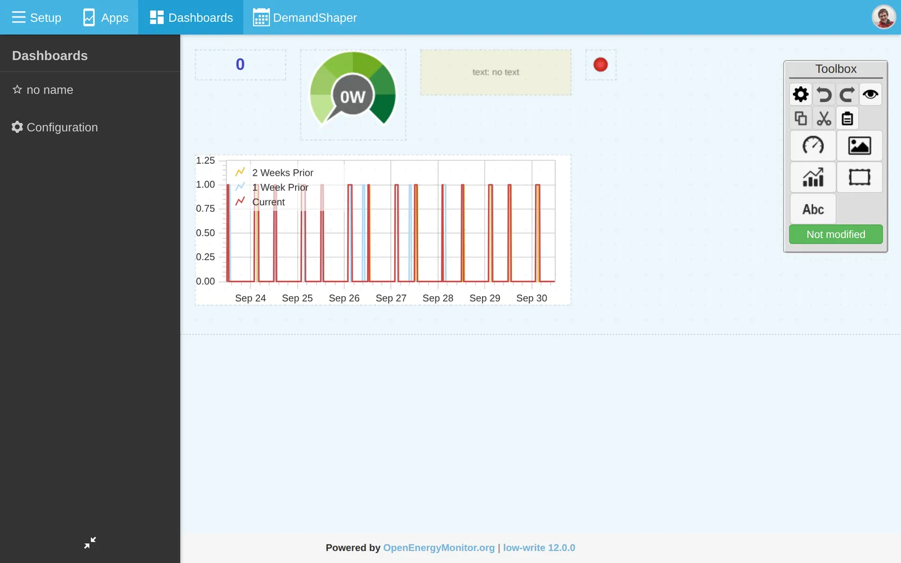
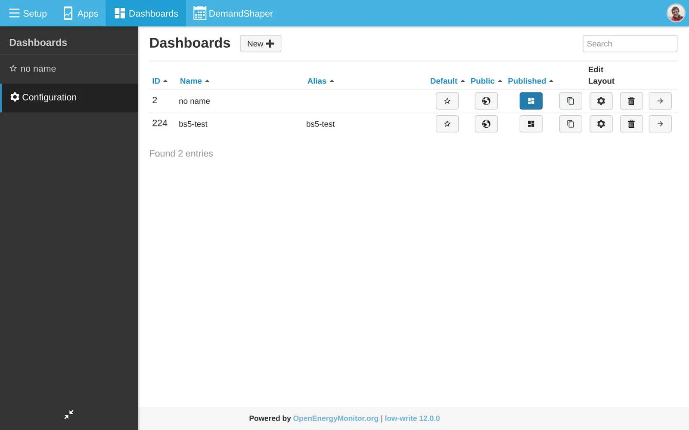

# Dashboards

Build your own dashboard from widgets, charts, text and images. A dashboard can be public, for example to show a building's energy use on a screen. Open dashboards from **Dashboards** in the menu.

For ready-made dashboards, see [Apps](apps.md).

## Create a dashboard

1. Go to **Dashboards** and click **New**.
2. Click the edit icon (**Edit Layout**) on the new dashboard.
3. The editor opens with a **Toolbox** on the right. Click a category button and choose an item:
   - Widgets: dials, values, thermometers, gauges and indicators.
   - Charts.
   - Text, containers and images.
4. Click on the dashboard to place the item. Drag to move and resize it.
5. To set a widget's feed and options, double-click it, or select it and click **Configure selected item**. Choose the **Feed** and click **Save changes**.
6. Click **Changed, press to save**.



The **Toolbox** also has undo, redo, copy, cut, paste, and move to front or back.

## Charts

| Chart | Shows |
|---|---|
| graph | A saved graph from the [graph module](graphs.md) |
| realtime | Live power over a short moving window |
| zoom | Power and daily, monthly or annual kWh, with zoom |
| stackedsolar | Solar and use, stacked |
| orderbars | Daily values in order of size |
| timecompare | One period against another |

Older dashboards with charts from the retired visualisation module are converted to these charts automatically.

## Dashboard settings

In the editor, click **Configure dashboard basic data** to open **Dashboard Configuration**:

- **Dashboard name**, **Alias name** and **Description**.
- **Background color** and **Grid size**.
- **Main**: show this dashboard first.
- **Published**: activate the dashboard.
- **Public**: anyone with the URL can see it.
- **Hide Menus**: show the dashboard without the Emoncms menus.

## Public dashboards

A public dashboard shows only feeds that are public. Make feeds public on the **Feeds** page with **Edit**. See [Feeds](feeds.md#edit-a-feed).

Dashboard URLs:

| URL | Shows |
|---|---|
| `dashboard/view?id=3` | Dashboard 3 |
| `dashboard/view/home` | Dashboard with alias `home` |
| `dashboard/view` | Main dashboard |
| `<username>/dashboard/view` | Main public dashboard of a user |

To show a private dashboard without logging in, add `&readkey=` and your read only API key. Anyone with the link can see the data.

## Dashboard list

The list shows each dashboard with **Name**, **Alias**, main, **Public** and **Published**. The icons on each row clone, edit, delete and view the dashboard.



```{warning}
Deleting a dashboard is permanent.
```

## Examples

See the [Emoncms showcase](https://community.openenergymonitor.org/c/emoncms/showcase) on the forum.
