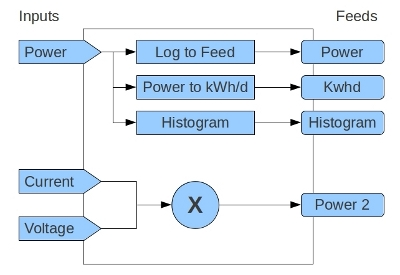

# Input processing

Inputs hold the latest value from a device. Input processing runs a list of steps on each new value, and can scale, combine or convert it and log the result to feeds. Virtual feeds use the same process lists, run when the feed is read.



For the user view, see [Inputs](../user_guide/inputs.md) in the user guide.

## Flow

1. Data arrives at `input/post` or `input/bulk`, or from MQTT through `scripts/services/emoncms_mqtt`.
2. `Modules/input/input_methods.php` finds or creates each input for the node and key, and stores its value and time. With Redis enabled, inputs are held in Redis.
3. For each input with a process list, it calls `Process::input($time, $value, $processList, $options)` in `Modules/process/process_model.php`.
4. `input()` runs the steps in order. Each step receives the value returned by the step before.

For a virtual feed, the feed engine `Modules/feed/engine/VirtualFeed.php` calls `input()` once for each datapoint it returns, with `$options['sourcetype']` set to `ProcessOriginType::VIRTUALFEED`.

## Process list format

### Stored format

Process lists are stored as a string in the `processList` column of the `input` and `feeds` tables:

```
key:arg,key:arg,...
```

- `key` is a process key such as `process__log_to_feed`, or a numeric id for processes that have an `id_num`, for example `1` for Log to feed.
- A process with several arguments has them separated by `:`, for example `key:arg1:arg2`.
- Processes without an argument have an empty argument, for example `key:`.

Example, log to feed 12 and write kWh to feed 13:

```
1:12,4:13
```

Numeric ids are kept for compatibility. `process_map` in `Process` maps them to keys.

### API format

The API takes and returns process lists as JSON:

```json
[
    { "fn": "process__log_to_feed", "args": [12] },
    { "fn": "process__power_to_kwh", "args": [13] }
]
```

Set a list with a POST:

```
POST input/process/set.json?inputid=5        processlist=<JSON>
POST feed/process/set.json?id=20             processlist=<JSON>   (virtual feeds)
```

`Process::validate_processlist()` checks each step: the process exists and is allowed in this context, and each argument has the right type and belongs to the user. `encode_processlist()` and `decode_processlist()` convert between the two formats.

## Process definitions

Core processes are defined in `Modules/process/process_processlist.php`. Each entry:

| Field | Meaning |
|---|---|
| `id_num` | Numeric id used in stored lists. Core processes only |
| `name` | Label in the process list dialog, wrapped in `tr()` |
| `short` | Badge text on the inputs page |
| `argtype` | `ProcessArg::VALUE`, `INPUTID`, `FEEDID`, `TEXT`, `SCHEDULEID` or `NONE` |
| `function` | Method that runs the step |
| `group` | Group in the process dropdown |
| `engines` | Feed engines allowed when creating a feed from this process |
| `requireredis` | Needs Redis |
| `input_context` | Allowed in input process lists |
| `virtual_feed_context` | Allowed in virtual feed process lists |
| `description` | Help text in the dialog, HTML |

`args` can replace `argtype` for a process with several arguments. `convert_arg_structure()` turns `argtype` into a one-item `args` array.

## Process functions

A process function has this signature:

```php
public function scale($arg, $time, $value, $options = null)
{
    if ($value === null) return $value;
    return $value * $arg;
}
```

- `$arg`: the argument, or an array for several arguments.
- `$time`: the input time.
- `$value`: the value from the step before.
- `$options`: context, including `sourcetype` and `sourceid`.

Return the value to pass to the next step. A process that only logs returns `$value` unchanged.

Flow control:

- `proc_skip_next = true` skips the next step. Used by the conditional processes.
- `proc_goto` jumps to a step. A list that runs more than twice its length is stopped and marked with `process__error_found`.
- `proc_initialvalue` holds the input value from the start of the list. **Reset to Original** returns it.

## Adding processes from a module

A module can add processes in `Modules/<module>/<module>_processlist.php`, with a class named `<Module>_ProcessList`:

```php
class Mymodule_ProcessList
{
    public function __construct($parent) { }

    public function process_list()
    {
        return array(
            array(
                "name" => tr("My process"),
                "short" => "myp",
                "argtype" => ProcessArg::VALUE,
                "function" => "my_process",
                "group" => tr("My module"),
                "input_context" => true,
                "virtual_feed_context" => true,
                "description" => tr("<p>What it does.</p>")
            )
        );
    }

    public function my_process($arg, $time, $value, $options = null)
    {
        return $value;
    }
}
```

The key is `<module>__<function>`, for example `mymodule__my_process`. `Process` loads every module's process list when it starts. See `Modules/schedule/schedule_processlist.php`.

## Performance

Input processing runs for every value received, so it must be fast:

- Keep database queries out of process functions where possible. Input and feed metadata are cached in Redis.
- Feed writes go through the storage engine. With the low-write setting they are buffered in Redis and written by `feedwriter`.
- Processes that read the last value of another input or feed use the cached value, not a query.

## History

Input processing was rebuilt in March 2013 to reduce database queries, and Redis caching was added in November 2013. See [Improving emoncms performance with Redis](http://openenergymonitor.blogspot.co.uk/2013/11/improving-emoncms-performance-with_8.html).
