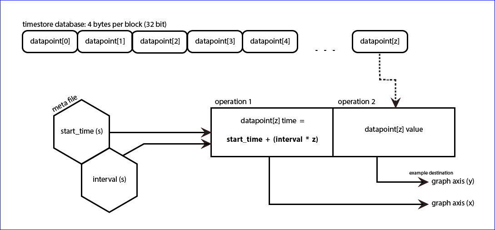

# Fixed interval

PHPFina source code: [PHPFina.php](https://github.com/emoncms/emoncms/blob/master/Modules/feed/engine/PHPFina.php)

In most applications time series data is recorded at a fixed interval. A temperature or power measurement is made every 10 seconds, minute or hour. With data this regular, the timestamp of each datapoint does not need to be recorded. The start time and interval are stored in a meta file, and the data file holds only the values. The timestamp of any datapoint is calculated from the start time, the interval and the position of the datapoint in the file.

PHPFina is the recommended engine for new feeds. Charts and analysis in Emoncms work on fixed intervals, including aligning datapoints across multiple feeds.

There are two main advantages over the [variable interval](Variable-interval.md) approach:

1. The position of a datapoint in the file is calculated directly from its time, so no search is needed. Fetching a datapoint takes 1 read in place of up to 30 for a binary search.
2. Each datapoint uses 4 bytes in place of 9, so a feed with few gaps uses less than half the disk space of a variable interval feed.

The disadvantages are:

- A gap in the data is padded with NaN values, so the space is used even when no data is recorded. This matters less than it may seem. A feed with data missing for half the time still uses less space than the variable interval equivalent.
- The interval is set when the feed is created and cannot be changed. The minimum is 10 seconds by default, set by `min_feed_interval`.
- Timestamps are rounded down to the feed interval.

Limits of the format:

- Values are 32-bit floats, with about 7 significant digits. A cumulative Wh counter loses 1 Wh resolution above 16,777,216 Wh. A cumulative kWh feed at 12,345 kWh resolves to about 0.001 kWh.
- The start time and interval are unsigned 32-bit integers, valid until 2106.
- The engine does not call `fsync`. Writes stay in the page cache until the kernel writes them out, and can be lost on a power cut.

## Files

Each feed is stored as two files, `<id>.meta` and `<id>.dat`, in `/var/opt/emoncms/phpfina/`. The `datadir` setting changes this location.

A single file would be possible, with the start time and interval in the first 8 bytes of the data file. Separate files leave room to add further meta data. Neither layout is clearly better.

Meta file `<id>.meta`, 16 bytes:

| Field | Size | Type | Notes |
|---|---|---|---|
| id | 4 bytes | unsigned integer | Legacy, written as 0 |
| npoints | 4 bytes | unsigned integer | Legacy, written as 0 |
| interval | 4 bytes | unsigned integer | Seconds |
| start_time | 4 bytes | unsigned integer | Unix timestamp of the first datapoint |

```{note}
The original implementation of PHPFina had two meta files, one holding the interval and start time and a second holding the number of datapoints (npoints). The npoints file was removed to reduce write load. The number of datapoints is now calculated from the data file size, divided by 4. This requires `clearstatcache($filename)` before each `filesize` call, as PHP caches file sizes.
```

The start time is 0 for a new feed. It is set by the first datapoint written.

Data file `<id>.dat`, one 4 byte float per interval:



## Writing to the time series data file

To write fixed interval data there are three steps:

1. Calculate the file position of the datapoint.

   ```php
   $timestamp = floor($timestamp / $meta->interval) * $meta->interval;
   $position = floor(($timestamp - $meta->start_time) / $meta->interval);
   ```

2. If there is a gap between the last datapoint and the new one, pad it with NaN values. Build the padding in a buffer and write it in one block.

   ```php
   $padding = $position - $last_position - 1;
   $buffer = "";
   for ($i=0; $i<$padding; $i++) $buffer .= pack("f",NAN);
   ```

3. Add the new datapoint and write the buffer at the end of the file.

   ```php
   $buffer .= pack("f",$value);
   fseek($fh,4*($last_position+1));
   fwrite($fh,$buffer);
   ```

The engine `post_multiple` method follows these steps for a batch of datapoints:

- Datapoints in a batch that are not in ascending order are dropped. A repeated timestamp keeps the last value.
- A datapoint within the existing file overwrites the value at its position. A datapoint before the start time is dropped.
- New datapoints and padding are packed into one buffer and appended with a single `fwrite`.
- With the `join` padding mode, a gap is filled by straight line interpolation between the last value and the new value, in place of NaN.
- A gap of more than 15,768,000 datapoints (5 years at 10 seconds) is refused.

## Reading from the time series data file

Simplified example of reading data from a fixed interval data file:

```php
public function get_data($id,$start,$end,$interval)
{
    $meta = $this->get_meta($id);
    $fh = fopen($this->dir.$id.".dat", 'rb');

    $data = array();
    for ($time=$start; $time<=$end; $time += $interval) {
        $value = null;
        if ($time>=$meta->start_time && $time<=$meta->end_time) {
            $pos = floor(($time - $meta->start_time) / $meta->interval);
            fseek($fh,$pos*4);
            $tmp = unpack("f",fread($fh,4));
            if (!is_nan($tmp[1])) $value = $tmp[1];
        }
        $data[] = array($time,$value);
    }

    fclose($fh);
    return $data;
}
```

1. Read the start time, interval and end time from the meta file, and open the data file.
2. Step through the requested range from `$start` at the requested `$interval`.
3. For each time within the feed range, calculate the datapoint position.
4. Seek to the position, read 4 bytes and unpack the float. NaN values are returned as null.
5. Add the datapoint to the data array.

The engine `get_data_combined` method has two modes:

| Mode | Value returned for each interval |
|---|---|
| No averaging | Value at the interval start, as in the example above. |
| Averaging | Mean of all datapoints in the interval, excluding NaN values. The datapoints are read in one block. |

Other behaviour:

- By default the requested interval is limited to the feed interval and rounded to a multiple of it. `limitinterval=0` turns this off.
- Averaging is turned off when the requested interval equals the feed interval. The file is then read sequentially after a single seek.
- `interval=original` returns the data at the feed interval.
- The interval can also be `daily`, `weekly`, `monthly` or `annual`. These align to the requested timezone.

## Other operations

| Method | Description |
|---|---|
| `scalerange` | Multiply a time range by a value, set it to NaN or take absolute values. Used by the graph editor. |
| `trim` | Remove data before a new start time and update the meta file |
| `clear` | Truncate the data file and reset the start time to 0 |
| `upload_fixed_interval` | Write a block of values at a given start time |
| `export` | Stream the raw data file from a byte offset (`feed/export.json`) |
| `sync` | Write an uploaded binary segment at a byte offset |
| `get_data_DMY_time_of_day` | Values at given hours of each day, week or month |
| `get_sha256sum` | SHA-256 hash of the first n datapoints (`feed/sha256sum.json`) |

Full PHPFina source code: [PHPFina.php](https://github.com/emoncms/emoncms/blob/master/Modules/feed/engine/PHPFina.php)
