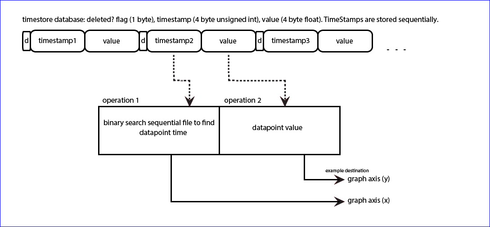

# Variable interval

PHPTimeSeries source code: [PHPTimeSeries.php](https://github.com/emoncms/emoncms/blob/master/Modules/feed/engine/PHPTimeSeries.php)

Variable interval storage such as PHPTimeSeries records the timestamp along with the value for each datapoint in the data file. The datapoints are only allowed to be written in ascending timestamp order, so the data file is always ordered. The timestamp can then be used as an index, and a binary search can find the datapoint at any given time.

```{note}
PHPTimeSeries is not recommended for new feeds. Use [PHPFina](Fixed-interval.md).

PHPTimeSeries exists to support feeds converted from the earlier MySQL time series engine. Storing a timestamp with each datapoint was the original design choice. Fixed interval storage suits Emoncms better. Sensor data arrives at regular intervals, and charts and analysis work on fixed intervals, including aligning datapoints across multiple feeds. Support for PHPTimeSeries elsewhere in Emoncms is limited, and it may be removed from the feed creation options.
```

Each feed is stored in one file, `feed_<id>.MYD`, in `/var/opt/emoncms/phptimeseries/`. The `datadir` setting can be used to change this location.

Each datapoint is stored as fixed length binary. In PHPTimeSeries each datapoint is 9 bytes long. The first byte is a flag, the next 4 bytes store the timestamp as an unsigned integer and the last 4 bytes store the value as a float. With fixed length binary, the start and end of each datapoint are known without searching the file for line endings or other markers. Each datapoint starts at a multiple of 9 bytes, and the number of datapoints is the file size divided by 9.c this 

```{note}
The 9 byte structure and the `.MYD` extension come from the MySQL MyISAM row format. PHPTimeSeries was designed to read data files converted from MySQL time series feeds. The flag byte is not used. The engine writes it as 249 and skips it on read. Deleting individual datapoints is not yet supported for PHPTimeSeries.
```

**PHPTimeSeries:**



## Writing to the timeseries data file

Adding a new datapoint to the timeseries data file could be as simple as:

```php
$fh = fopen("feed_1.MYD","a");
fwrite($fh,pack("CIf",249,$time,$value));
fclose($fh);
```

This does not enforce timestamp ordering. If a previous write was partial, it also does not ensure that the new datapoint starts at a multiple of 9 bytes.

The engine `post_multiple` method handles both cases:

- Datapoints in a batch that are not in ascending order are dropped. A repeated timestamp keeps the last value.
- The file is opened with `c+` and locked with `flock(LOCK_EX)`.
- The number of datapoints is `floor(filesize / 9)`, so a partial datapoint at the end of the file is overwritten by the next append.
- A datapoint with the same timestamp as the last datapoint overwrites it in place.
- A datapoint older than the last datapoint is found with an exact binary search and updated if it exists. Otherwise it is dropped, as the engine cannot insert in the middle of the file.
- New datapoints are packed into one buffer and appended with a single `fwrite`.

```{note}
Appending 9 bytes at a time is inefficient on SD cards. Each append writes a whole filesystem block (1 KiB on the emonSD data partition) plus a share of an inode block, and the card programs flash in larger pages again. Write load depends on the number of feed files and how often they are flushed, not necessarily on the size of the data.

Emoncms reduces the flush rate with RedisBuffer. Feed data is held in Redis, and the `feedwriter` service writes it to disk in one batch per feed every few minutes. A longer kernel writeback interval (`vm.dirty_expire_centisecs`, `vm.dirty_writeback_centisecs`) or a long ext4 `commit=` interval gives a similar reduction without application buffering. All three options leave data in memory until the next flush, so it can be lost on a power cut.
```

## Reading from the timeseries data file

To read a datapoint, seek to its start position in the file, read 9 bytes and unpack the binary. Example of reading datapoint 100 from a PHPTimeSeries file:

```php
$datapoint = 100;
$datapoint_position = $datapoint * 9;
fseek($fh,$datapoint_position);
$bin = fread($fh,9);
$datapoint = unpack("x/Itime/fvalue",$bin);
print $datapoint['time']." ".$datapoint['value'];
```

A data processing script can read the whole file sequentially by placing the above in a loop from datapoint 0 to the last datapoint in the file.

### Reading a time range

To explore historical timeseries data it is useful to zoom and pan through large amounts of data on a graph. A graph is at most around 1920 pixels wide, and datapoints spaced less than 2-3 pixels apart are hard to distinguish, so a graph needs around 800 datapoints. A data file may hold millions of datapoints and a query range may span thousands or millions of them. A way is needed to extract datapoints at a lower resolution than the recorded resolution.

For example, a query from 10 February 2014 (timestamp 1391990400) to 17 June 2014 (1402963200) covers 10,972,800 seconds. With data recorded at around 10 second intervals and 800 datapoints required, the output interval is ~13,700 seconds.

The engine `get_data_combined` method steps through the query range one output interval at a time. It has two modes:

| Mode | Value returned for each interval |
|---|---|
| No averaging | Nearest datapoint at or after the interval start, if it falls inside the interval. Otherwise null. With `limitinterval=2` the datapoint keeps its own timestamp. |
| Averaging | Mean of all datapoints in the interval, excluding NaN values. The datapoints between the interval boundaries are read in one block. |

The output interval is either a fixed number of seconds or one of `daily`, `weekly`, `monthly` and `annual`. These align to the requested timezone.

### Binary search

Fetching a datapoint at a given time requires a search of the file for the datapoint closest to the requested time. A binary search does this efficiently. It requires ordered data, and timeseries data is ordered by ascending time.

A binary search reads the datapoint at the file midpoint and checks whether the requested time is in the first or second half. It repeats this on the selected half until it narrows down on the datapoint. This usually takes around 20 iterations. This is much faster than a brute force search which may need to read the whole file, which can hold millions of datapoints.

Binary search method in the PHPTimeSeries engine (comments shortened):

```php
// Returns nearest datapoint that is >= search time
private function binarysearch($fh,$time,$npoints,$exact=false)
{
    if ($npoints==0) return -1;
    $start = -1; $end = $npoints-1;

    // Maximum of 30 iterations. The position is usually
    // found within 20 iterations.
    for ($i=0; $i<30; $i++)
    {
        // Read the datapoint in the middle of the range
        $mid = $start + ceil(($end-$start)*0.5);
        fseek($fh,$mid*9);
        $dp = @unpack("x/Itime/fvalue",fread($fh,9));

        // Exit if this is the requested time
        if ($dp['time']==$time) {
            return array($mid,$dp['time'],$dp['value']);
        }

        // Range is 1 datapoint wide: return the next datapoint
        // unless an exact match is required
        if (($end-$start)==1) {
            if (!$exact && $dp['time']>$time) {
                return array($mid,$dp['time'],$dp['value']);
            }
            return -1;
        }

        // Search the upper half if the requested time is later
        if ($time>$dp['time']) $start = $mid; else $end = $mid;
    }
    return -1;
}
```

The search works in datapoint positions rather than bytes, and returns the position, time and value. In averaging mode the positions of two consecutive interval boundaries give the block of datapoints to read.

## Other operations

| Method | Description |
|---|---|
| `trim` | Rewrite the file from a given start time |
| `clear` | Truncate the file to zero length |
| `export` | Stream the raw file from a byte offset (`feed/export.json`) |
| `sync` | Write an uploaded binary segment at a byte offset |
| `get_sha256sum` | SHA-256 hash of the first n datapoints (`feed/sha256sum.json`) |

Full PHPTimeSeries source code: [PHPTimeSeries.php](https://github.com/emoncms/emoncms/blob/master/Modules/feed/engine/PHPTimeSeries.php)
