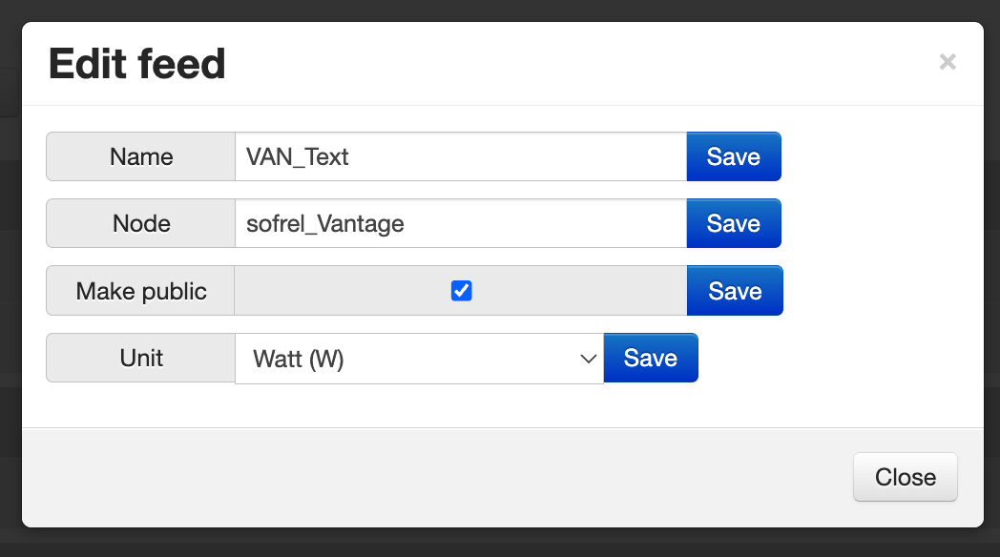
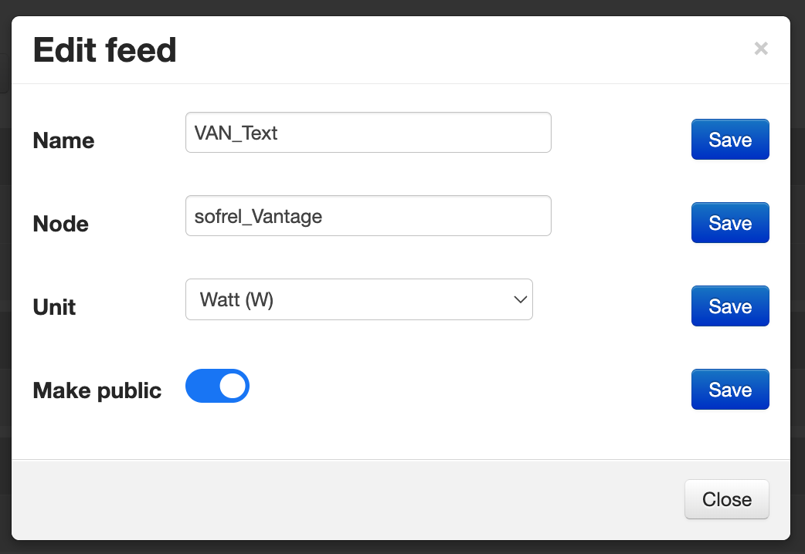

# Feed Module — UI/UX Improvements Documentation

## Feed Module — Edit Modal
### 1. Overview

Feed edit modal is designed to carry out single or bulk edit on rows of feed data. 
Users can modify the name, nodes, units and changing its availability to public.  
Affected file:  
`
Modules/feed/Views/feedlist_view.php
`

### 2. Existing UI Problems

- Inline CSS
- Poor spacing
- Outdated UI/UX design

  

### 3. Summary of Improvements

- Migrated inline CSS and embedded styles to CSS file
- Improved spacing/typography
- Modern UI/UX design

  

### 4. Code Changes
#### 4.1 CSS structure

All inline CSS and styles previously embedded in `<script>` or HTML have been removed.
They are now consolidated in a separate CSS file for better maintainability and modularity:

`
Modules/feed/Views/feed_view.css
`

This change improves:
- Maintainability: Styles are centralized, making future updates easier.
- Separation of concerns: HTML, JS, and CSS are properly separated.
- Readability: Inline styles are eliminated, leading to cleaner code.

#### 4.2 HTML Structure

Traditional checkbox is replaced with more modern design, which is the toggle switch. 
Due to limitation of Bootstrap v2.0, the element is fully styled using CSS.

### 5. Accessibility Improvements
- Labels are properly associated with inputs using `<label for="id">`. 
- Focus and keyboard navigation supported for all interactive elements
- Improved contrast and sizing for better visibility and usability

### 6. Impact
- Maintainability: Centralized CSS and modular design make future changes easier
- Consistency: All feed edit rows now have aligned labels, inputs, and buttons
- Accessibility: Improved keyboard navigation and focus for all users