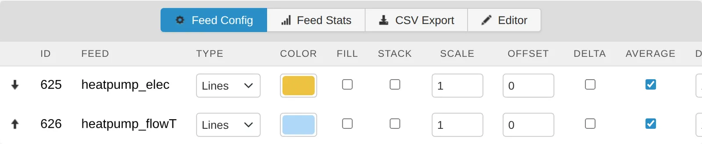
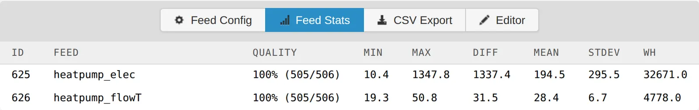

# Graphs

The graph module is the main viewer for feed data. Use it to compare feeds, calculate daily totals and averages, view statistics and export CSV.

## Open a graph

- Click a feed on the **Feeds** page to open it in the graph view.
- To open several feeds, tick them on the **Feeds** page and click **Graph view** in the toolbar.

The URL lists the feed ids, for example `http://emonpi.local/graph/1,2`.

## Choose feeds and axes

The sidebar lists your feeds by tag. Each feed has two tick boxes: the first places it on the left y-axis, the second on the right. Use both axes to compare feeds with different units, such as power and temperature.

## Time window

Choose a preset from **1 hour** to **5 Years**, or use **Zoom In**, **Zoom Out**, **Earlier** and **Later**. Drag across the graph to zoom to a period. To enter exact dates, click **Select time window** and set **Start** and **End**.

## Interval

**Type** sets how data is grouped:

- **Fixed Interval**: one value per interval, for example every 60 seconds. Click the interval to set it.
- **Daily**, **Weekly**, **Monthly**, **Annual**: one value per period, aligned to your timezone.

**Fill nulls with last value** fills gaps in the data. **Show gaps** leaves them visible.

## Feed Config

**Feed Config** sets how each feed is drawn:

| Column | Effect |
|---|---|
| Type | **Lines**, **Bars**, **Points** or **Steps** |
| Color | Line colour |
| Fill | Fill the area below the line |
| Stack | Stack on other stacked feeds |
| Scale, Offset | Multiply or shift values |
| Delta | Show the change in each period. Use with cumulative kWh feeds for daily kWh |
| Average | Show the mean for each interval, not a sample |
| DP | Decimal places |

## Feed Stats

**Feed Stats** shows **Quality**, **Min**, **Max**, **Diff**, **Mean** and **Stdev** for each feed in the window. **Wh** is the energy for a power feed in watts.

## Save a graph

Enter a name under **My Graphs** and click **Save**. Saved graphs can be opened from **Select graph** and added to dashboards.

## Related tasks

- [Daily kWh](daily-kwh.md)
- [Averages](daily-averages.md)
- [Histograms](histograms.md)
- [Export CSV](export-csv.md)

## Graph URLs

| URL | Shows | Access |
|---|---|---|
| `graph/1,5` | Feeds 1 and 5 | Public feeds, or when logged in |
| `graph?feedidsLH=1&feedidsRH=5` | Feed 1 on the left axis, feed 5 on the right | Public feeds, or when logged in |
| `graph#/Saved/1` | Saved graph 1 | When logged in |
| `graph/embed?graphid=1` | Saved graph 1, without menus or editor | Public feeds |

## Source code

[emoncms/graph](https://github.com/emoncms/graph) on GitHub.
