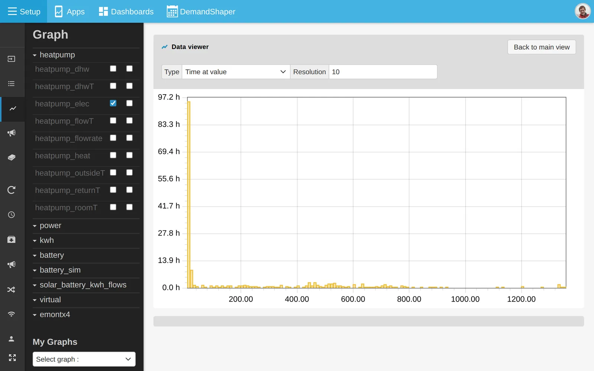
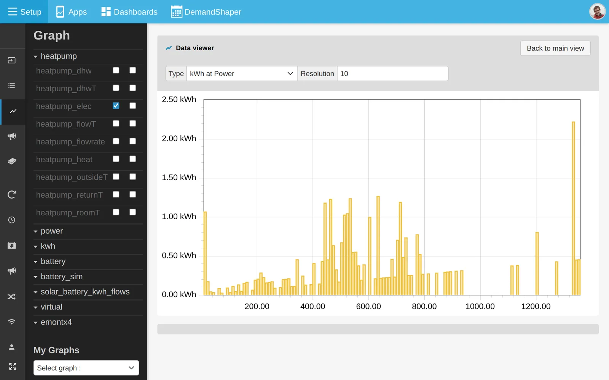

# Histograms

The graph view has a histogram mode. It shows how long a feed spent at each value, or how much energy was used at each power level.

This example uses a heat pump power feed.

## Open a histogram

1. Open the feed in the [graph view](graphs.md) and choose the time window.
2. In **Feed Config**, click **Histogram** on the feed.
3. Set **Type** and **Resolution**.

For a more detailed result, use a shorter interval. Each request is limited to 70,000 datapoints by default.

## Time at value

**Time at value** shows the time spent in each range of values.

In this example the heat pump spent about 1,123,200 seconds between 0 and 50 W, out of 2,592,000 seconds in the window. It was on standby 43% of the time.

## kWh at Power

**kWh at Power** shows the energy used or generated in each power range. Use a power feed in watts.

In this example most of the heat pump's energy, 97 kWh, was used between 500 and 549 W.

