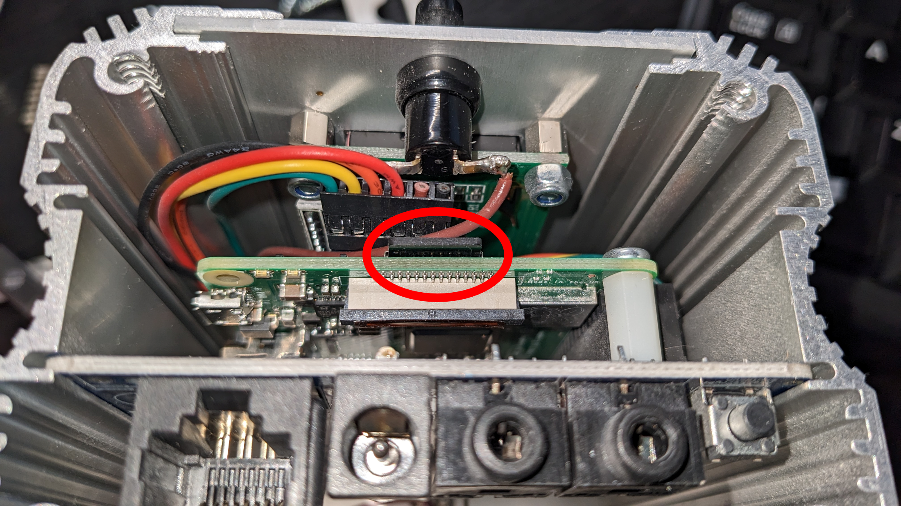

# Backup and restore

The backup module keeps a copy of your Emoncms data and restores it after a failure or on a new SD card. Open it from **Setup > Backup**. It has two tabs, **Backup** and **Restore**.

The backup module works on local installs such as the emonPi and emonBase. For emoncms.org, see [Back up a remote account](#back-up-a-remote-account).

## What is included

Included:

- Emoncms accounts, inputs, input processing, feeds, dashboards and apps.
- Feed data.
- emonHub configuration, `emonhub.conf`.

Not included:

- WiFi and network settings.
- Other changes to the system.

## Back up to a drive

Emoncms can back up every day to a USB drive or a network share. Each run copies only new data, a few MB a day.

1. Plug in a USB drive.
2. Go to **Setup > Backup** and click **Scan for drives**.
3. Choose the drive:
   - **Set up this drive** mounts the drive as it is. Nothing on it is erased.
   - **Erase and format** erases the whole drive and formats it as btrfs. Type `ERASE` to confirm. btrfs compresses feed data by about 80%, checks every block for damage, and keeps dated copies of feed data as well as the database.
4. The daily backup turns on. Click **Back up now** to run the first backup.

The status line at the top of the **Backup** tab shows whether your data is protected:

- Green: a recent backup exists and the daily backup is on.
- Amber: the drive is disconnected, no backup has run yet, the last backup is more than two days old, or the daily backup is off.
- Red: the last backup failed, the last backup is more than a week old, or the drive does not respond.

A full check runs every Sunday. To run one now, click **Verify and repair**.

The **Restore points** card lists the dated database copies on the drive. The last 7 daily and 4 weekly copies are kept.

```{note}
Backup to a drive is on by default on a Raspberry Pi. On other systems, see the [backup module readme](https://github.com/emoncms/backup#backup-to-an-attached-drive).
```

## Download a portable copy

A portable copy is one `.tar.gz` file that holds everything. Keep it off site, or use it to move to another system.

1. On the **Backup** tab, under **Portable copy**, click **Build archive**.
2. When the archive is built, click **Download**.

The archive holds all data each time, so it is larger and slower than a drive backup.

## Restore

```{warning}
Restoring replaces all Emoncms data on this system. Inputs, feeds, dashboards and feed data are all replaced by the copy you restore from.
```

The current database is saved before a restore, so a restore started by mistake can be undone. Feed data is not saved.

Open the **Restore** tab and choose a source:

- **From the backup drive**: choose a restore point and click **Restore from drive**.
- **From an archive file**: upload a `.tar.gz` archive and click **Upload and restore**. Browsers limit the upload size. For a large archive, see the [backup module readme](https://github.com/emoncms/backup#portable-archive).
- **From an old emonSD card**: put the card in a USB card reader, plug it in and click **Import from SD card**.

Tick **I understand this overwrites all Emoncms data on this system** to confirm.

When the restore is complete, log out and log in with the restored account details.

## Move to a new SD card

To move to a new emonSD image, set up a new SD card and import the data from the old one. The old card stays unchanged as a backup.

### Prepare the new card

Buy a card with emonSD installed from the [OpenEnergyMonitor shop](https://shop.openenergymonitor.com/emonsd-pre-loaded-raspberry-pi-sd-card/), or write the latest image from [emonSD download](../emonsd/download.md) to a card of 16 GB or more. [balenaEtcher](https://etcher.balena.io) is a simple tool for writing images.

### Swap the cards

1. Go to **Setup > Admin > System Info** and click **Shutdown**. Wait 30 seconds, then unplug the power.
2. Remove the old SD card. On an emonPi, remove the end plate with a Torx T20 bit first.

   

3. Insert the new card, refit the end plate and power up.
4. Connect to the network. See [Connect](../emonpi/connect.md). The first boot runs updates and takes a while.

### Import the old card

1. Put the old SD card in a USB card reader and plug it into the emonPi or emonBase.
2. Open Emoncms and log in with the default account from [emonSD download](../emonsd/download.md). The import replaces it with your original account.
3. Go to **Setup > Admin > Update** and run **Full Update**.
4. Go to **Setup > Backup**, open the **Restore** tab and click **Import from SD card**.
5. When the import is complete, log out and log in with your original account details.

### Fix a corrupt card

If the old card does not mount, `fsck` may repair it. With the card in a USB reader, connect via SSH ([credentials](../emonsd/download.md)) and run:

```
sudo fsck.ext4 /dev/sda2    # system partition
sudo fsck.ext2 /dev/sda3    # data partition
```

Then run the import again.

## Back up a remote account

The backup module cannot back up emoncms.org or another remote server. Use one of these:

- **Sync module**: download all feeds from the remote account to a local emonPi, emonBase or Raspberry Pi. You can browse the data locally afterwards. See [Sync](sync.md).
- **Python backup script**: download feed data to a computer, with an option to convert it to CSV. See the [forum post](https://community.openenergymonitor.org/t/python-based-emoncms-backup-utility/19526).

## Back up a whole server

To back up every account on your own server:

1. Stop the services that write data, so the files are not changing:

   ```
   sudo systemctl stop emonhub emoncms_mqtt feedwriter apache2
   ```

2. Export the database:

   ```
   mysqldump -u root -p emoncms > emoncms_backup.sql
   ```

3. Copy the feed data directories. On emonSD they are under `/var/opt/emoncms` (`phpfina`, `phptimeseries`). On other installs, check `settings.ini`.
4. Copy `settings.ini` from the Emoncms directory, usually `/var/www/emoncms`.
5. Start the services again.

## Help

If a backup or restore fails, post on the [community forum](https://community.openenergymonitor.org). Include the log shown on the backup page and the server information from **Setup > Admin > System Info**.
