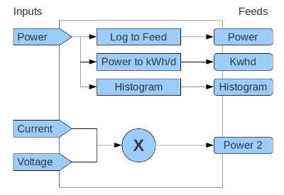
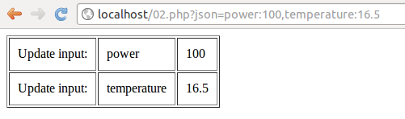
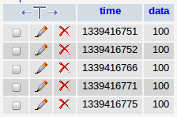

## Inputs and Input processing

One of the core features of emoncms is input processing and therefore separation between inputs and feeds.

The need for input processing arose initially from the need to calculate kWh per day data from raw power data. Doing a small bit of processing every time an input is updated means that the kWh/d data can be loaded really fast for visualization rather than having to wait for kwhd data to be calculated on the fly from power data every time you want an overview. As time has moved on however input processing has expanded to allow server based calibration of inputs, multiplying inputs together, histogram data creation and quite a few other things. 

Here's a diagram to illustrate the main concept:

At present the processes attached to an inputs is configured from a GUI, see the guide pages. Maybe in the future it could be configured graphically as in the diagram above or it could be possible to have an auto configuration option where certain processes are applied automatically if the input is called "power" or "temperature" or other specific names.

So the main thing to note is that when sensor data is received by emoncms (or by this method in general) the input data is not stored historically. Data is stored historically by creating a feed (a data store) and mapping the input to the feed with the option to do some quite powerful input processing before data is stored to a feed.

What I have tried to do below is to extract the main parts of registering inputs, processing inputs and logging to a feed from the full emoncms application so that its a bit easier to see the what is the core code involved.

### Step 1: Processing the json-like input string

This first part takes the json-like string and explodes it into first data pairs and then into the constituent input name, value pairs.

1) Copy and paste the code in a php script on your server called 01.php:

    <?php
      $json = $_GET['json'];
      $datapairs = explode(',', $json);
    
      echo "<table border=1>";
      foreach ($datapairs as $datapair)       
      {
        $datapair = explode(":", $datapair);
        
        // sanitize input by ensuring it is of correct format
        $inputname = preg_replace('/[^\w\s-.]/','',$datapair[0]);
        $value = floatval($datapair[1]);
        
        echo "<tr><td>$inputname</td><td>$value</td></tr>";
      }
      echo "</table>";
    ?>

$\_GET\['json'\] fetches the json attribute from the URL and the function explode splits a given string by the character specified. So first power:100,temperature:16.5 is split into an array with two strings power:100 and temperature:16.5 and then for each of these strings they are further split into input name and value variables.

2) Goto the script in your browser and send a couple of variables to the script, for example:

    01.php?json=power:100,temperature:16.5

You should see the following appear in your browser:

### Step 2: Storing inputs in an input table.

Now that we have recieved and processed the input string the next step is to register or save the inputs into an input table in a database. Once we have registered that inputs have been recieved in the database we can then setup input processing rules on those inputs as to what we would like to do with them.

**Update March 2013**: In the latest release input processing was rebuilt to improve performance. For the interest of showing how things evolve both implementations are shown here, here's the old implementation:

**Pre March 2013 input processing implementation**

    <?php
    
      $userid = 1;
    
      // Connect to the mysql database, enter your database details here
      $mysqli = new mysqli("localhost", "username", "password", "example");
    
      // As above get the json-like data string from the url
      $json = $_GET['json'];
      $datapairs = explode(',', $json);
    
      $inputs = array();
      echo "<table border=1 cellpadding=10px>";
      foreach ($datapairs as $datapair)       
      {
        $datapair = explode(":", $datapair);
        
        // sanitize input by ensuring it is of correct format
        $inputname = preg_replace('/[^\w\s-.]/','',$datapair[0]);
        $value = floatval($datapair[1]);
    
        $time = time();
        $datetime = date("Y-n-j H:i:s", $time);
    
        // Check if the input already exists by trying to select it:
        $result = $mysqli->query("SELECT id FROM input WHERE name='$inputname' AND userid='$userid'");
        $array = $result->fetch_array();
        $id = $array['id'];
    
        echo "<tr>";
        if ($id)
        {
          // if it does exist then update the input
          echo "<td>Update input: </td>";
          $mysqli->query("UPDATE input SET time='$datetime', value = '$value' WHERE id = '$id'");
          $inputs[] = array($id,$datetime,$value);
        }
        else  
        {
          // Otherwise create a new input
          echo "<td>Created input: </td>";
          $mysqli->query("INSERT INTO input (userid,name,time,value) VALUES ('$userid','$inputname','$datetime','$value')");
        }
    
        echo "<td>$datapair[0]</td><td>$datapair[1]</td></tr>";
      }
      echo "</table>";
    ?>

To run the code:

1) Copy and paste the code into a php script on your server called 02.php

2) Create a mysql database called example. If your new to mysql databases you can either do this via mysql command line directly or via a nice tool called phpmyadmin.

3) Create an input table using the following sql code. In phpmyadmin click on the SQL tab and paste the code into the edit box and click 'GO'.

    CREATE TABLE input (
    `id` int NOT NULL AUTO_INCREMENT, PRIMARY KEY(id),
    `userid` text,
    `name` text,
    `processList` text,
    `time` DATETIME,
    `value` FLOAT
    )

**4) Goto the script in your browser** and send a couple of variables to the script, for example:

    02.php?json=power:100,temperature:16.5

You should see the following appear in your browser:

If you now refresh the page a second time, it should change to updated:

If you look at the inputs table in phpmyadmin it should look like this:

### 

### Step 3: Processing an input, logging it to a feed

In the input table screenshot above there is a field called _processList_, as you can well see it is NULL at the moment. This is where the input processing for each input is specified. In emoncms the input processing specification is built in the input processing GUI, however to keep things simple here we will set the input processing manually.

The processList is again a json-like string. Lets say we want to log an input to a feed id 1\. The processList entry for this process would be: **1:1**

**The first 1** specifies the process id of the process **log\_to\_feed** in emoncms.

**The second 1** specifies the feedid, so feed id 1 in this example.

We could easily log to a second feed, creating a duplicate by adding **1:2** (log\_to\_feed (process\_id=**1**) feedid=**2**). The full processList string logging to two feeds would now look like: **1:1,1:2**

Clearly that example is not very useful as why would you want an exact duplicate of the feed? I will come back to the different types of input processes that emoncms features in a moment it has 16 different types of input processing all together.

**One of the key things to note is that the order of the processList** determines the that processes are applied, this makes it possible to call say a scale or offset process to calibrate a value and then use the output of that process the scaled or offset value and log that value in turn to a feed.

But first lets get the power input that we registered to an input table in the example above logging to a feed.

**1) First add a process. **In phpmyadmin click on the edit button next to the power input row. In the processList box enter **1:1** and click go.

**2) Now create a feed table **with ID 1 in the name the format used in emoncms is first feed and then underscore and the feedid, create a feed manually by entering the following SQL in the SQL box in phpmyadmin:

    CREATE TABLE **feed_1** (
    time INT UNSIGNED, data float,
    INDEX ( `time` ))

**3) Below the last line echo "</table\>"; above add the following code:**

      // The process_list specifies the process ID of a process function
      // So here the process_list id 1 references the process function log_to_feed
      // Scroll down the page to see the actual log_to_feed function 
    
      $process_list = array();
      $process_list[1] = array( "Log to feed",2,"log_to_feed",1,1);
    
      foreach ($inputs as $input)            
      {
        $id = $input[0];
    
        // Fetch the inputs processList (i.e: 1:1 as discussed above)
        $result = $mysqli->query("SELECT processList FROM input WHERE userid='$userid' AND id='$id'");
        $array = $result->fetch_array();
        $input_processlist = $array['processList'];
    
        if ($input_processlist)
        {
          // Split the process list into individual processes at each comma
          $processlist = explode(",",$input_processlist);                
          $value = $input[2];
    
          // For each of the individual processes:
          foreach ($processlist as $inputprocess)
          {
            // Split into process function id and function argumnet (the feed id in this example)
            $inputprocess = explode(":", $inputprocess);
            $processid = $inputprocess[0];
            $arg = $inputprocess[1];
     
            // Did you know that you can call a php function from a variable, its quite neat
            // So first we get the function name from the process_list:
            $process_function = $process_list[$processid][2];
            // and then we execute the function whos name is give by the variable $process_function
            $value = $process_function($arg,$time,$value);
          
            // Notice how $value is returned, in some processes such as the scale or offset  
            // the output (the scaled or offet value) can then be logged to feed in
            // the next turn of the foreach loop.
          }
        }
      }
    
      // Here's the actual process function for log_to_feed
    
      function log_to_feed($feedid,$feedtime,$value)
      {
        global $mysqli;
        $feedname = "feed_".trim($feedid)."";
        $mysqli->query("INSERT INTO $feedname (`time`,`data`) VALUES ('$feedtime','$value')");
    
        echo "Log value: ".$value." to $feedname ";
    
        return $value;
      }
    ?>

**4) Goto the script in your browser** and run the script again. You should now see the following appear in your browser:

and in the feed table feed\_1 after a few calls to the script you should see timestamped data logged there:

## Input processing rebuilt March 2013

Most of the time taken to handle a request to input processing or for that matter emoncms in general is taken up by requests to the mysql database. The php part of the code is usually pretty fast especially with Opcode cashing enabled such as APC.

Reducing the number of MYSQL queries required is usually a sure way to improve the performance of the application. If we look at the code above there is first a mysql query to check if the input exits:

    SELECT id FROM input WHERE name='$inputname' AND userid='$userid'

depending on if it exists or not we either INSERT a new input or UPDATE the existing input. 

Finally we request the processList of the input in the process section:

    SELECT processList FROM input WHERE userid='$userid' AND id='$id'

That makes 3 mysql queries per input. If we have 4 inputs per packet of data that emoncms recieves which is quite common the first part of the input processing section alone would result in 12 mysql queries. (The first part being registering the inputs and finding out which processes to actually run)

To save on the number of queries we can load everything at once at the beginning of the request.

    SELECT id,name,processList FROM input WHERE userid='$userid'

We then have all the inputs in a php array that can be searched through to check if the input recieved exists and if it does we now already have the processList which saves another query. 

If we still update each input with latest time and value, the single-query-at-the-start implementation would reduce the number of queries for 4 inputs down from 12 to 4. 

But lets go further, updating the inputs last value and time (recording and input) is only used by emoncms in a small fraction of cases by input processes that divide, multiply, sum, subtract the value of another input. If we only recorded an input in the case that it was being used in these processes that would likely mean that most requests to input processing would only needed the one query (to check if the input exists and get its processList). In the latest version of emoncms this is achieved by marking an input as needing to be recorded when a divide, multiply, sum, subtract by input type process is added.

Going forward from here it would be good to find further query savings in the process functions themselves found in process_model.php which could provide significant further performance improvements.

## Performance improvements with Redis November 2013

[8th Nov 2013: Improving emoncms performance with Redis plus interesting consequences for SD cards](http://openenergymonitor.blogspot.co.uk/2013/11/improving-emoncms-performance-with_8.html)
