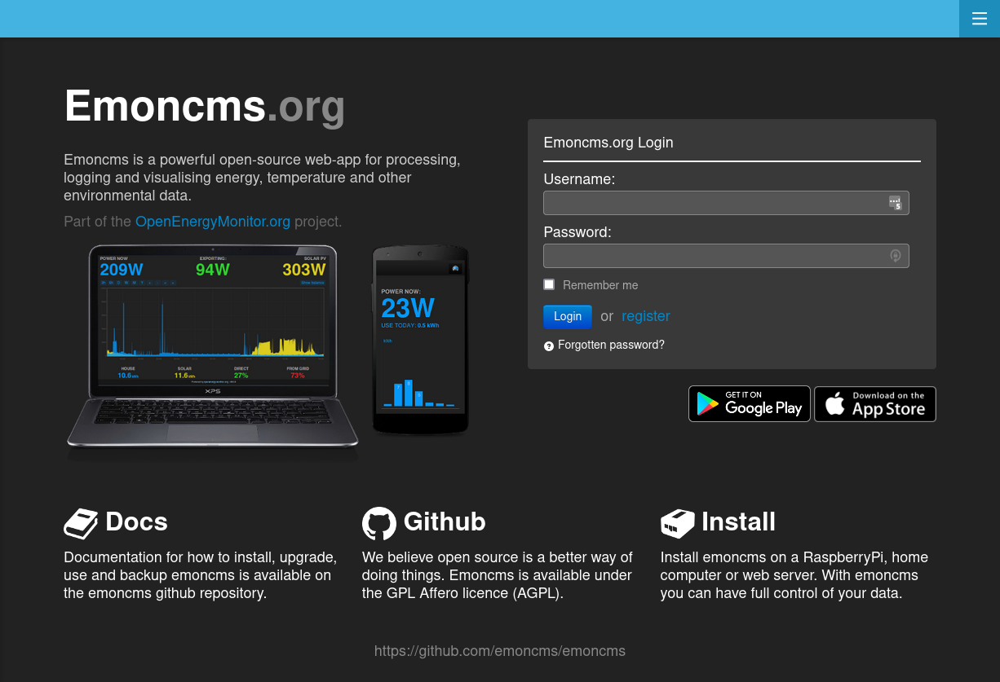
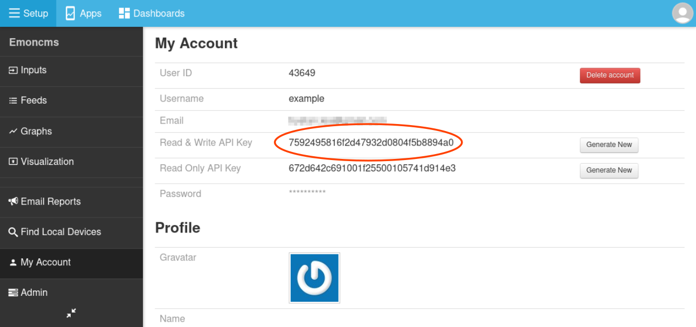

# Getting started: emoncms.org

[Emoncms.org](https://emoncms.org) is our hosted Emoncms service. Use it for access from anywhere, public dashboards, or as a second copy of data you log at home.

Emoncms.org charges per feed, pay as you go. Hardware from the OpenEnergyMonitor shop comes with emoncms.org credit worth 20% of the purchase, designed to cover 5 to 10 years of use. See [pricing](https://emoncms.org/site/pricing).

To run Emoncms on your own server, see [Install](../emonsd/install.md).

## Create an account

1. Open [emoncms.org](https://emoncms.org) and click **Register**.
2. Enter your email address, a username and a password. You need to verify the email address.

## Find your API key

Devices and scripts use the **Read & Write API Key** to send data. Find it on the **My Account** page.

## Send data

- **From an emonPi or emonBase**: see [Send data to emoncms.org](intro-rpi.md#send-data-to-emoncmsorg).
- **From your own device or script**: use the input API with your API key. See [Posting data](postingdata.md).

## Set up feeds

Inputs appear on the **Inputs** page when data arrives. The rest of the setup is the same as on a local install:

- [Log inputs to feeds](intro-rpi.md#log-inputs-to-feeds)
- [Graphs](graphs.md)
- [Apps](apps.md)
- [Dashboards](dashboards.md)

[Virtual feeds](virtual-feeds.md) are free on emoncms.org.
