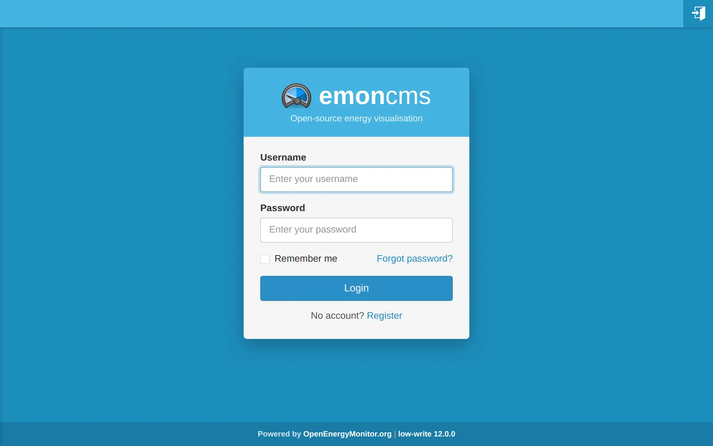
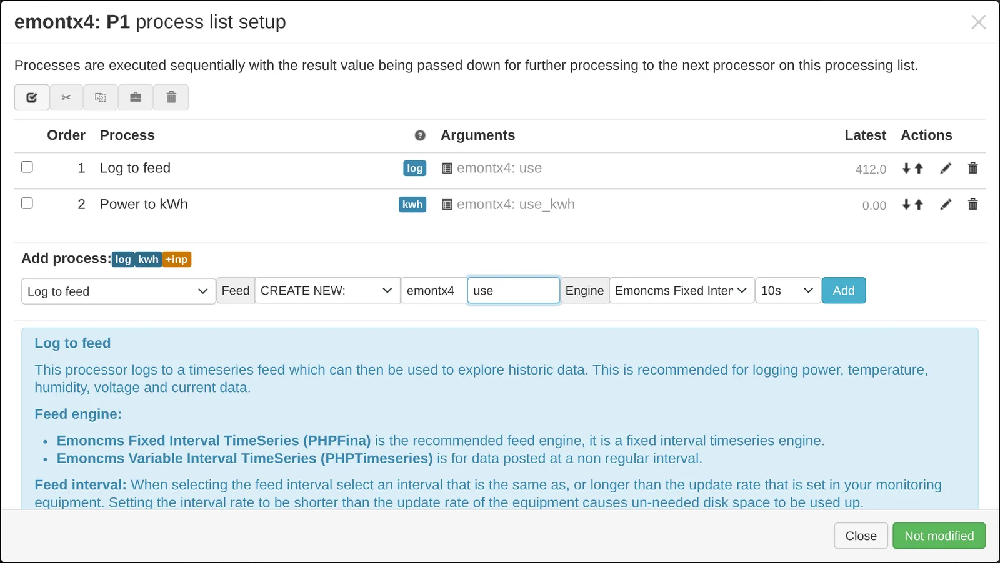
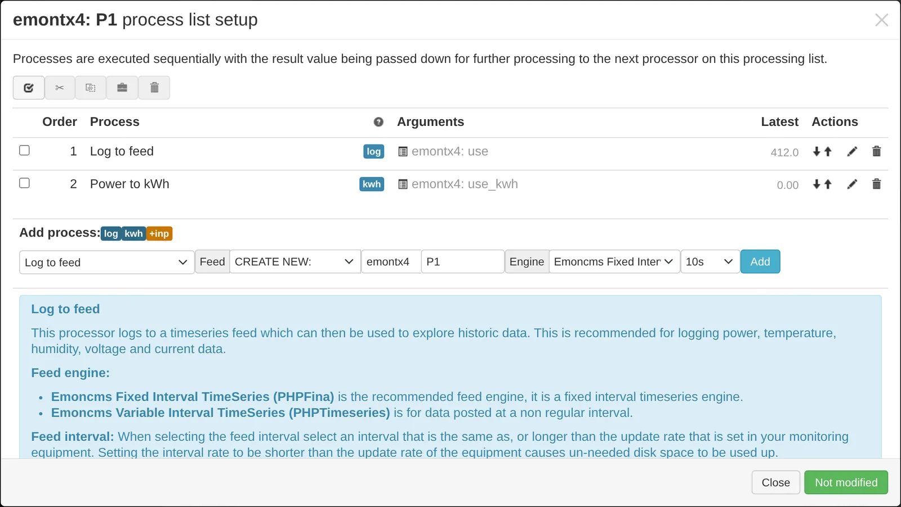
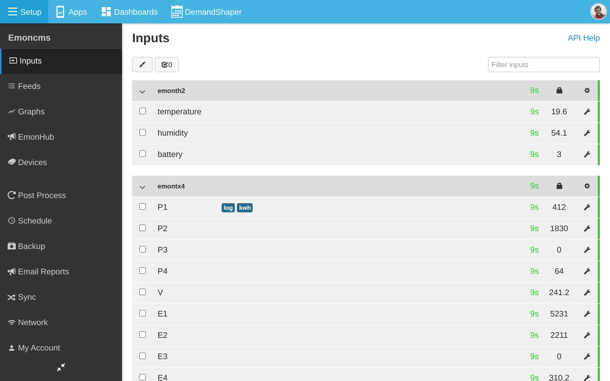
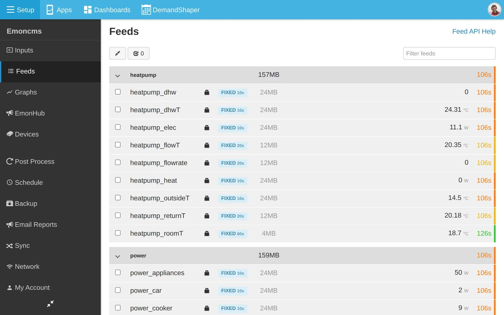
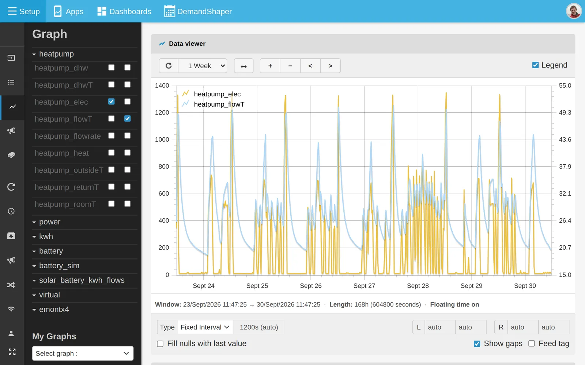
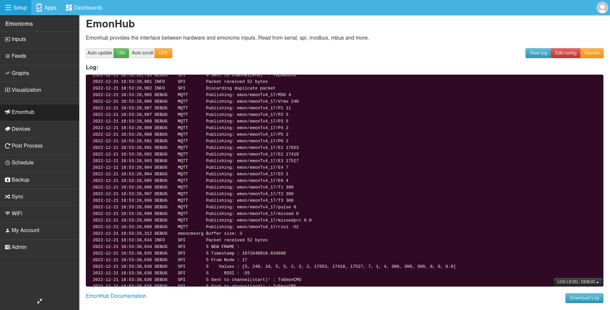
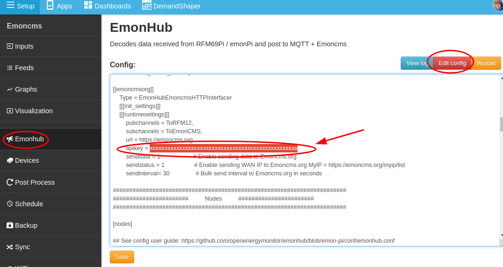

# Getting started: emonPi and emonBase

Set up Emoncms on an emonPi or emonBase, log your first feeds and, if you want, send data to emoncms.org.

## Before you start

- The emonPi or emonBase is powered up and connected to your network. See [Connect](../emonpi/connect.md).
- Open its address in a browser, for example `http://emonpi.local`. The Emoncms login page appears.



## Log in

Log in with username `emonsd` and password `emonsd`. Change the password afterwards on the **My Account** page.

Emoncms opens on the **Feeds** page. It is empty until you create feeds.

## Check your inputs

Go to **Setup > Inputs**. Data from the emonPi, and from an emonTx or other node sending to an emonBase, appears here automatically.

Each input holds only its latest value. To record history, log the input to a feed. See [Core concepts](coreconcepts.md).

## Log inputs to feeds

This example logs a power input, such as `P1` from an emonTx4, and creates a cumulative kWh feed from it.

1. Click the spanner icon on the input.
2. In the process list dialog:
   - Select **Log to feed**.
   - Under **Feed**, choose **CREATE NEW:** and enter a name, for example `use`.
   - Leave **Engine** set to **Emoncms Fixed Interval TimeSeries**.
   - Select an interval of 10s for an emonPi or emonTx, or 60s for an emonTH.
   - Click **Add**.

   

3. To add daily kWh for a power input:
   - Select **Power to kWh**.
   - Create a new feed, for example `use_kwh`, with the same interval.
   - Click **Add**.

   

   The emonTx4 and recent emonPi firmware also send cumulative energy for each CT channel. You can log those inputs in place of **Power to kWh**. See [Daily kWh](daily-kwh.md).

4. Click **Changed, press to save**, then **Close**.

   

5. The input now shows its processes as short labels, such as `log` and `kwh`.

   

```{note}
Do not choose an interval shorter than the rate at which the device sends data. A longer interval is fine and uses less disk space.
```

Use the default feed names where they apply, such as `use`, `solar` and `heatpump_elec`. [Apps](apps.md) then find the feeds without manual selection.

For hardware with a device template, such as the emonTx4, the device module can create all inputs, processes and feeds in one step. See [Devices](devices.md).

## View the data

Go to **Setup > Feeds**. The new feeds are listed and update every few seconds.



Click a feed to open it in the graph view. There is little data at first. Zoom in to the last few minutes, or come back later.



Next steps:

- [Graphs](graphs.md): compare feeds and view statistics.
- [Daily kWh](daily-kwh.md): daily totals, after a couple of days of data.
- [Apps](apps.md): ready-made dashboards for solar, batteries and heat pumps.

## emonHub

emonHub runs on the emonPi and emonBase alongside Emoncms. It reads data from the hardware and passes it to Emoncms over MQTT. It can also send data to emoncms.org.

Go to **Setup > EmonHub** to see the emonHub log. The log helps when inputs do not appear. Click **Edit config** to edit the emonHub configuration.



emonHub also reads many other devices, such as Modbus and M-Bus meters, DS18B20 temperature sensors, solar inverters and batteries. See [emonHub](../emonhub/overview.md) and [emonHub interfacers](../emonhub/emonhub-interfacers.md).

## Local or remote

Data logged on the emonPi or emonBase stays in your home and needs no subscription. The SD card holds many years of data.

You can also send data to a remote server:

- [emoncms.org](https://emoncms.org), our hosted service. See [Getting started: emoncms.org](intro-remote.md).
- Your own server. See [Install](../emonsd/install.md).

A remote server suits public dashboards and access from anywhere. You can log locally and remotely at the same time.

To reach your local Emoncms from outside your home, see [Remote access](remoteaccess.md).

### Send data to emoncms.org

There are two ways:

- **emonHub** sends input data. You set up input processing again on emoncms.org. Follow the steps below.
- **Sync module** uploads the feeds you record locally. You set up input processing once, on the emonPi or emonBase. Uploads resume after an internet outage. See [Sync](sync.md).

To send input data with emonHub:

1. Create an account on [emoncms.org](https://emoncms.org) and copy the **Read & Write API Key** from the **My Account** page.
2. On the emonPi or emonBase, go to **Setup > EmonHub** and click **Edit config**.
3. Find the `[[emoncmsorg]]` section and replace `xxxxxxxxxxxxxxxxxxxxxxxxxxxxxxxx` after `apikey =` with your key.
4. Click **Save**.

   

5. The inputs appear on emoncms.org within a minute. Set up input processing there as above.
