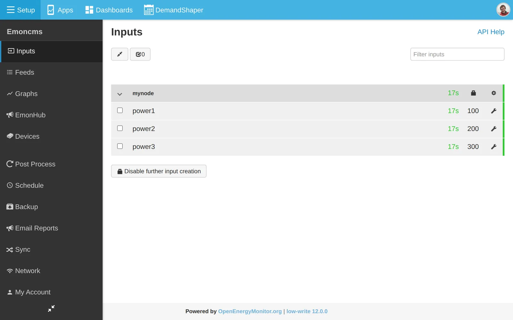

# Posting data

Send data to Emoncms from your own scripts, devices or other software, such as Node-RED or Home Assistant. Use the HTTP input API, MQTT or encrypted HTTP input.

For the full input API, click **API Help** on the **Inputs** page.

## HTTP input API

### API key

Scripts and devices authenticate with the **Read & Write API Key**. Find it on the **My Account** page or the input API help page.

The examples below use `emonpi.local` as the host and `APIKEY` in place of your key.

### Send a test value

Paste this into a browser address bar:

```
http://emonpi.local/input/post?node=mynode&fulljson={"power1":100,"power2":200,"power3":300}&apikey=APIKEY
```

Emoncms returns `{"success": true}`. The inputs appear under the node `mynode` on the **Inputs** page.



To record the inputs, add input processing. See [Inputs](inputs.md).

### Send the key in a header

Keeping the key out of the URL stops it appearing in server logs:

```
curl -H "Authorization: Bearer APIKEY" \
  "http://emonpi.local/input/post?node=mynode&fulljson={\"power1\":100}"
```

### Use POST

All parameters can go in the POST body:

```
curl -X POST http://emonpi.local/input/post \
  -H "Authorization: Bearer APIKEY" \
  -d 'node=mynode&fulljson={"power1":100,"power2":200}'
```

### CSV values

Values without names are numbered from 1:

```
http://emonpi.local/input/post?node=mynode&csv=100,200,300&apikey=APIKEY
```

### Set the time

Add a Unix timestamp to set the input time:

```
http://emonpi.local/input/post?time=1581112821&node=mynode&csv=100,200,300&apikey=APIKEY
```

### Bulk upload

`input/bulk` sends many readings from several nodes in one request. Use it for historic data or buffered readings. See the input API help page.

## MQTT

MQTT is a messaging protocol. On the emonPi and emonBase it passes data between emonHub, Emoncms and other software.

### Server

The emonPi and emonBase run a [Mosquitto](https://mosquitto.org) MQTT server on port 1883. Find the username and password on the [emonSD download](../emonsd/download.md) page.

Any MQTT client can connect to the emonPi or emonBase IP address on port 1883, for example [MQTT Explorer](https://mqtt-explorer.com) on a computer, or an MQTT app on a phone.

### Topics

Emoncms uses the base topic `emon/`. Each value has its own topic:

```
emon/<node>/<key>
```

For example, `emon/emonpi/power1` is input `power1` of node `emonpi`. Publish a value to a topic under `emon/` and it appears as an input on the **Inputs** page.

The base topic is set in `/etc/emonhub/emonhub.conf` and in the `[mqtt]` section of `/var/www/emoncms/settings.ini`.

### Test from the command line

Install the Mosquitto clients:

```
sudo apt install -y mosquitto-clients
```

The examples below use `USER` and `PASS` in place of the MQTT credentials. Add `-h <host>` to connect to another machine.

Publish a test value:

```
mosquitto_pub -u USER -P PASS -t 'emon/test/power1' -m '100'
```

Show all Emoncms messages. `#` is a wildcard:

```
mosquitto_sub -v -u USER -P PASS -t 'emon/#'
```

Show messages for one node:

```
mosquitto_sub -v -u USER -P PASS -t 'emon/emonpi/#'
```

### Services

| Service | Role | Restart | Log |
|---|---|---|---|
| emonHub | Decodes data from the emonPi, the emonBase radio and other interfacers. Publishes each value to `emon/<node>/<key>`. | `sudo systemctl restart emonhub` | **Setup > EmonHub**, or `/var/log/emonhub/emonhub.log` |
| emoncms_mqtt | Subscribes to `emon/#`. Posts each value to Emoncms as an input. | `sudo systemctl restart emoncms_mqtt` | **Setup > Admin > Emoncms Log**, or `/var/log/emoncms/emoncms.log` |
| emonPiLCD | Subscribes to the emonHub topics to show live values on the emonPi display. | `sudo systemctl restart emonPiLCD` | `/var/log/emonpilcd/emonpilcd.log` |

The emonHub log shows every value published to MQTT.

To publish from Emoncms to another topic, for example `house/power/solar`, add the **Publish to MQTT via Redis** input process and enter the topic in the process text box.

## Encrypted input

Devices that cannot use HTTPS can encrypt the data they post to `input/post` and `input/bulk`. The write API key is the shared key. The API key itself is not sent.

### Request

- Method: `POST` to `input/post` or `input/bulk`.
- Header `Content-Type: aes128cbc`. Use `aes128cbcgz` when the request string is compressed with zlib (PHP `gzcompress`) before encryption. The HMAC and the response hash then cover the compressed data.
- Header `Authorization: USERID:HMAC`, where HMAC is the SHA-256 HMAC of the plain request string, keyed with the hex decoded write API key.
- Body: base64 of the 16 byte IV followed by the AES-128-CBC ciphertext of the plain request string. The key is the write API key, hex decoded to 16 bytes. Use URL safe base64 with no padding.

The plain request string uses the same parameters as an unencrypted request, for example `node=emontx&data=100,200,300`.

### Response

The response is the URL safe base64 SHA-256 hash of the plain request string. Compare it with your own hash to confirm that Emoncms received the data.

### Steps

1. Build the request string, for example `node=emontx&data=100,200,300`.
2. Create a random 16 byte initialisation vector.
3. Encrypt the request string with AES-128-CBC.
4. Join the IV and the ciphertext and encode as base64.
5. Calculate the HMAC of the request string.
6. POST the encoded string with the two headers.
7. Check the returned hash.

### PHP example

```php
<?php

$userid = USERID;
$apikey = "WRITE APIKEY";

$data = "node=emontx&data=100,200,300";

// Encrypt data
$iv = openssl_random_pseudo_bytes(16);
$encryptedData = $iv.openssl_encrypt($data, 'AES-128-CBC', hex2bin($apikey), OPENSSL_RAW_DATA, $iv);
$base64EncryptedData = rtrim(strtr(base64_encode($encryptedData), '+/', '-_'), '=');

// Generate hmac_hash for user authorization
$hmac = hash_hmac('sha256',$data,hex2bin($apikey));

// Generate request
$ch = curl_init();
curl_setopt($ch,CURLOPT_URL,"http://localhost/emoncms/input/post");
curl_setopt($ch,CURLOPT_POST,1);

// Set request headers Authorization & Content-Type
curl_setopt($ch,CURLOPT_HTTPHEADER, array(
  "Authorization: $userid:$hmac",
  "Content-Type: aes128cbc"
));

curl_setopt($ch,CURLOPT_POSTFIELDS,$base64EncryptedData);
curl_setopt($ch,CURLOPT_RETURNTRANSFER,true);

$result = curl_exec($ch);
if (PHP_VERSION_ID < 80000) {
    curl_close($ch);
}

// Generate sha256 hash of data string to compare with returned sha256 hash result
$sha1 = str_replace(array('+','/'),array('-','_'), base64_encode(hash("sha256", $data, true)));

if ($sha1==$result) {
    print "ok";
} else {
    print $result;
}
```
