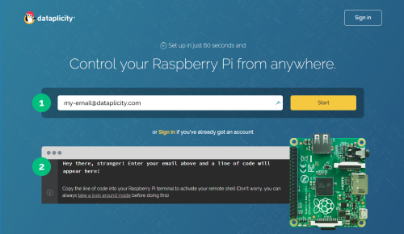
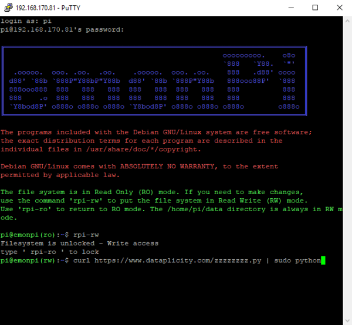
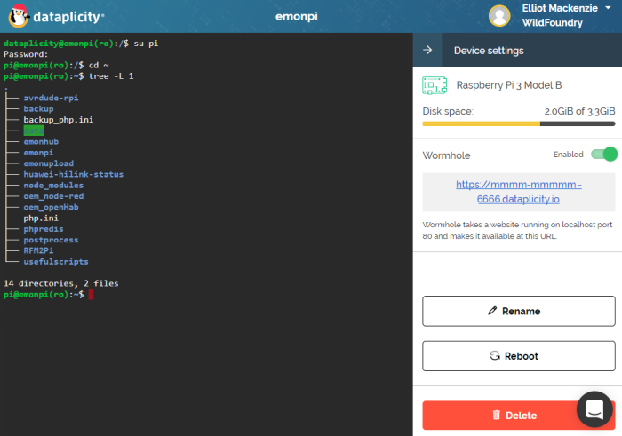
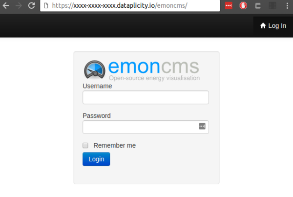

# Remote access

Reach your emonPi or emonBase from outside your home network, for example to view Emoncms or to connect via SSH.

## Dataplicity

[Dataplicity](https://www.dataplicity.com) is the simplest secure option. It gives remote SSH access and a secure web address for Emoncms, with no router changes. The free tier covers one device.

1. Enable SSH and find the credentials for your image on [emonSD download](../emonsd/download.md).
2. Create a Dataplicity account and copy the installation command.

   

   

3. Connect to the emonPi or emonBase via SSH and run the installation command.

   

4. The device appears in your Dataplicity dashboard.

   

5. Open the device to get a remote terminal.

   

6. Turn on **Wormhole** to reach Emoncms over HTTPS. Wormhole tunnels to port 80 on the emonPi.

   

For help, post on the [community forum](https://community.openenergymonitor.org) with the `dataplicity` tag.

## Open source alternatives

These options use open source software you run yourself. Each takes more setup than Dataplicity.

| Option | Needs a public server | Router changes | Setup |
|---|---|---|---|
| WireGuard VPN | No | Forward one UDP port | Moderate |
| Headscale | Yes, a small VPS | None | Moderate |
| SSH reverse tunnel | Yes, a small VPS | None | Simple, SSH and HTTP only |

In each case Emoncms stays off the public internet. Only devices you connect can reach it.

### WireGuard

[WireGuard](https://www.wireguard.com) is a fast, simple VPN. Your phone or laptop joins your home network as if it were there.

1. Install WireGuard on the emonPi or emonBase: `sudo apt install wireguard`. Or install it on another always-on device, such as your router.
2. Forward one UDP port, 51820 by default, on your router to that device.
3. Create a key pair and a peer entry for each phone or laptop, and install the WireGuard app on each.
4. Most home connections change IP address. Use a dynamic DNS service, such as [Duck DNS](https://www.duckdns.org), for a fixed name.

Many routers, and tools such as [PiVPN](https://pivpn.io), set up WireGuard with a guided installer.

### Headscale

[Headscale](https://headscale.net) is an open source server for the Tailscale clients. Devices connect directly to each other, with no router changes. The Headscale server needs a public address, for example a small VPS.

1. Install Headscale on the VPS. See the [Headscale documentation](https://headscale.net).
2. Install the Tailscale client on the emonPi or emonBase and on your phone or laptop.
3. Connect each device to your server: `sudo tailscale up --login-server https://headscale.example.com`.
4. Open Emoncms at the emonPi's address on your private network.

The hosted Tailscale service uses the same clients and needs no server of your own. The client is open source. The hosted service is not.

### SSH reverse tunnel

The emonPi opens an SSH connection to a server you control and forwards a port back through it. This suits occasional access for SSH or for Emoncms from one computer.

1. Set up SSH key login from the emonPi to the server.
2. Install autossh on the emonPi to keep the tunnel open: `sudo apt install autossh`.
3. Start the tunnel, for example forwarding the emonPi's SSH port to port 2222 on the server:

   ```
   autossh -M 0 -N -R 2222:localhost:22 user@server.example.com
   ```

4. From the server, connect with `ssh -p 2222 pi@localhost`.

Keep forwarded ports bound to localhost on the server. Use SSH port forwarding from your computer to reach Emoncms through the tunnel.

## Port forwarding

Port forwarding opens a port on your router to the emonPi. We do not recommend it:

- Emoncms on the emonPi uses HTTP, so passwords and data cross the internet unencrypted.
- Most home connections change IP address. You need a dynamic DNS service, such as [Duck DNS](https://www.duckdns.org), to keep a fixed name.
