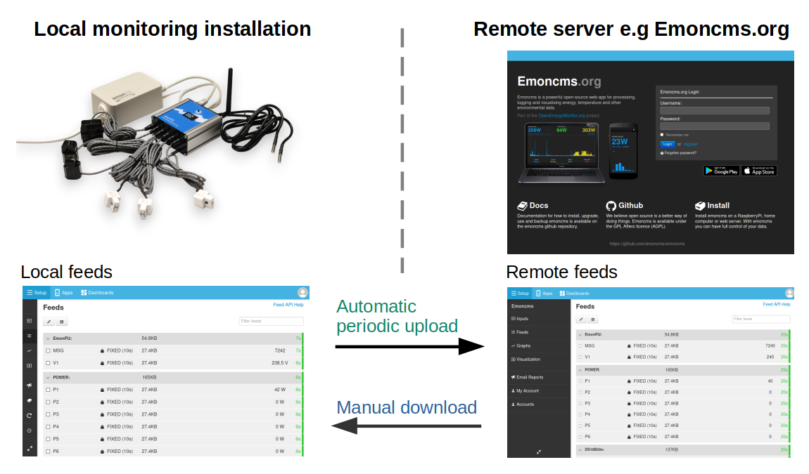

# Sync

The sync module copies feed data between two Emoncms servers. Typically these are an emonPi or emonBase at home and a remote server such as [emoncms.org](https://emoncms.org). Open it from **Setup > Sync** on the local system.

## Upload or download

**Upload** sends local feeds to the remote server at a set interval. Set up input processing once, on the emonPi or emonBase. The remote server receives the resulting feeds. This replaces sending input data with emonHub, which needs input processing set up on both systems.

Uploads send data in binary, which uses little bandwidth. If the internet connection drops, data is still recorded locally and uploads resume when it returns.

**Download** copies feeds from the remote server to the local system once. Use it to recover data after an SD card failure, to keep a local copy, or to move from remote to local logging. Downloads do not repeat.

## Connect to the remote server

1. Go to **Setup > Sync**.
2. Enter the **Remote server**. The default is emoncms.org.
3. Sign in with your **Username** and **Password**, or with the **Write apikey** of the remote account.
4. Click **Connect**.

HTTPS encrypts the connection but uses more bandwidth than HTTP. On a connection with little bandwidth, use a longer sync interval.

## Upload feeds

1. Open the **Upload** tab.
2. Tick the feeds and click **Upload**, or click the switch on each feed.
3. Set the **Sync interval**, from 5 minutes to daily. The default is 5 minutes.

Uploads start within a few seconds. A feed that is up to date on both servers is shown in green.

To stop, tick the feeds and click **Stop upload**.

## Download feeds

1. Open the **Download** tab. It lists remote feeds that are not on this system or are ahead of it.
2. Click **Download** on a feed, or tick feeds and click **Download selected**.

Downloaded feeds do not update after the download. Download again to fetch new data.

## Source code

[emoncms/sync](https://github.com/emoncms/sync) on GitHub.
