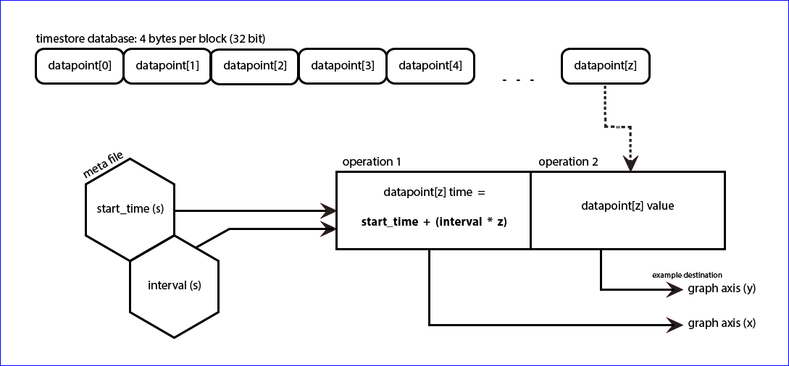

## Fixed interval no averaging (PHP Fina)

PHPFina source code can be found here: [PHPFina.php](https://github.com/emoncms/emoncms/blob/master/Modules/feed/engine/PHPFina.php)

In many if not most applications time series data is recorded at a fixed interval. A temperature or power measurement is made every 10 seconds, minute or hour. Given this highly regular nature of the time series data we can do away with the need to record every datapoint's timestamp and instead just record the start time of the time series and the time series interval in a meta file and then only record the datapoint values in the datafile. The timestamp for any given datapoint can easily be worked out by the start time, interval and the position of the data point in the file.

There are two main advantage of this approach versus the variable interval approach.

1. The first advantage is that if we want to read a datapoint at a given time we don’t need to search for the datapoint as we can calculate its position in the file directly. This reduces  the amount of reads required to fetch a datapoint from up to 30 reads down to 1 giving a significant performance improvement.

2. The second advantage is that in a time series where the data is highly reliable the disk use can be up to half that of the disk use used by a variable interval engine, due to not needing to record a timestamp for each datapoint.

The disadvantage is that when you have a gap in your data, that gap needs to be padded with NAN values, those times need to be allocated even if not used. This isn’t a big a disadvantage as it may first seem because even if you had a gap of 6 months out of a year you would still only consume as much disk space as the variable interval method. Another disadvantage is that you need to set the interval of the feed when you create the feed.

The current PHPFina timeseries implementation uses two files for each fixed interval feed, a meta file to store the start time and interval and the datafile to store the 4 byte data values. It would be possible to reduce this to a single file if the first 8 bytes of the data file contained the start_time and interval meta data, this would reduce flexibility to add further meta data in the future. There is not necessarily a right way to do it, it's just a design decision to bear in mind.

**Metafile:**

Meta file: $id.meta:

- id (4 bytes, Unsigned integer, Legacy now unused)
- npoints (4 bytes, Unsigned integer, Legacy now unused)
- interval (4 bytes, Unsigned integer)
- start_time (4 bytes, Unsigned integer)

Note: The original implementation of PHPFina had two meta files, one containing the interval and start_time and a second holding the number of data points (npoints). The recording of npoints has since been removed and is instead calculated on the fly from the file size which works fine as long as the stats cache is cleared for the file using "clearstatcache($filename);". 

**PHPFINA:**

### Writing to the time series data file

To write fixed interval data there are three steps:

1\) Calculate the file position of the datapoint to be written.

    $timestamp = floor($timestamp / $meta->interval) * $meta->interval;
    $position = floor(($timestamp - $meta->start_time) / $meta->interval);

2\) If there is a gap between the datapoint to be written and the last datapoint then padd the gap with NAN values, to padd efficiently buffer the padding.

    $buffer = pack("f",NAN);
    $buffer .= …
    fwrite($fh,$buffer);

3\) Write the new datapoint at the end.

    fseek($fh,4*$position);
    fwrite($fh,pack("f",$value));

### Reading from the time series data file.

The following example gives a really paired down example of reading data back from the fixed interval data file.

    public function get_data($id,$start,$end,$interval)
    {
        $meta = $this->get_meta($id);
        $fh = fopen($this->dir.$id.".dat", 'rb');
        
        $data = array();
        for ($time=$start; $time<=$end; $time += $interval) {
            $pos = round(($time - $meta->start_time) / $meta->interval);
            
            $value = null;
            if ($pos>=0 && $pos < $meta->npoints) {
                fseek($fh,$pos*4);
                $tmp = unpack("f",fread($fh,4));
                if (!is_nan($tmp[1])) $value = $tmp[1];
            }
            $data[] = array($time,$value);
        }
        
        fclose($fh);
        return $data;
    }

1\. We start by fetching the start_time and interval of the fixed interval feed from the meta file. We also open the .dat file so that it's ready to read.

    $meta = $this->get_meta($id);
    $fh = fopen($this->dir.$id.".dat", 'rb');

2\. Next, we then iterate through the request range starting at the $start timestamp and advancing at the specified $interval.

    for ($time=$start; $time<=$end; $time += $interval) {

3\. We find the nearest data point to each timestamp and check that it is in range:

    $pos = round(($time - $meta->start_time) / $meta->interval);
    if ($pos>=0 && $pos < $meta->npoints) {
    
4\. Fseek moves to the position in the file that we want to read and the combination of fread and unpack reads the binary data and converts it to a float value. We return the value if it is a number or otherwise return null.

    fseek($fh,$pos*4);
    $tmp = unpack("f",fread($fh,4));
    if (!is_nan($tmp[1])) $value = $tmp[1];

5\. Finally the datapoint is added to the data array ready to be passed back as the result of the feed engine class method. 

Full PHPFina source code can be found here: [PHPFina.php](https://github.com/emoncms/emoncms/blob/master/Modules/feed/engine/PHPFina.php)
