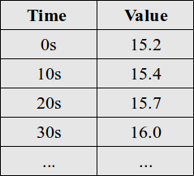

## Emoncms Time Series engine history

Writing, storing and viewing time series data is a core part of an energy monitoring application like emoncms. Over the years the way time series data has been handled in emoncms has gone through several significant revisions both out of necessity as emoncms.org use has grown and through increased understanding of how disks and filesystems work and how to reduce disk IO through in-memory storage.
In order to best describe the current solution it helps to begin with a brief history of time series database design within emoncms.

Time series data is a series of timestamped measurements. For example a temperature time series may look like this:

The first solution used in emoncms was a simple mysql table with two fields one for the time-stamp and the other for the value and one table per time series feed. Data was requested using a mysql query that picked out a table row 'every nth row'.

After around 5 months query times became increasingly slow nearing 12s for a historical data request which involved selecting 1000 data points out of 2.5 million.  A temporary solution was found that initially gave an improvement of 10x. The solution involved adding an index on the time column and making repeated requests from php pulling out a set of data points at given time intervals. 

[12 Apr 2012: Speeding up emoncms feed data requests](http://openenergymonitor.blogspot.co.uk/2012/04/speeding-up-emoncms-feed-data-requests.html)

While it worked sufficiently well on a server with a light load as emoncms.org grew this approach became again unusable. Whenever the mysql query queue became more than a few tens of lines the delay added as queue items waited to be processed slowed down the overall historical data request significantly. A series of improvements to emoncms that reduced the number of mysql queries performed in input processing gave a little bit more time of 'ok' performance but it never took long for emoncms to grow and usability to deteriorate.

[30th May 2013: Emoncms.org load stats](http://openenergymonitor.blogspot.com/2013/05/emoncmsorg-load-stats.html)

In May 2013 Mike Stirling who wrote the [timestore time series database](http://www.mike-stirling.com/redmine/projects/timestore) got in contact, suggesting I took a look at his work. Timestore is a dedicated time series database written in c, its data request performance and disk use blew the results I had go so far with mysql away: Over halving disk use and reducing data request times by another 10x on a non loaded server and around 398x to 196ms on a busy server.

[3rd Jun 2013: Timestore timeseries database](http://openenergymonitor.blogspot.com/2013/06/timestore-timeseries-database.html)

[22nd Jul 2013: Emoncms powered by timestore](http://openenergymonitor.blogspot.com/2013/07/emoncms-powered-by-timestore.html)

[31st Jul 2013: From 1.3 minutes to 196ms: timestore on emoncms.org](http://openenergymonitor.blogspot.com/2013/07/from-13-minutes-to-196ms-timestore-on.html)

Timestore became the engine of choice within emoncms in late July 2013 providing a huge boost in performance but converting the large amounts of mysql time series data to timestore on an already stretched server was very time consuming. I started to experiment with writing time series engines with direct file access from scratch in php and realised that it wasn’t that hard to write an engine that could take the GB's of mysql time series data amassed on emoncms.org move it to another folder and read and write to it directly obtaining significantly improved performance over mysql without requiring timely conversion. This engine became the PHPTimeSeries engine which is a variable interval time series engine documented here:

[Documentation: Variable Interval time series implementation](Variable-interval)

[4th Jul 2013: More direct file storage research](http://openenergymonitor.blogspot.com/2013/07/more-direct-file-storage-research.html)

While timestore solved the problem of reading historical data its write performance was slower than the mysql solution due to the addition of all the averaged layers with associated increase in disk IO. As I worked through converting emoncms.org feeds to it I noticed the server load climb significantly.

Moving input and feed meta data (last updated time and value) to redis an in-memory database rather than using mysql which resulted in disk IO load caused another significant improvement in performance. 

By this time most of the meta data that did not need to be persistent and most of the feed data had been removed from mysql and either put in timestore, phptimeseries or redis.

The next big capacity improvement came from moving the server to Solid State Drives (SSD's) which have much shorter seek times as there's no hard drive head that needs to move across a physical disk. Thanks to Ynyr Edwards for encouraging me to try redis and for helping with adding redis to emoncms as well as recommending the use of a dedicated server with SSD drives.

[25th Jun 2013: Idea for using redis in-memory database to improve emoncms performance](http://openenergymonitor.blogspot.com/2013/06/idea-for-using-redis-in-memory-database.html)

[4th Jul 2013: In memory storage: PHP shared memory vs Redis vs MYSQL](http://openenergymonitor.blogspot.com/2013/07/in-memory-storage-php-shared-memory-vs.html)

[8th Nov 2013: Improving emoncms performance with Redis plus interesting consequences for SD cards](http://openenergymonitor.blogspot.co.uk/2013/11/improving-emoncms-performance-with_8.html)

At this point with much reduced mysql load, very fast graph load times thanks to timestore it seemed that from an emoncms.org load and user experience point of view it seemed we had a winning solution, but a few months later another instability began to occur. Timestore would freeze up for seconds at a time. I managed to replicate the issue on my local machine. I poured through the timestore code (thanks to Mike for making timestore open source) and started to understand how timestore worked, Im not a good c programmer so to try and check if I understood it I started writing a port in php. I then did some performance testing on both versions. It turned out that the php port didn’t suffer from the stability issue and continued to be stable up to its maximum post rate which was over 10x the current emoncms.org load and so I decided to move over to using the php port with the added benefit that I now knew how every line of code worked and so could adapt as needed in future.

- [18th Feb 2014: Emoncms v8, New feed engines, PHPFiwa, PHPFina](http://openenergymonitor.org/emon/node/3868)
- [Documentation: Variable interval time series](Variable-interval)
- [Documentation: Fixed interval time series](Fixed-interval)

This brings us to the present day with the 2 main emoncms feed engines:

- PHPFina: Fixed interval no averaging *
- PHPTimeSeries: variable interval time series

**Note:** For a period of time we used a variation of PHPFina called PHPFiwa, standing for Fixed interval with averaging. This engine generated pre-processed average layers as the data was recorded, the implementation caused a lot of additional write load as multiple average layer files where written on each data point addition to the engine. An averaging option is now added to the methods that fetch data from the phpfina engine as a post-processing step instead and the phpfiwa engine was depreciated.

These 2 engines provide between them an implementation that can fit most applications.

- PHPFina is great for all regular data that needs to be recorded at a fixed interval, e.g power, temperature, kWh data.
- PHPTimeSeries is great for irregular data such as state changes, but its also good for daily data while regular for most of the year may need to have an hour time shift due to daylight saving time.

## Blog posts and related links

[18th Feb 2014: Emoncms v8, New feed engines, PHPFiwa, PHPFina](http://openenergymonitor.org/emon/node/3868)

[8th Nov 2013: Improving emoncms performance with Redis plus interesting consequences for SD cards](http://openenergymonitor.blogspot.co.uk/2013/11/improving-emoncms-performance-with_8.html)

[31st Jul 2013: From 1.3 minutes to 196ms: timestore on emoncms.org](http://openenergymonitor.blogspot.com/2013/07/from-13-minutes-to-196ms-timestore-on.html)

[22nd Jul 2013: Emoncms powered by timestore](http://openenergymonitor.blogspot.com/2013/07/emoncms-powered-by-timestore.html)

[4th Jul 2013: More direct file storage research](http://openenergymonitor.blogspot.com/2013/07/more-direct-file-storage-research.html)

[4th Jul 2013: In memory storage: PHP shared memory vs Redis vs MYSQL](http://openenergymonitor.blogspot.com/2013/07/in-memory-storage-php-shared-memory-vs.html)

[28th Jun 2013: Load stat's for MYISAM vs INNODB for feed storage on the RaspberryPI](http://openenergymonitor.blogspot.com/2013/06/load-stats-for-myisam-vs-innodb-for.html)

[27th Jun 2013: Rethinking the data input and storage core of emoncms: benchmarks](http://openenergymonitor.blogspot.com/2013/06/rethinking-data-input-and-storage-core.html)

[25th Jun 2013: Idea for using redis in-memory database to improve emoncms performance](http://openenergymonitor.blogspot.com/2013/06/idea-for-using-redis-in-memory-database.html)

[3rd Jun 2013: Timestore timeseries database](http://openenergymonitor.blogspot.com/2013/06/timestore-timeseries-database.html)

[31st May 2013: The current emoncms feed storage implementation](http://openenergymonitor.blogspot.co.uk/2013/05/the-current-emoncms-feed-storage.html)

[30th May 2013: Emoncms.org load stats](http://openenergymonitor.blogspot.com/2013/05/emoncmsorg-load-stats.html)

------

[5th Jun 2013: Removing redundant datapoints – algorithm 1](http://openenergymonitor.blogspot.com/2013/06/removing-redundant-datapoints-algorithm.html)

[4th Jun 2013: Removing redundant datapoints - part 1](http://openenergymonitor.blogspot.com/2013/06/removing-redundant-datapoints-part-1.html)

