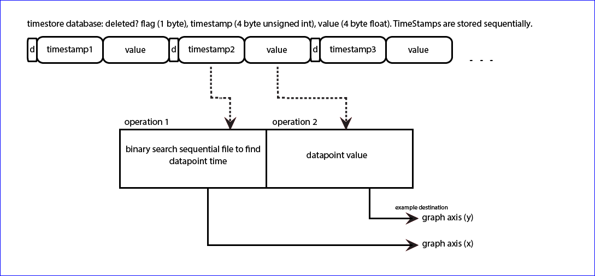

## Variable interval

PHPTimeSeries source code can be found here: [PHPTimeSeries.php](https://github.com/emoncms/emoncms/blob/master/Modules/feed/engine/PHPTimeSeries.php)

Variable interval storage such as PHPTimeSeries records the timestamp along with the value for each datapoint in the data file. The datapoints are only allowed to be written in timestamp accending order so that the data file is always in an ordered state. This allows the timestamp to be used as an index on which a binary search can be used to find any datapoint at a given time.
Each data point is stored as a fixed length binary. In PHPTimeSeries each datapoint is 9 bytes long. The first byte is a flag that can be used to indicate a deleted datapoint without physically removing that datapoint from the file. The next 4 bytes store the timestamp as an unsigned integer and the last 4 bytes store the value as a float. The primary reason to store each datapoint as fixed length binary data like this is that the program can know the start and end of each datapoint without searching through the file for endlines or other markers, the program knows that each datapoint starts at an integer number of 9 bytes.

**Note:** The 9 byte datapoint structure used in PHPTimeSeries is the same as the structure used by MYSQLTimeSeries engine, PHPTimeSeries was designed to be able to read the mysql time series data files directly. PHPTimeSeries does not yet implement the use of the deleted datapoint flag byte. If I where writing a new variable interval feed engine I would be tempted to drop the use of the deleted datapoint flag, An erronous datapoint could be corrected rather than deleted.

**PHPTimeSeries:**

### Writing to the timeseries data file

Adding a new datapoint to the timeseries data file could be as simple as:

    $fh = fopen("feed.1.dat","a");
    fwrite($fh,pack("If",$time,$value));
    fclose($fh);

This however does not enforce timestamp ordering or ensure that if the datafile was partially writen in a previous write the new datapoint is in the correct multiple of 9 bytes position in the file.

    $fh = fopen("feed.1.dat","c+");
    $npoints = floor(filesize("feed.1.dat") / 9.0);
    $last_datapoint_position = ($npoints – 1) * 9.0;
    fseek($fh,$last_datapoint_position);

Note: Due to the way filesystems work writing 9  bytes at a time to each data file in this way is not particularly write efficient. File systems usually have a minimum IO size that is much larger than 9 bytes, we can improve the engine write implementation by buffering and writing in large blocks that are closer to this minimum IO size. This is the current area of research in emoncms feed engines.

### Reading from the timeseries data file.

To read a datapoint from a file we need to seek to the start position of the datapoint in the file, read in the datapoint length (9 bytes) and finally unpack the binary in to the format we require. Here's an example of reading the 100th datapoint from a phptimeseries file:

    $datapoint = 100;
    $datapoint_position = $datapoint * 9.0;
    fseek($fh,$datapoint_position);
    $bin = fread($fh,9);
    $datapoint = unpack("x/Itime/fvalue",$bin);
    print $datapoint['time']." ".$datapint['value'];

It can often be useful to write your own data processing script that can read through the whole file. The data can be read through sequentially by placing the above in a loop that starts at datapoint 0 and ends at the last datapoint in the file.

To view and explore historical timeseries data it's useful to be able to zoom in and out and pan through large amounts of historical data displayed on a graph. Given that the screen resolution you might view a graph on might be at most 1920 pixels wide and that its would be hard to distinguish datapoints wich where spaced at much less than 2-3 pixels the number of datapoints required for the graph will be in the region of 800 datapoints. The timeseries data file might have many millions of datapoints in it and our query range may span many thousands or millions of datapoints and so we need a way to extract a lower resolution of datapoints than the recorded resolution.

There are several different ways that this can be done, one often used approach is to pre-compile downsampled layers that are the arithmetic mean of the higher resolution layers above, this allows for the selection of one block from the relevant layer and has the added advantage that the datapoints returned are representative of the period they represent, this approach is used in the more advanced fixed interval with averaging time series engine that is also an option within emoncms.

The other approach currently used in the PHPTimeSeries engine is to request a datapoint at evenly spaced out intervals in time in the query range.

For example if our query spanned 10th of February 2014 (timestamp: 1391990400) to 17th of June 2014 (1402963200) this would cover a range of 10,972,800 seconds, if the underlying data was recorded at around 10 second intervals and we want 800 datapoints across the range we need to pull out a datapoint every ~1370 seconds.

To fetch a datapoint at a given time from the  datafile above we need to search through the file for a datapoint that is closest to the requested time. We can do this efficiently using a search algorithm called a binary search, a binary search can be used where the data is ordered. Our timeseries data is ordered by time ascending and so is perfect for using a binary search.

A binary search works by finding the file midpoint and then asking if the datapoint we want is in the first half or the second half it then finds the mid point of the half it was in and asks which half of this new range its in, until it narrows down on the value. This simple approach usuall finds the datapoint you want in around 20 itterations compared to the brute force method which may need to go through the whole file that may be millions of lines long.

The binary search method in the phptimeseries engine looks like this:

    private function binarysearch($fh,$time,$filesize)
    {
        $start = 0; $end = $filesize-9;

        // 30 here is our max number of itterations
        // the position should usually be found within
        // 20 itterations.
        for ($i=0; $i<30; $i++)
        {
            // Get the value in the middle of our range
            $mid = $start + round(($end-$start)/18)*9;
            fseek($fh,$mid);
            $d = fread($fh,9);
            $array = unpack("x/Itime/fvalue",$d);

            // If it is the value we want then exit
            if ($time==$array['time']) return array('pos'=>$mid,'time'=>$array['time'],'value'=>$array['value']);

            // If the query range is as small as it can be 1 datapoint wide: exit
            if (($end-$start)==9) return array('pos'=>($mid-9),'time'=>$array['time'],'value'=>$array['value']);

            // If the time of the last middle of the range is
            // more than our query time then next itteration is lower half
            // less than our query time then nest ittereation is higher half
            if ($time>$array['time']) $start = $mid; else $end = $mid;
        }
    }

This binary search function can then be called within a loop that itterates through the request times we are looking for:

    for ($i=0; $i<$dp; $i++)
    {
        $result = $this->binarysearch($fh,$start+($i*$interval),$filesize);
        $data[] = array($time*1000,$result['value']);
    }

Full PHPTimeSeries source code can be found here: [PHPTimeSeries.php](https://github.com/emoncms/emoncms/blob/master/Modules/feed/engine/PHPTimeSeries.php)
