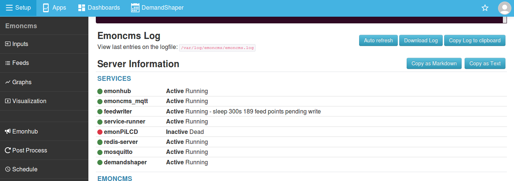

# Troubleshooting

Start with the [community forum FAQ](https://community.openenergymonitor.org/t/frequently-asked-questions/3005).

## Inputs or feeds not updating

### Check the services

Go to **Setup > Admin > System Info** and check the **Services** list. `emonhub`, `emoncms_mqtt`, `feedwriter`, `redis-server` and `mosquitto` should all show **Active** and running.



To check a service via SSH:

```
sudo systemctl status emoncms_mqtt
```

Common causes of a stopped service:

- Incorrect configuration or installation.
- A full `/tmp` or `/var/log` partition.
- SD card corruption after a power cut.

`emoncms_mqtt` and `feedwriter` depend on `redis-server`. `emonhub` and `emoncms_mqtt` depend on `mosquitto`.

### Services running but no inputs

Check the log at **Setup > EmonHub**:

- No `NEW FRAME` lines means emonHub receives no data from the radio or the measurement board. Check the hardware and the radio settings in emonhub.conf. Click **Edit config** on the EmonHub page.
- `NEW FRAME` lines but no `MQTT Publishing:` lines means a problem with the MQTT interfacer. Compare it with the [default emonhub.conf](https://github.com/openenergymonitor/emonhub/blob/emon-pi/conf/emonpi.default.emonhub.conf).

See [emonHub troubleshooting](../emonhub/troubleshooting.md) for an example of a working log and how to read it.

### emonHub not running

Check the log at **Setup > EmonHub**. A common cause is an error in emonhub.conf. Check it against the [default emonhub.conf](https://github.com/openenergymonitor/emonhub/blob/emon-pi/conf/emonpi.default.emonhub.conf).

### Emoncms MQTT service not running

Check **Setup > Admin > Emoncms Log**, or via SSH:

```
tail /var/log/emoncms/emoncms.log
```

A common cause is a problem with MySQL, Redis or Mosquitto. Try a reboot.

### Ask for help

Post on the [community forum](https://community.openenergymonitor.org/). Include any errors from the logs and the server information from **Setup > Admin > System Info**. Click **Copy as Markdown** and paste the result into your post.

## Disk space

Check free space in the **Disk** section of **Setup > Admin > System Info**. The data partition is `/var/opt/emoncms`.

If a partition is full, ask for help on the forum as above.

## Incorrect system time

The emonPi and emonBase must have the correct time, set to UTC. They get the time from an NTP server, so they need an internet connection at boot. For long periods without internet, [add a hardware real time clock](../emonpi/modifications.md).

On the emonPi, press the LCD button until the `uptime` page shows the time.

To check the time via SSH:

```
timedatectl
```

`System clock synchronized: yes` shows that the time is set from NTP.

### Force a time update

1. Check that the emonPi or emonBase has an internet connection.
2. Reboot.
3. If the time is still wrong, connect via SSH ([credentials](../emonsd/download.md)) and restart the time service:

   ```
   sudo systemctl restart systemd-timesyncd
   ```

4. Run `timedatectl` again to check.

### Set the Emoncms timezone

The system time is UTC. Emoncms applies your timezone separately. To set it, go to **Setup > My Account** and change **Timezone**.

## Vrms reads twice the expected value

In North America, see [Use in North America](../emonpi/north-america.md). Step 3 covers software calibration.

## Reset a local password

Connect via SSH ([credentials](../emonsd/download.md)) and run:

```
php /opt/emoncms/modules/usefulscripts/resetpassword.php
```

Enter the user id (default 1), then a new password or press enter to generate one:

```
=======================================
EMONCMS PASSWORD RESET
=======================================
Select userid, or press enter for default:
Using default user 1
Enter new password, or press enter to auto generate:
Auto generated password: 9f7599c8da
```

If you have also forgotten the username, list the users in the database. Enter the MySQL password when prompted ([credentials](../emonsd/download.md)):

```
mysql -u emoncms -p emoncms -e "SELECT id, username, email FROM users;"
```

## Factory reset

```{warning}
A factory reset deletes all Emoncms data.
```

```
sudo /opt/openenergymonitor/EmonScripts/other/factoryreset
sudo reboot
```
