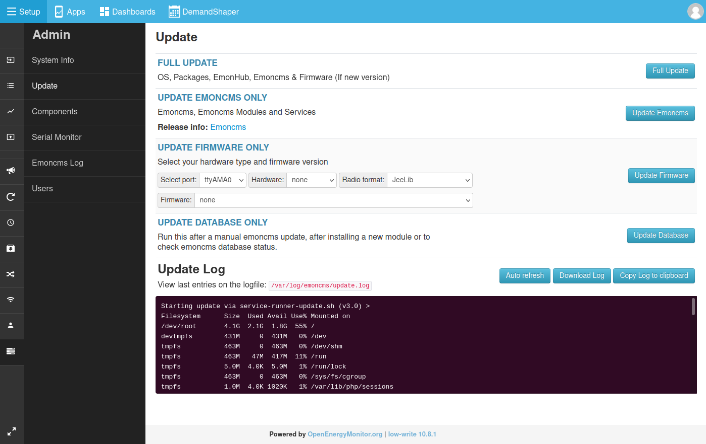

# Update

Keep the emonPi or emonBase up to date with the updater on the **Admin** page. It updates the operating system packages, emonHub, Emoncms and its modules.

We also release new [emonSD images](../emonsd/download.md). A new image can include changes that the updater cannot make, such as a new partition layout. Move to a new image when one is released.

## Run an update

1. Go to **Setup > Admin > Update**.
2. Click **Full Update**.
3. Watch the **Update Log** until the update finishes.

**Full Update** does not update the firmware on the emonPi or emonTx. Use **Update Firmware Only** for that.

## Update the database

Run **Update Database** after a manual Emoncms update or after installing a module:

1. Go to **Setup > Admin > Update**.
2. Click **Update Database**.
3. If changes are listed, click **Apply changes**.

Updates from before version 11.5.7 also need this step.

## Components

**Setup > Admin > Components** lists Emoncms and each module with its version and branch. Use it to update one component, or to switch between the `stable` and `master` branches.

## If an update fails

Save the update log and run the update again. If it fails again, post on the [community forum](https://community.openenergymonitor.org). Include the update log and the server information from **Setup > Admin > System Info**. Click **Copy as Markdown** and paste the result into your post.

## Move to a new emonSD image

Write the new image to a new SD card, then import your data from the old card with a USB SD card reader. Keep the old card as a backup. See [Backup and restore](import.md#move-to-a-new-sd-card).
