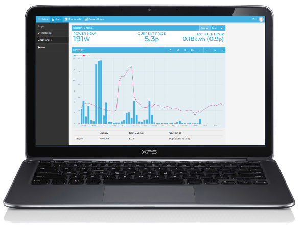
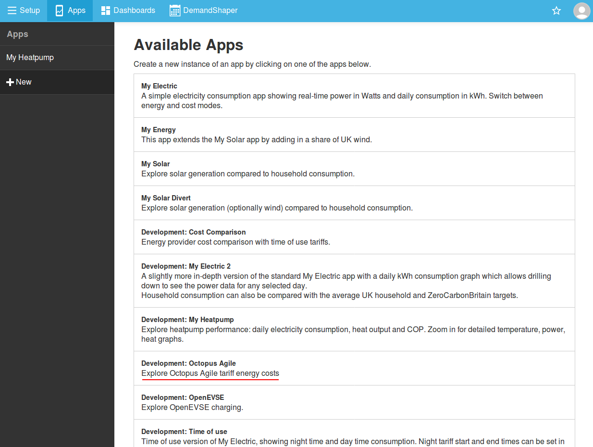
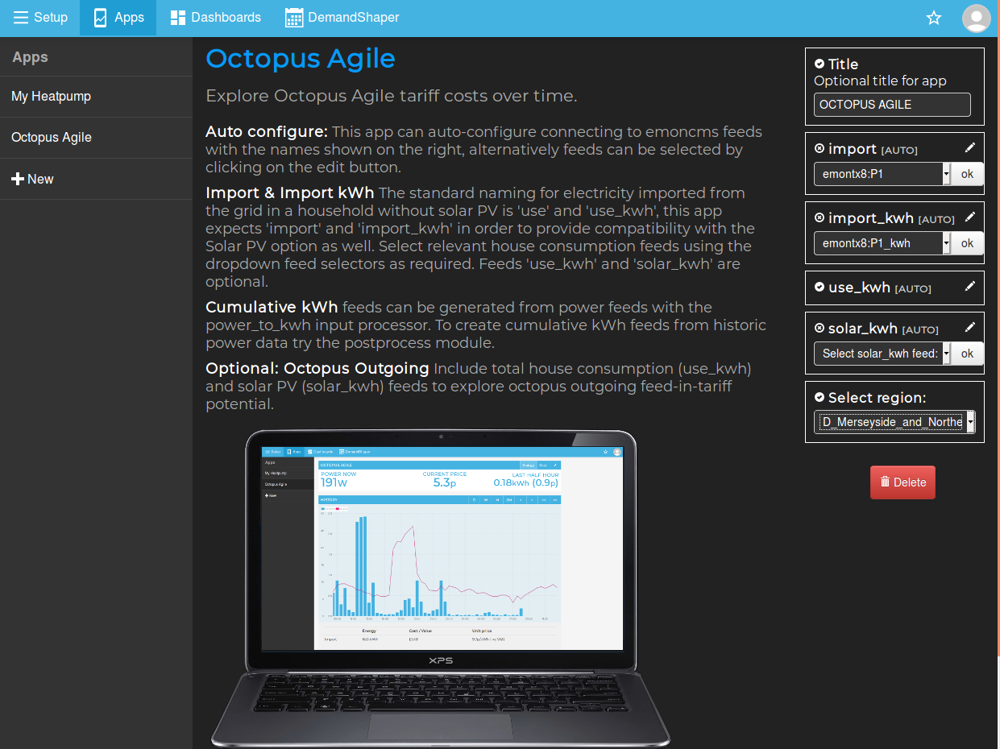
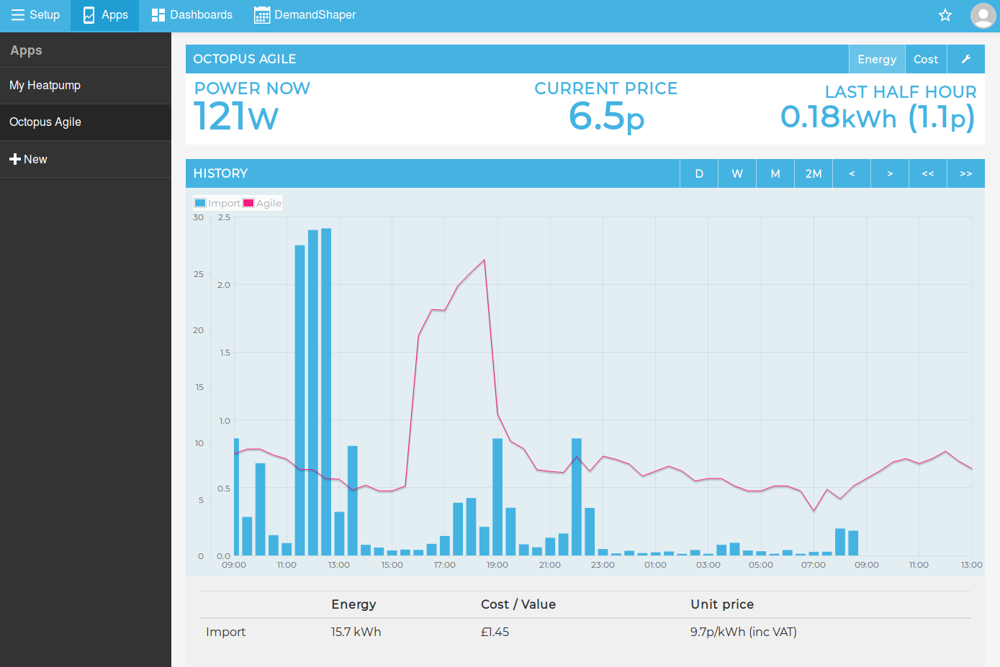
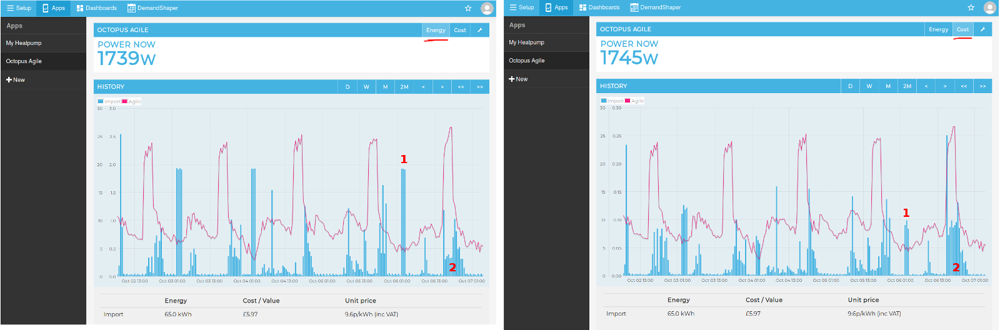
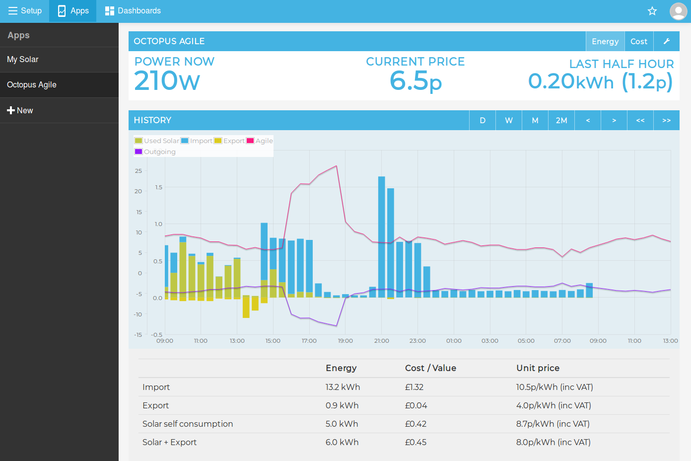
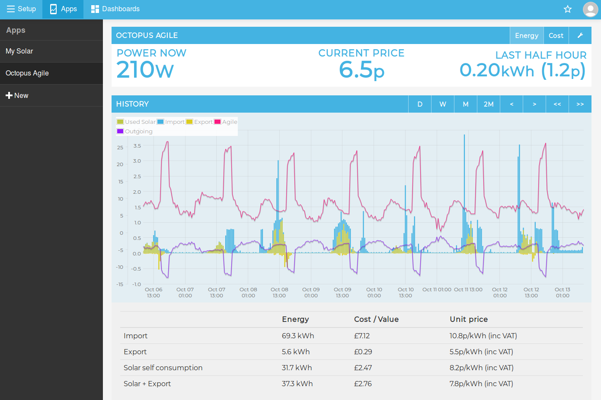
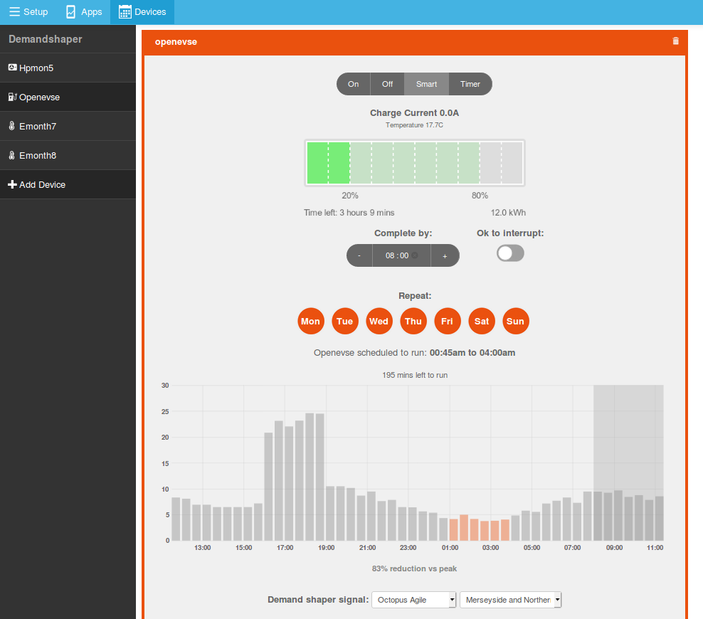

# Octopus Agile app

## What is Octopus Agile?

[Octopus Agile](https://octopus.energy/agile/) is a time of use tariff available in the UK from Octopus Energy. The tariff varies on a half hourly basis and tracks the wholesale cost of electricity and electricity network costs. Electric loads such as water heating and electric vehicles can take advantage of time-of-use tariffs by charging at lower cost off-peak times - both providing a direct financial benefit for the household and in turn reducing the infrastructure requirements and associated cost that would otherwise be needed if these loads where added at periods of peak demand.

The Octopus Agile tariff is a first of it's kind in the UK both making use of new smart meter technology and being available nation wide. The tariff is a 100% renewable energy tariff. For more information on the tariff see the Octopus website and associated blog posts:

- [https://octopus.energy/agile](https://octopus.energy/agile)
- [https://octopus.energy/blog/agile-octopus-bigger-story/](https://octopus.energy/blog/agile-octopus-bigger-story/)
- [https://octopus.energy/blog/agile-pricing-explained/](https://octopus.energy/blog/agile-pricing-explained/)
- [https://octopus.energy/blog/outgoing/](https://octopus.energy/blog/outgoing/)

You may also be interested in community member Mick Wall's (@Zarch) [Energy Stats](https://www.energy-stats.uk) website that provides tariff pricing over time for quick reference, see his forum post here: [My Octopus Agile & Go Tariff comparison / analysis website](https://community.openenergymonitor.org/t/my-octopus-agile-go-tariff-comparison-analysis-website/10987).

## Octopus Agile Simulator

We designed this app out of our own interest to find out how much the Agile tariff would cost in our own homes. With historic data from OpenEnergyMonitor energy monitoring and historic agile tariff pricing provided by Octopus it's possible to simulate what past consumption would have cost on the Agile tariff.

## 1. Hardware & Software requirements

The Octopus Agile emoncms app runs within our open source energy monitoring web application called [emoncms](https://github.com/emoncms/emoncms). Emoncms is available pre-installed on either our web connected energy monitoring base stations the [emonBase & emonPi](https://guide.openenergymonitor.org/setup/), or via our [emoncms.org](https://emoncms.org/) online service. It's also possible to install emoncms on your own hardware or VM, we have a nice installation script to help with this for use with Debian systems, see [EmonScripts](https://github.com/openenergymonitor/EmonScripts).

It's possible to either use our clip on CT based energy monitoring hardware to collect historic consumption to use with the app or feed data in yourself via a data collection script if you have an alternative suitable data source. Emoncms has an API to which you can post power data or regular meter readings (resolution must be half hourly or shorter), see [emoncms.org input API page](https://emoncms.org/site/api#input). Emoncms can then process this into a timeseries feed of [cumulative kWh electricity consumption](https://guide.openenergymonitor.org/setup/daily-kwh/).

If you would like to use our hardware, follow either the Home Energy Monitor or Solar PV application guide first before continuing with the Agile App setup below. These guides cover which hardware to use, installation and emoncms feed setup.

<table>
<tr><td style="width:50%; text-align:center">

<h3><a href="https://guide.openenergymonitor.org/applications/home-energy/">Home Energy Monitor setup guide</a></h3>

Rename the <i>use</i> and <i>use_kwh</i> feed names suggested in the Home Energy Monitor guide to <i>import</i> and <i>import_kwh</i> for use with the app.

</td><td style="width:50%; text-align:center">

<h3><a href="https://guide.openenergymonitor.org/applications/solar-pv/">Solar PV setup guide</a></h3>

Feed names suggested in this guide are already suitable. No need to change.

</td></tr>
</table>

## 2. Adding the Octopus Agile Emoncms App

Once logged in to emoncms, navigate to 'Apps', click on '+ New' and then from the list of available apps select 'Development: Octopus Agile'.

## 3. App Configuration

If the app does not load automatically you will at this point see the configuration window allowing feed selection. The app requires the selection of an *import* and *import_kwh* feed. If you do not have on-site generation such as solar pv *import* and *import_kwh* will be the same as your total house consumption. Import is the power feed in watts and *import_kwh* is the cumulative kWh feed typically created using the *power_to_kwh* input processor.

If you have historic power data but not a cumulative kWh feed, it is possible to create a cumulative kWh feed from the power feed using the emoncms postprocess module. The emoncms postprocess module is available from the emoncms setup menu, select the power_to_kwh processor and the power feed you wish to convert, enter a name for the new feed e.g import_kwh and then click Create. The new feed will be created within a couple of minutes and will be available in the feed list.

If you do not have solar you do not need to specify a *solar_kwh* feed or the *use_kwh* feed. The *Launch App* button will appear with only *import* and *import_kwh* specified.

Select the relevant Octopus Agile region for your location.

## 4. Agile Import only

Compatible with the OpenEnergyMonitor [Home Energy Monitor configuration](https://guide.openenergymonitor.org/applications/home-energy/).

The default view shows half hourly consumption in blue over the last 24 hours and the forecasted price for the coming 4 hours. The Agile tariff price is overlayed in purple and the current price and cost in the last half hour is shown at the top.

The average unit price is shown below the graph. The average unit price is calculated by summing up the cost in each half hour and then dividing by the total amount of consumption in the view.

## 5. Energy and Cost mode

Switch between Energy and Cost mode to see how the time of use tariff affects the significance of different loads. The following example shows an EV charge event [1] and heat pump heating event [2]. The EV charge event uses much more energy in each half-hour than the heat pump but in terms of cost per half hour, they are about the same.

## 6. Agile Outgoing and Solar PV:

Compatible with the OpenEnergyMonitor [Solar PV configuration](https://guide.openenergymonitor.org/applications/solar-pv/).

In addition to the standard import view the app also has the ability to explore the [Octopus agile outgoing smart export tariff](https://octopus.energy/blog/outgoing/). In addition to calculating export value and average unit price, the app also calculates the value of the solar self consumption based on the half-hourly value of otherwise imported electricity on the agile tariff. The combined value of the self-consumption and export is also displayed.

In the week long average screenshot below covering 06 Oct to 13 Oct we can see the expected result that the value of the day time self consumption is a little lower than the cost of the imported electricity which is greater during the more expensive evening peak. The export value of the solar matches pretty closely to the fixed agile outgoing price. The app also shows the combined value of the Solar self consumption and export. This house includes PV diversion and EV charging. It would be interesting to model the addition of battery storage to use more of the solar and reduce peak time consumption.

## 7. Smart scheduling with Octopus Agile

If you are interested in this app you may also be interested in the Emoncms Demand Shaper module, which can be used to schedule electric vehicle charging or smart plugs to make best use of the cheaper agile tariff times. For more information see: [Emoncms DemandShaper](https://guide.openenergymonitor.org/integrations/demandshaper/).

## Further Development

The Octopus Agile emoncms app is under ongoing development, for more information on features planned and for support using the app see the forum post: [Octopus Agile emoncms app](https://community.openenergymonitor.org/t/octopus-agile-emoncms-app/11767).

The source code for this app is available on github here: [https://github.com/emoncms/app/blob/master/apps/OpenEnergyMonitor/octopus/octopus.php](https://github.com/emoncms/app/blob/master/apps/OpenEnergyMonitor/octopus/octopus.php)
