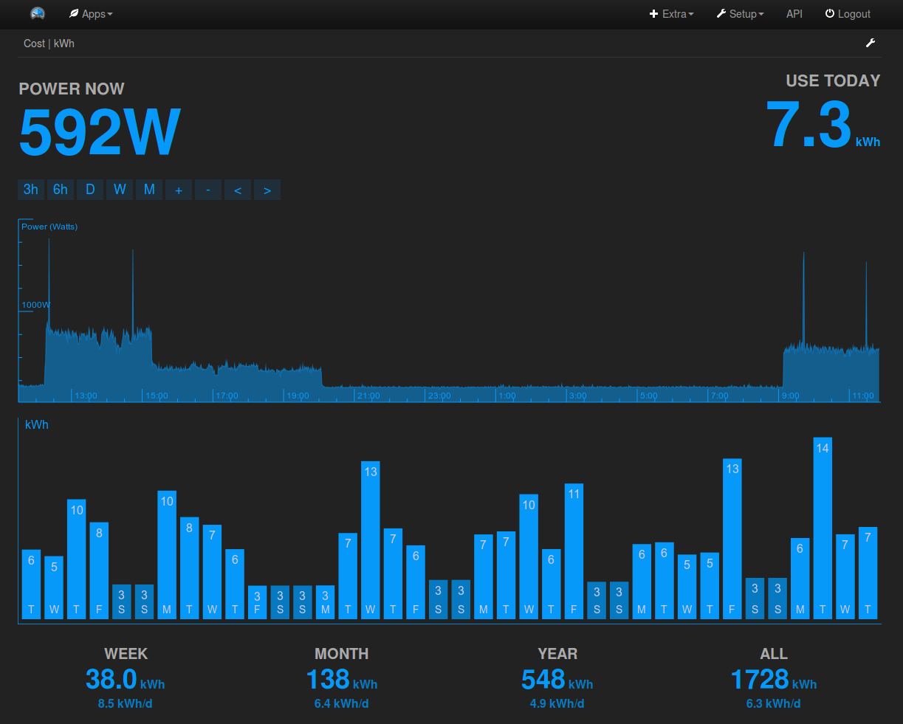
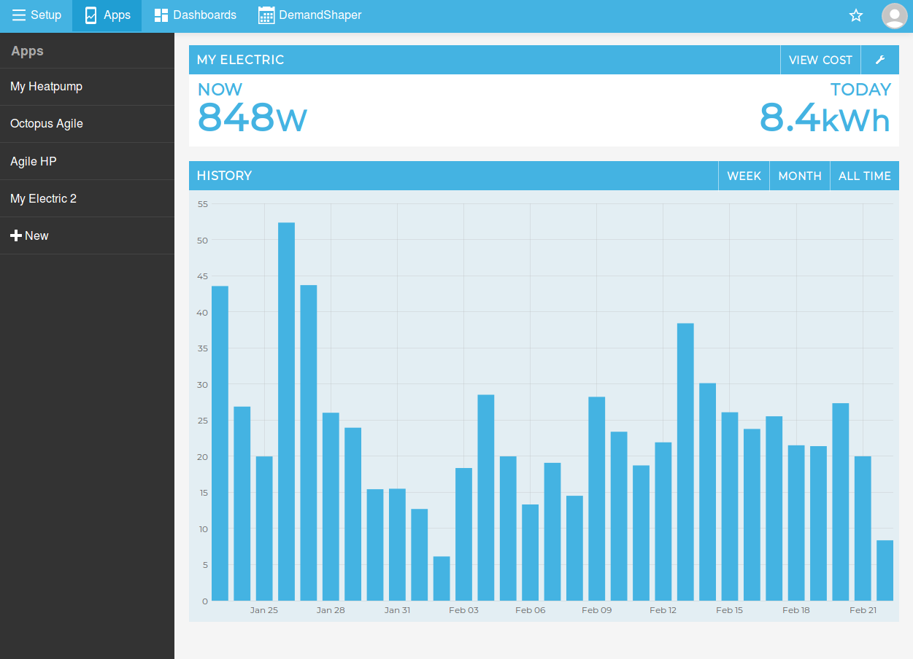
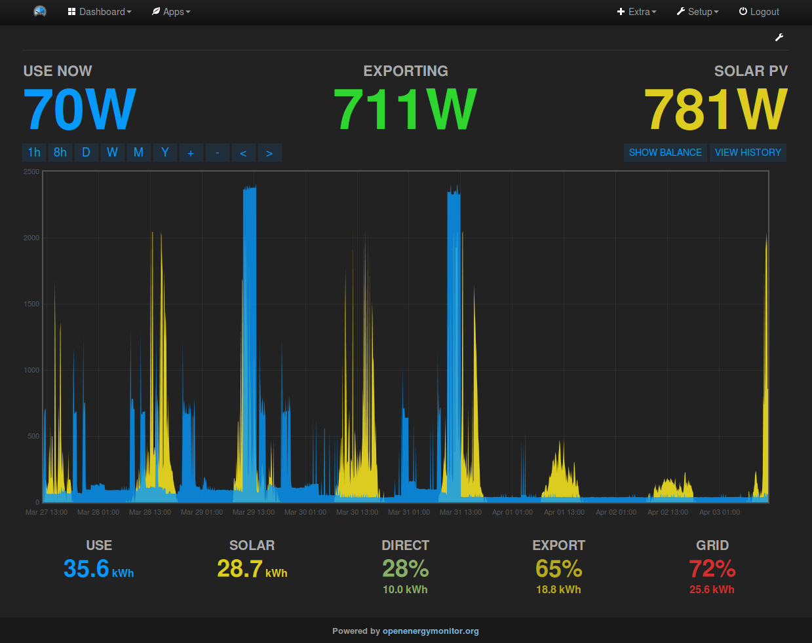
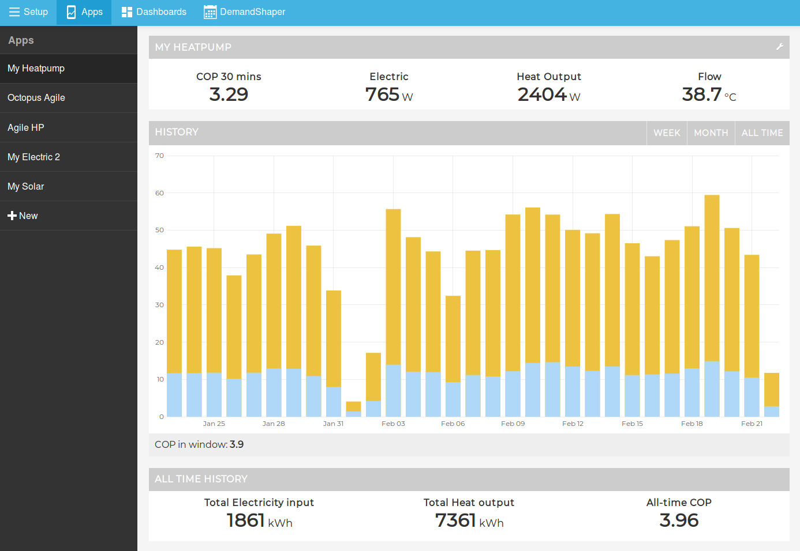
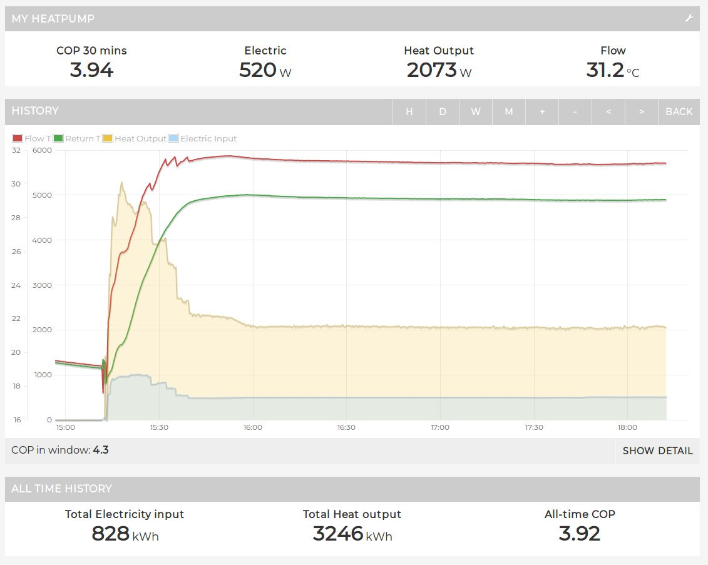

# Application dashboards

The Emoncms app's module contains pre-built application specific dashboards. These are built from the ground up for ease of setup, responsive design and to often include calculations that are harder to perform in the custom dashboard builder.

**Available Apps**

- My Electric
- My Energy
- My Solar
- My Solar Divert
- Cost Comparison
- My Electric 2
- My Heatpump
- Octopus Agile
- Time of use
- Time of use - flexible
- Time of use - flexible + CL

## My Electric

My Electric is a dashboard designed for the simple [home energy monitor application](/applications/home-energy). It includes realtime power and kWh used today as well as a moving power graph and daily kWh bar chart.

## My Electric 2

My Electric 2 is a slightly more interactive version of the 'My Electric' dashboard. Clicking on a particular day on the bar graph zooms in to see the power graph for that day, providing an easier way to explore historic consumption data.

## My Solar PV

The My Solar app can be used to explore onsite solar generation, self consumption, export and building consumption both in realtime with a moving power graph view and historically with a daily and monthly bargraph. See [Solar PV application guide](/applications/solar-pv).

## My Heatpump

The My Heatpump app can be used to explore the performance of a heatpump including, electricity consumption, heat output, COP and system temperatures. 

Clicking on a particular day brings up the detailed electric, heat, flow and return temperature graph for that day:

