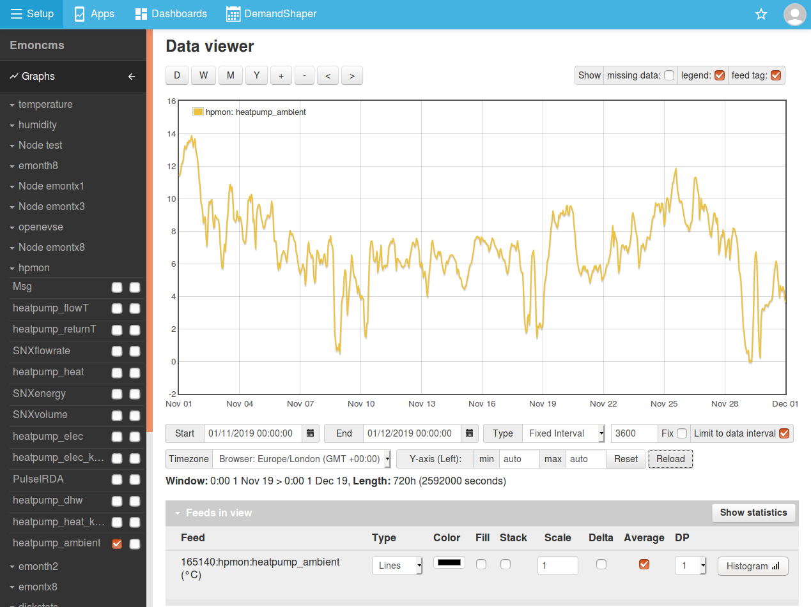

# Calculating Averages

This guide details how to generate interval based averages i.e hourly, or timezone correct: daily, weekly and monthly averages from emoncms feeds. Designed for determining power, temperature and humidity averages.

Averages are returned for the time period given by the returned timestamp up to the next timestamp. The timestamp is for the start of the average period.

## Hourly averages

1. Open the feed for which you wish to generate averages for in the default data viewer called graph.
2. Click on the Average tickbox for the feed, below the graph.
3. Select 'fixed interval' for type and then enter 3600 in the box next to it (i.e: 3600 seconds in an hour)
4. To complete hit **Reload**.

**Note:** If its your first time you may need to click on **Reload a second time** as the averages are computed in the background when the request is first made.

The result should look like this:

**CSV Export:** The returned averages can be exported as CSV for use in external programs by clicking on the 'Show CSV Output' button available at the bottom of the graph viewer page. See Exporting CSV for more on this.

## Daily averages

To calculate timezone correct daily averages:

1. Open the feed in the default data viewer (graph) as above.
2. Click on the Average tickbox for the feed, below the graph.
3. select **daily** for type from the dropdown menu.
4. To view the output as a bar graph select 'Bars' from the dropdown graph type selector next to the feed
5. To complete hit **Reload**.

**CSV Export:** The returned averages can be exported as CSV for use in external programs by clicking on the 'Show CSV Output' button available at the bottom of the graph viewer page. See Exporting CSV for more on this.
