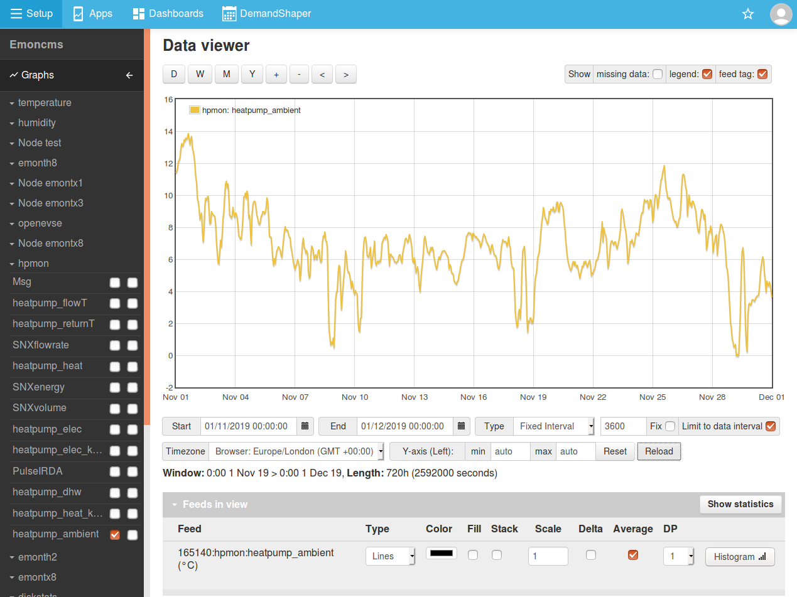
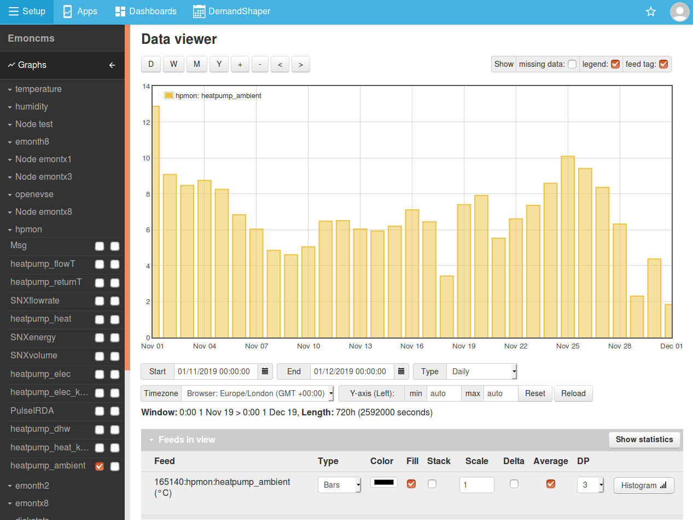

# Averages

The graph view calculates hourly, daily, weekly and monthly averages of any feed, such as power, temperature or humidity. Daily, weekly and monthly periods follow your timezone.

Each value is the mean from its timestamp to the next. The timestamp marks the start of the period.

## Hourly averages

1. Open the feed in the [graph view](graphs.md).
2. Set **Type** to **Fixed Interval** and set the interval to 3600 seconds.
3. In **Feed Config**, tick **Average**.

## Daily averages

1. Open the feed in the graph view.
2. Set **Type** to **Daily**.
3. In **Feed Config**, tick **Average** and set **Type** to **Bars**.

Averages are calculated in the background on first request. If the graph is empty, click **Refresh** after a few seconds.

To export the averages, see [Export CSV](export-csv.md).
