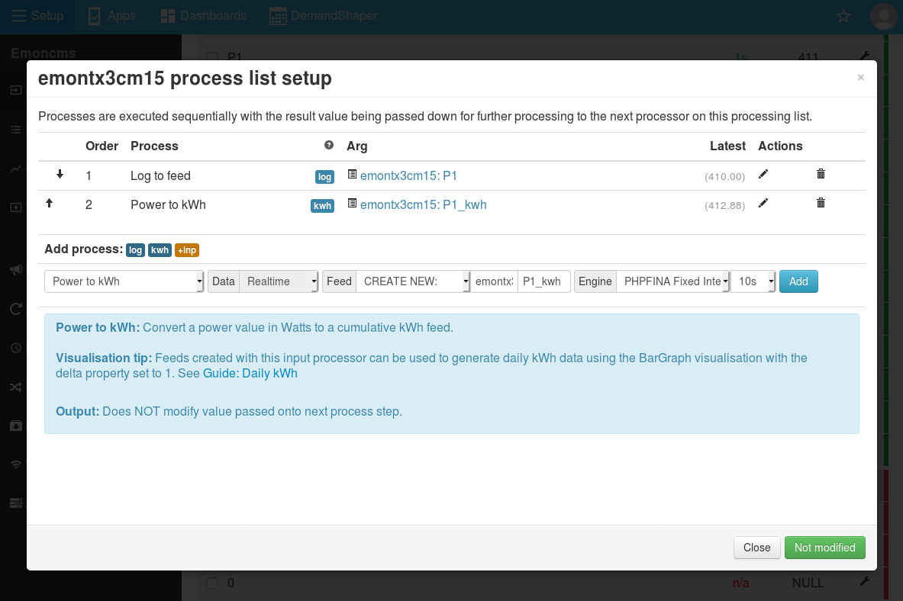
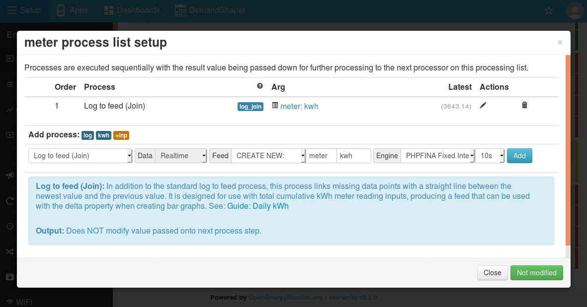
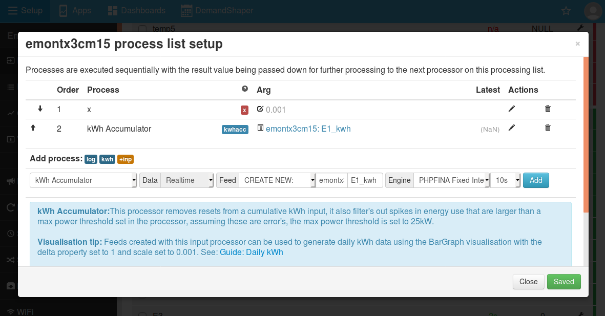
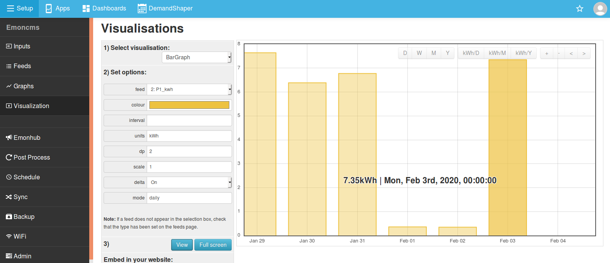
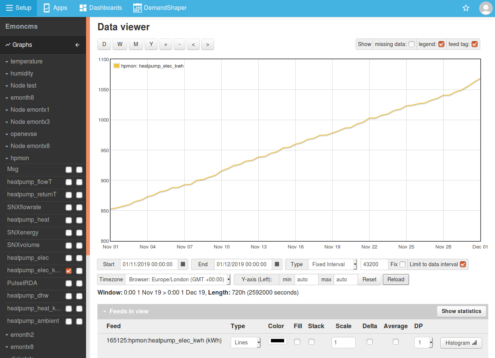
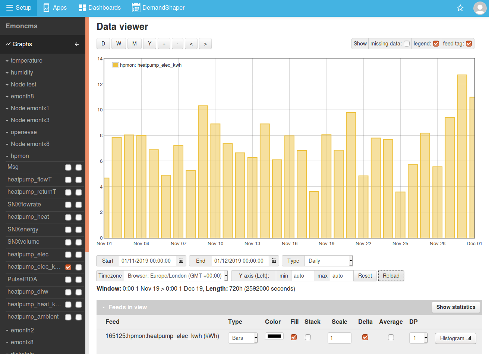

# Calculating Daily kWh

Emoncms supports the creation of daily, weekly & monthly kWh data and graph's from several different emoncms input types.

- Power in Watts (i.e emontx, emonpi CT channels)
- Wh/kWh readings that do not reset on power cycle e.g energy meters
- Wh/kWh readings that reset on power cycle e.g emontx/emonpi pulse count

## Creating daily kWh data from power inputs

The standard emonTx and emonPi firmware transmit real power values for each CT channel. Accumulating kWh data can be calculated from this power data using the emoncms "Power to kWh" input processor.

1. In the inputs interface select the power input for which you wish to generate kWh data. Click on the spanner icon to bring up the input processing configuration interface.

2. Select the `power to kWh` input processor and create a feed, select a feed interval that either matches your post rate i.e 10s on the emontx and emonpi or for reduced disk use; intervals of up to 3600s can be used. Add `_kwh` to the feed name in order to help distinguish it from the power feed.

## Creating daily kWh data from cumulative Wh or kWh inputs

**Option 1: Wh/kWh readings that do not reset on power cycle e.g energy meters** 
If meter data is irregular, missing data will be recorded as null values with the standard 'log to feed' input process. If a null value happens to coincide with midnight, the bar graph produced will show spikes or gaps. To avoid this issue use the `Log to feed (Join)` input process - which joins across missing values with a straight line.

1. In the inputs interface select the input for which you wish to record kWh data. Click on the spanner icon to bring up the input processing configuration interface.

2. If the input value is in Watt hours (Wh) apply a scale of 0.001 to convert to a kWh reading.

3. Select the `Log to feed (Join)` input processor and create a new feed, select a feed interval that either matches your post rate i.e 10s on the emontx and emonpi or for reduced disk use; intervals of up to 3600s can be used.

**Option 2: Wh/kWh readings that reset on power cycle e.g emontx/emonpi pulse count** 
The emontx and emonpi pulse count and continuous monitoring cumulative energy inputs reset if the unit is power cycled. If these inputs are recorded with the standard 'log to feed' process the resulting feed includes all resets as well as null values if there is any missing data. The bar graph produced will show spikes or gaps. To avoid this issue use the `Wh Accumulator` or `kWh Accumulator` input process - which both joins across missing values with a straight line and removes the reset - continuing from the value prior to the reset.

1. In the inputs interface select the input for which you wish to record kWh data. Click on the spanner icon to bring up the input processing configuration interface.

2. If the input value is in Watt hours (Wh) apply a scale of 0.001 to convert to a kWh reading.

3. Select the `kWh Accumulator` input processor and create a new feed, select a feed interval that either matches your post rate i.e 10s on the emontx and emonpi or for reduced disk use; intervals of up to 3600s can be used.

---

## Viewing a kWh per day bar graph

**Note:** At least 2 days of data is required to generate a daily kWh graph from accumulating kWh data. At the moment, the bar graphs built using the vis module don't show the current day's kWh consumption. The MyElectric app in the apps module, which also uses the cumulative kWh feed type, does show the current day.

Click on `Setup > Visualisation`, and select the `BarGraph`.

Select the cumulative kWh feed created above.

**Delta:** The important property here is 'delta'. With delta set to 1, the bar graph will draw the total kWh for each day calculated from the kWh value at the end of the day, minus the kWh value at the start of the day.

**Scale & Units:** If the feed is in watt hours, the scale can be used to convert it to kWh by multiplying by 0.001. Units can be set in the units field.

**Interval:** The interval property can be set if you wish to have kwh at a set interval such as kwh per hour, for daily, weekly, monthly data use the **mode** property.

**Mode:** Use this property to obtain timezone correct kwh data. Set to either daily, weekly or monthly.

The same options can be used in dashboards for the same output.

All of the visualisations in emoncms that make use of daily data also support this approach including: SimpleZoom, Stacked, StackedSolar, Zoom and OrderBars.

The **Graph module** (set as default data viewer on the emonPi/emonBase and Emoncms.org) can also be used to create kWh per day bar graph from cumultive Wh / kWh data:

Raw feed cumulative kWh view:

To convert the cumulative kWh feed to daily kWh bargraph using the graph tool select Window `type-daily` feed `type=Bars` and `delta = 1` then click `reload`

