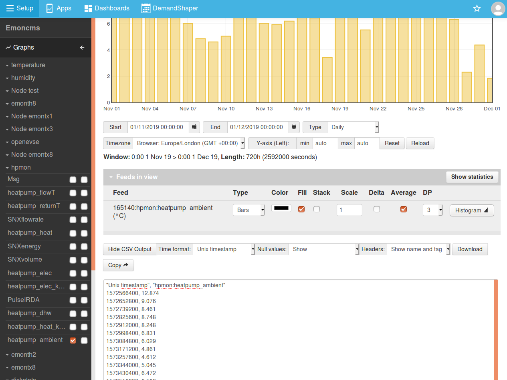
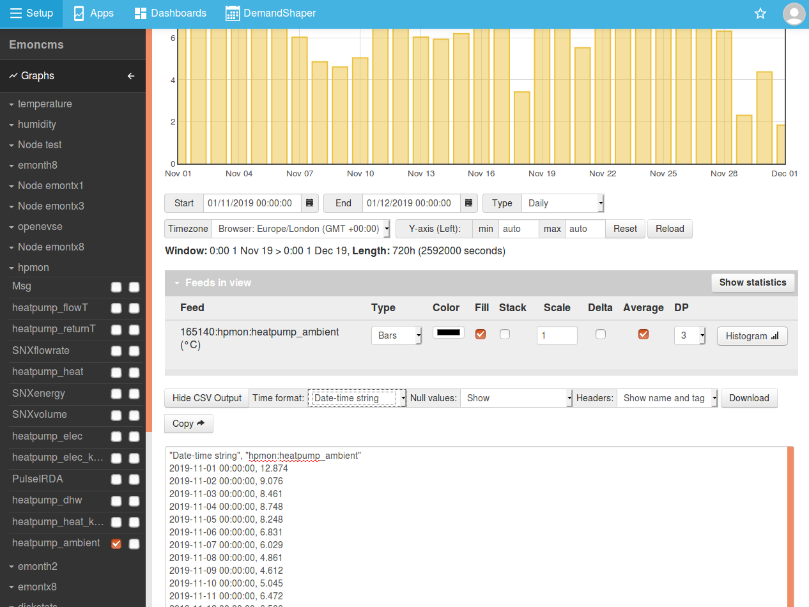
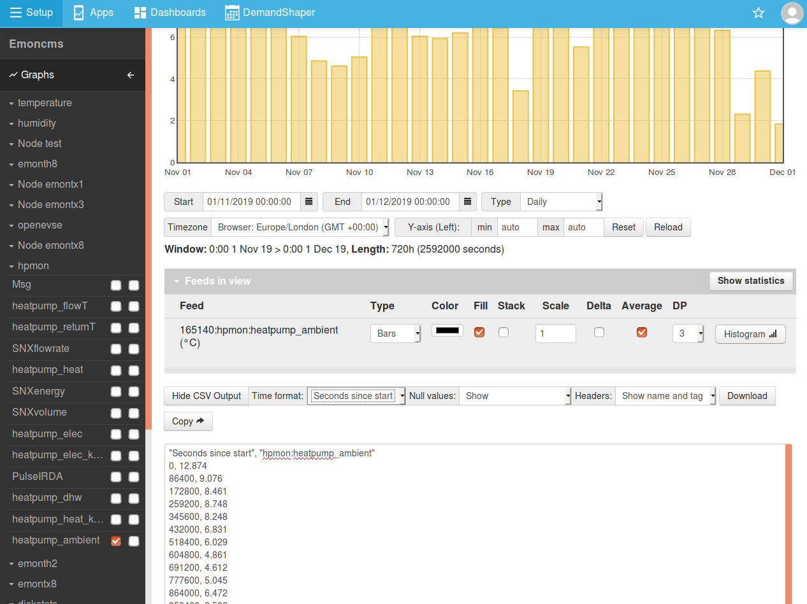
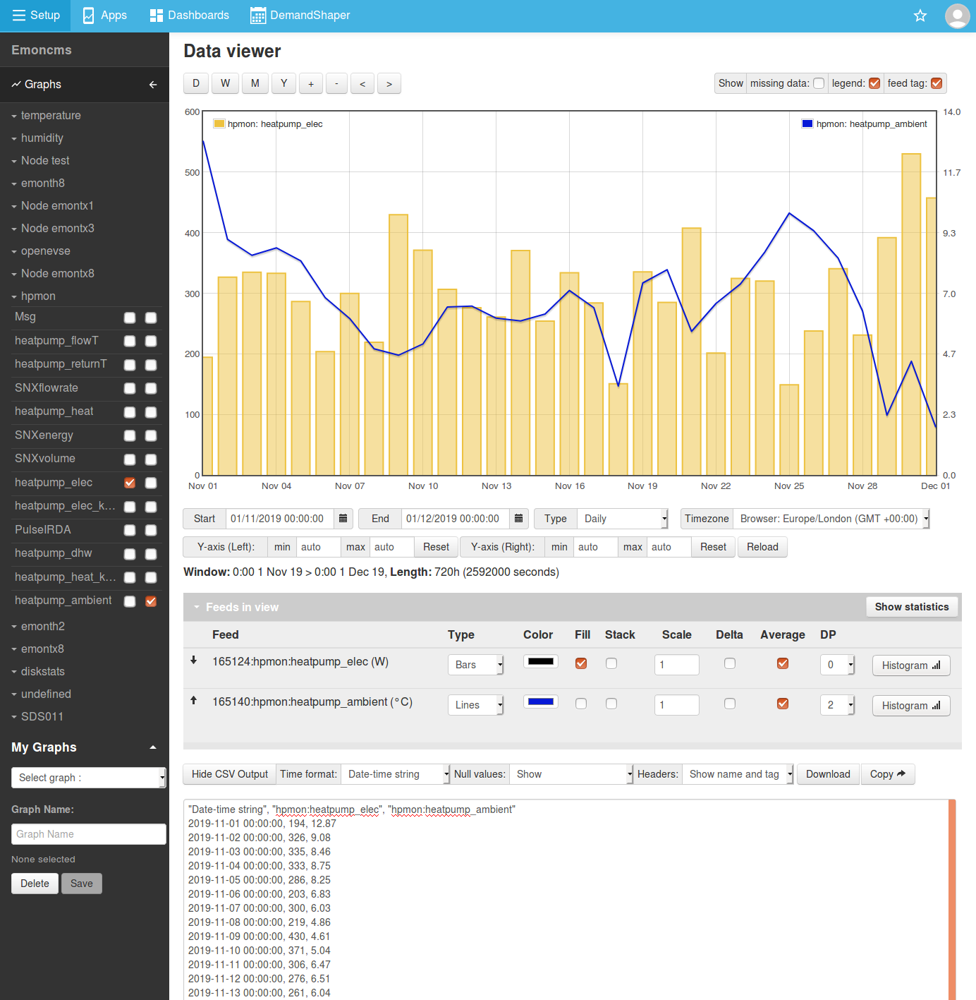
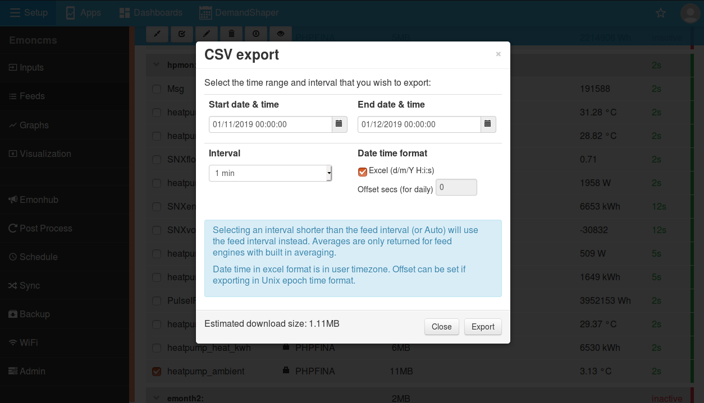

# Exporting CSV

Its possible to easily export data selected using the emoncms data viewer by clicking on the **Show CSV Output** button at the bottom of the page. Multiple feeds can be selected with datapoints aligned to the same timestamps.

The data viewer CSV export tool is limited to 8928 datapoints. For larger exports the export tool that is part of the feed interface can be used, see below.

## Data viewer CSV export tool

There are 3 timestamp formats available:

1. Unix timestamp
2. Seconds since the start of the export
3. Date time string "2016-04-06 00:00:00"

**Unix timestamp**

**Date time string (i.e: 2019-11-01 00:00:00)**

**Seconds since the start of the export**

**Example of exporting multiple feeds**

Multiple feeds can be exported for the same timestamps by selecting multiple feeds from the left hand feed selection menu.

Make sure that null values are shown to ensure that datapoints line up correctly.

## Full Export via Feed interface

Full feed exports can be obtained via the export tool that can be accessed from the feed list interface. The start time, end time interval and timezone offset can be selected and am estimate is given of the download size. Select a feed using the tick box selector and then click on the down-arrow icon in the feed list toolbar to open the feed export tool.

