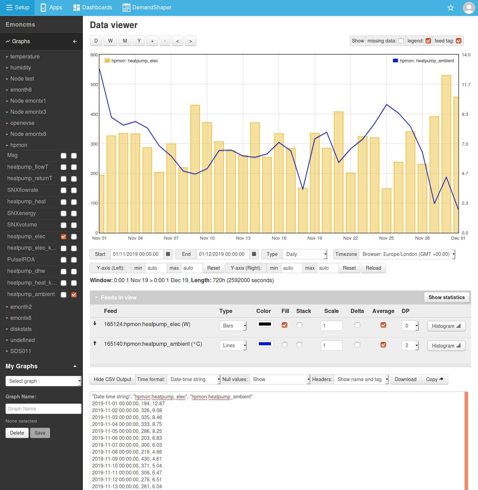
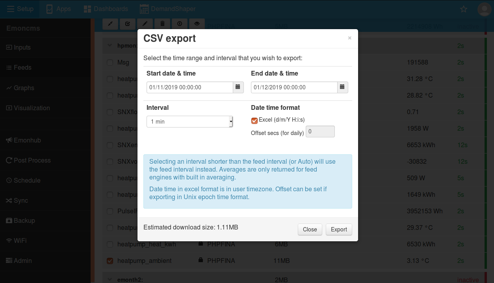

# Export CSV

There are two ways to export feed data as CSV:

- **Graph view**: export what the graph shows, with several feeds on the same timestamps.
- **Feeds page**: export a whole feed or a long period.

## From the graph view

1. Open the feeds in the [graph view](graphs.md) and set the time window and interval.
2. Click **CSV Export**.
3. Choose the options:
   - **Time format**: **Unix timestamp**, **Seconds since start** or **Date-time string**.
   - **Null values**: **Show**, **Replace with last value** or **Remove whole line**.
   - **Headers**: **Show name and tag**, **Show name** or **Hide**.
4. Click **Download**, or **Copy** to copy to the clipboard.

With several feeds, keep **Null values** set to **Show** so that each row lines up on the same timestamp.

Each request is limited to 70,000 datapoints per feed by default (`max_datapoints` in settings.ini). For more, use a longer interval or export from the feeds page.

## From the feeds page

1. On the **Feeds** page, tick the feeds to export.
2. Click **Download** in the toolbar.
3. Set **Start date & time**, **End date & time**, **Interval** and **Date time format**.
4. Check the **Estimated download size** and click **Export**.

**Interval** can be the original feed interval, a fixed interval from 5 seconds to 12 hours, or **Daily**, **Weekly**, **Monthly** or **Annual**.

