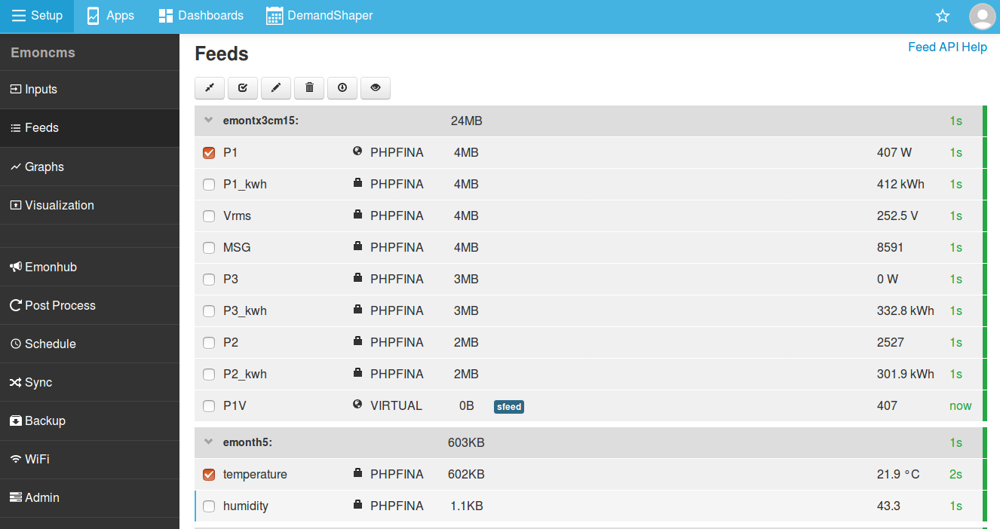
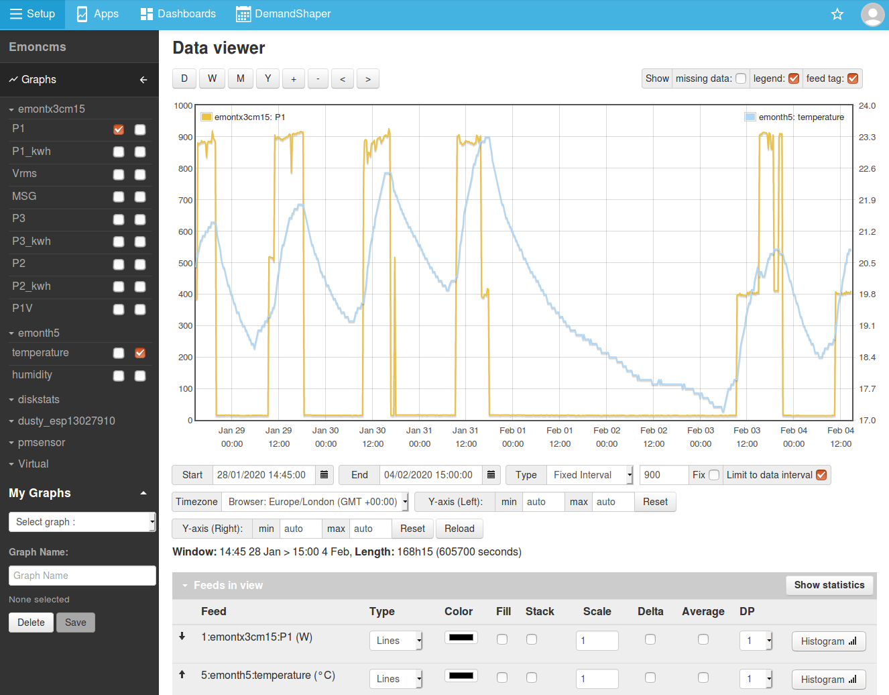
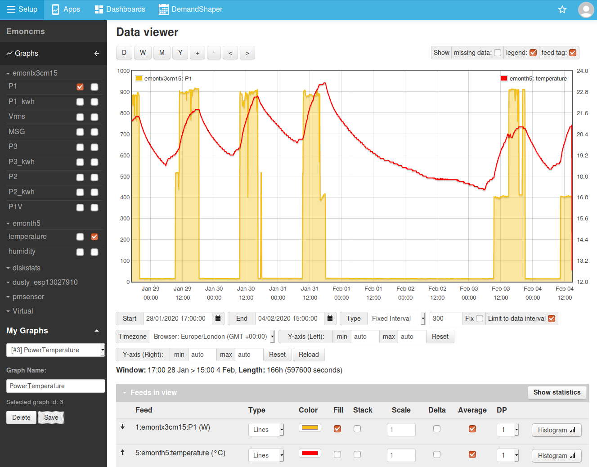
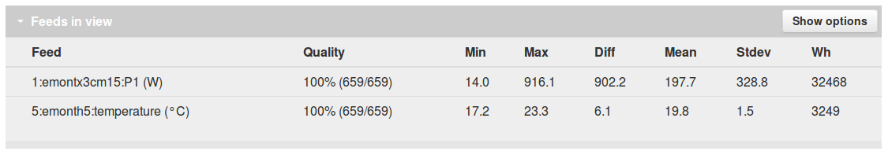
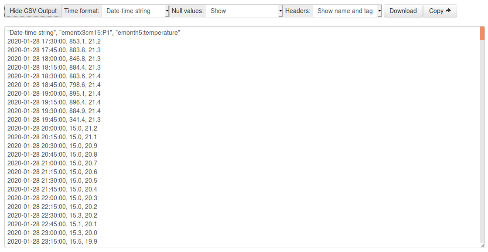

# View Graphs

The Emoncms graph viewer is used to explore feed data. With a comprehensive set of features it is possible to compare multiple feeds on one graph, view averages and statistics, export CSV data and share and embed resulting graphs in dashboards.

## 1) Select feeds to view on feeds page

To view a single feed click on the feed row on the feeds page to bring up the graph view. To view multiple feeds select the feeds you wish to view using the selection tick boxes and then click on the eye icon in the feeds page toolbar:

**Graph view URL:** Note that selected feeds are listed in the URL when accessed via the feeds page. See Graph module API options below for more examples.

    http://emonpi.local/graph/1,2

## 2) The Graph view

The feeds selected above will now display on the graph view. To compare feeds with different axis scales e.g power and temperature click on the axis tick box in the left sidebar to place the feed on the applicable left or right y-axis.

## 3) Configuring a custom graph

The screenshot below shows an example with the feed series colours changed, temperature is now in red and the power feed is filled by placing a tick in the Fill tick box.

**Averaging:** By default feeds are loaded without averaging. Tick the average tick box for each feed to view fully representative averages of the underlying data. *Tip: In the case of unreliable data with lots of missing data-points enabling averaging can give better results in the graph view.*

**Saving a Graph:** Enter a unique graph name in the 'My Graphs' section to save the current graph for faster access in future.

## 4) Feed statistics

Click on 'Show statistics' to view min, max, difference between min and max, mean & standard deviation for each feed in the graph view. A Watt-hour calculation is also made for each feed - but only applicable in the case of power feeds in Watts. In the example graph above we can see that the power view covers 32.5 kWh of consumption.

## 5) CSV Export

The data in the graph view can be exported as CSV for further analysis in an external program. Click on 'Show CSV Output', select time format as required. 

**Null values:** If shown, missing data points will be displayed as null entries, this makes comparison across different feeds easier as it ensures the time-base is consistent.

## 6) Graph API options

**Embed a graph:** Remove the Emoncms theme wrap and graph editor. This is available publicly but will only show graph data if individual feeds are made public.

    http://emonpi.local/graph/embed?graphid=1
    
**Load a saved graph by id:** Only available when logged in.

    http://emonpi.local/graph#/Saved/1
    
**Load specified feeds in a graph:** Available publicly if individual feeds are made public.

    http://emonpi.local/graph/1,5
    
**Load graph with feeds aligned to left or right y-axis:** Available publicly if individual feeds are made public.

    http://emonpi.local/graph?feedidsLH=1&feedidsRH=5
    
## Open Source

The EmonCms graph module is available on github here: [https://github.com/emoncms/graph](https://github.com/emoncms/graph) 
See also open bugs and enhancement requests: [https://github.com/emoncms/graph/issues](https://github.com/emoncms/graph/issues)
