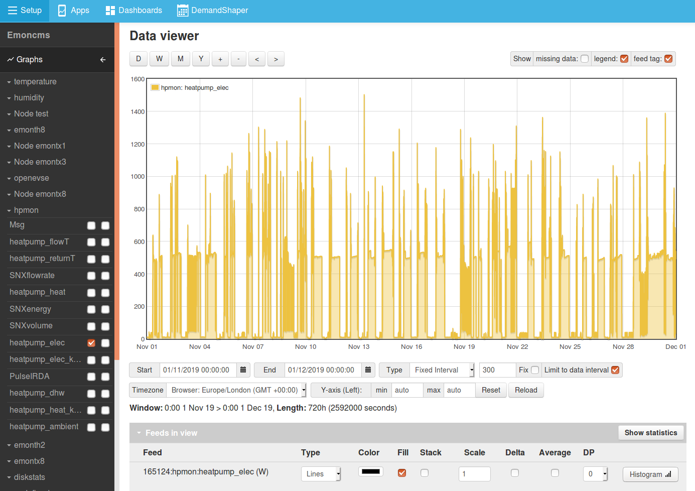
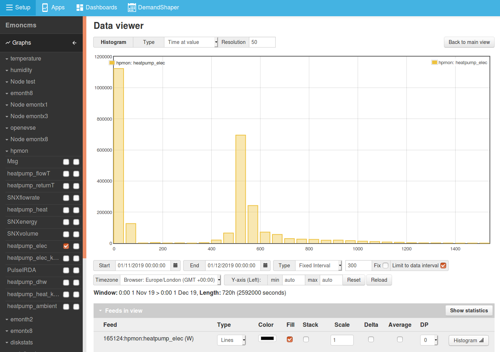
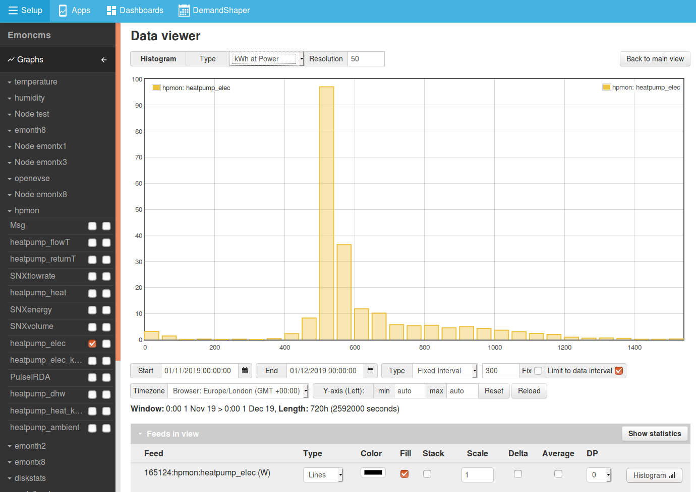

# Histograms

The Emoncms Data Viewer features a histogram tool for determining the time spent at different values or energy used at different power levels.

The following is an example of using this feature for determining the amount of time a heat pump spends on standby and the power level at which most of its energy demand is consumed.

## Example: Heat pump power data

Here we select the heat pump power feed and data range to view. For higher resolution decrease the interval to a point where the number of datapoints is near 8928 datapoints.

## Time at value

The first histogram mode shows the amount of time spent at a given range.

This could be useful for determining the amount of time a heat pump spends at standby as an example. Here we see that the heat pump spent ~1,123,200 seconds between 0-50 Watts out of a total time of 2,592,000 seconds selected in the data viewer. This tells us that the heat pump is on standby for 43% of the time in this period.

## kWh at power

The kWh at power mode is useful for determining the power level where most power was used or generated, In this example we can see that most of the energy used by the heat pump was consumed in the 500-549 Watt segment (97 kWh).

