# emonCMS: Getting started emonPi/Base

## Login and account creation

This guide picks up at the point where the emonPi, emonBase or raspberryPi is powered up and connected to the local network. You should have completed the initial ethernet or WiFi connection wizard and now be presented with the emoncms login page.

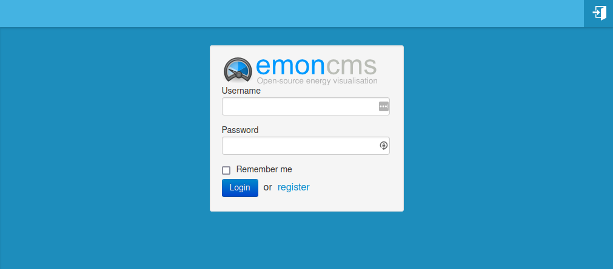

EmonCMS is the main user interface on the emonPi/base, it can be used to store and visualise data locally or just used to configure posting data to a remote server, or both.

1\. As this is a new system, the first thing to do is to create a local account on your emonPi/base. Click register and enter suitable details for your first account:

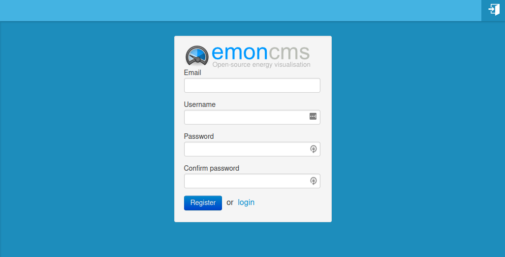

2\. When you first login, emonCMS opens on the Feeds page. **Feeds store time-series data**. This page will be empty to start with, once created, feeds will appear listed on this page. 

While it's possible to create feeds directly on the feeds page and insert data either via the feed API or CSV import tool, the main way of creating feeds is via the Inputs page. 

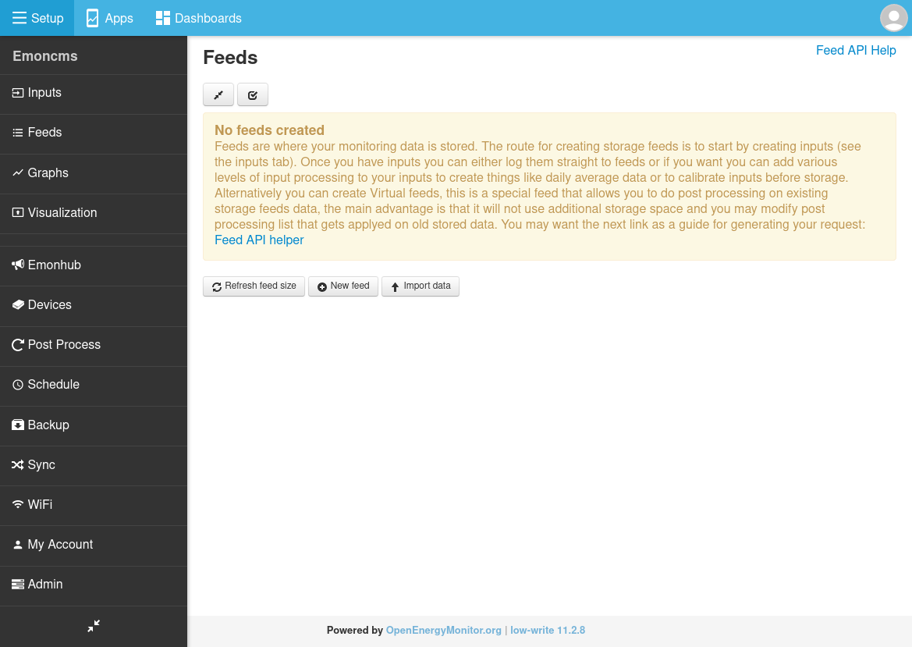

3\. Using the setup menu to the left, navigate to the Inputs page. If you have an emonBase and already have a node such as the emonTx4 powered up and transmitting data via RFM69 radio or USB cable, you should see data appear on this page automatically. If you have an emonPi, it's data will also appear on this page in the same way.

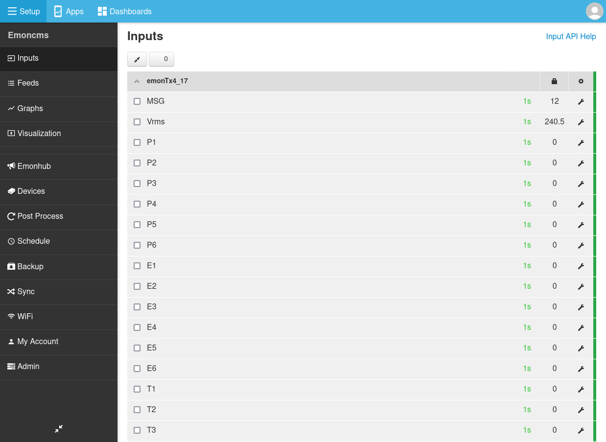

Inputs hold only the most recent value and time associated with incoming data. Each input has an associated “node” identifier and a “key” sub-identifier. To record historic data a feed needs to be created from an input.

## Local vs Remote logging

At this point you might want to choose if you want to record and access your data locally on your emonPi/base or post the data to a remote server such as [Emoncms.org](https://emoncms.org), or you may want to do both. This will determine where you carry out the next set of configuration steps.

```{admonition} Local vs Remote logging
Both the emonPi and emonBase feature full local data logging and visualisation capability, making it easy to keep your energy data within the privacy of your home and without any online service subscription requirements. The local web interface is accessible via the emonPi/emonBase hostname or IP address.

The emonPi and emonBase SD card includes 10 GB’s of data storage enough for 138 years! worth of feed data for our solar PV application (6 feeds at 10s resolution). The software has also been designed to minimise write wear to prolong SD card lifespan.

If you wish to access your data away from home this is possible using remote access services such as [Dataplicity](https://www.dataplicity.com). Dataplicity currently offer a free-tier of one device per user. For more information see: Remote Access.

We do also offer a remote data logging and visualisation service called [Emoncms.org](https://emoncms.org). Emoncms.org is a pay-as-you-go service but all OpenEnergyMonitor shop hardware purchases come with 20% free emoncms.org credit which is designed to give 5-10 years of free use.

It is possible to install our emonCMS on your own remote server, we have a nice installation script to help with this for use with Debian systems, see [EmonScripts](../emonsd/install.md).

Posting data to a remote server such as emoncms.org is particularly useful for applications that require public dashboards as there is usually more bandwidth for many users to access the same dashboard than available over a household or remote monitoring site connection. Remote data logging is also useful for applications that require aggregation or remote data analysis. The OpenEnergyMonitor system provides both local and remote options so that you can choose the right tool for your application.
```

## A quick intro to emonHub

Before we continue with input configuration for local data logging - or - configuring the emonPi/base to post data to a remote server, it's worth mentioning a piece of software called emonHub.

emonHub is also installed on the emonPi/base and sits just in front of emonCMS, providing a bridge between the hardware side and the emonCMS inputs interface.

emonHub is a seperate piece of software to emonCMS but it can be configured from within the emonCMS interface. It's also possible to view the emonHub log, which can be valuable when trying to troubleshoot data input issues.

From the Setup menu click on EmonHub to open the emonHub log page

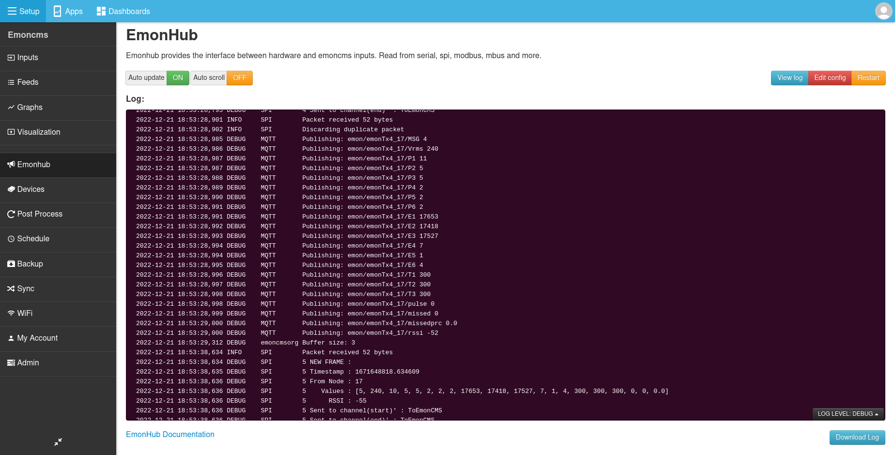

Click on emonHub config to open a basic text editor for the emonHub configuration file

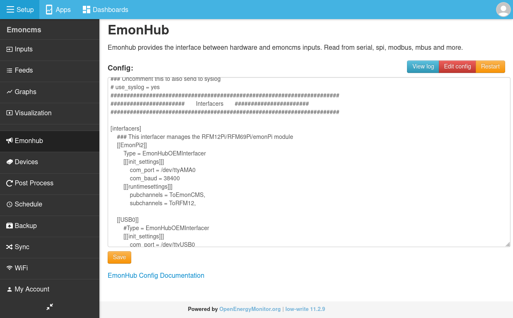

For a more in-depth guide to emonHub configuration, see the [emonHub documentation](../emonhub/overview.md).

The standard configuration is designed to provide out of the box support for the main types of OpenEnergyMonitor hardware, whether that's receiving data via radio, usb link or hardware mounted directly such as the emonPi. This data is then passed on to emonCMS locally via MQTT and remotely typically via HTTP.

```{tip}
emonHub also supports reading data from a wide variety of 3rd party sources, extending the functionality of an emonPi/base, including: Modbus (e.g SDM120 electric meters), MBUS (A wide range of heat meters), DS18B20 Temperature sensors, Direct pulse counting, SMA Solar, Victron VE.Direct, Fronius (TCP Modbus), Renogy, Tesla PowerWall. BMW Connected Drive, JLR. See [emonHub: Interfacers](../emonhub/emonhub-interfacers.md)
```

## Logging data locally

Continuing from where we left off above on the emonPi/base emonCMS inputs page. The following describes a generic example of configuring an emoncms input, e.g an emonTx4 or emonPi power input. 

1\. Click on the input config spanner next to the input you wish to record:

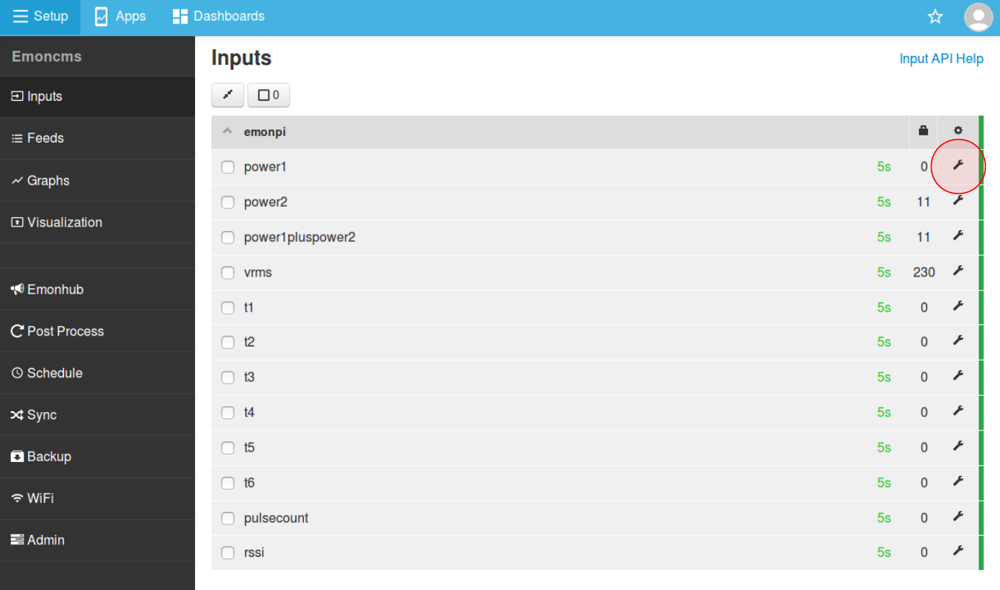

2\. The process list setup box will now open.

- Choose the `Log to Feed` input process *(default)*.
- Check that `Feed` is set to `CREATE NEW` and enter a suitable feed name e.g `use`.
- Select the default `PHPFINA` Feed Engine *(default)*.
- Select a logging interval e.g. `10s` for emonTx/emonPi or `60s` for emonTH**.
- Click add to `Add` to add that input process.

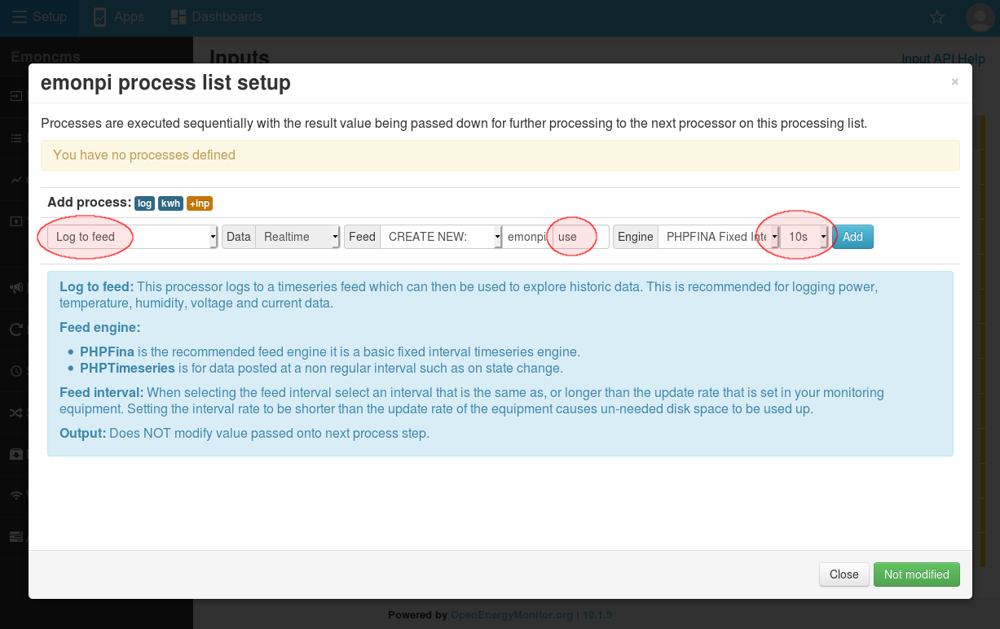

3\. If logging a `Power` value input you may also want to create a corresponding cumulative kWh feed from the power input. This is done by adding a `Power to KWh` input process.

```{note}
The emonTx4 and some of our more recent emonTx3 and emonPi firmware's report cumulative CT channel energy as seperate inputs and these can be used instead of calculating kWh data from power inputs in emonCMS.
```

- Choose `Power to KWh` Input Process.
- Check that `Feed` is set to `CREATE NEW` and enter a suitable feed name e.g `use_kwh`.
- Select the default `PHPFINA` Feed Engine *(default)*.
- Select a logging interval e.g. `10s` for emonTx/emonPi.
- Click add to `Add` to add that input process.

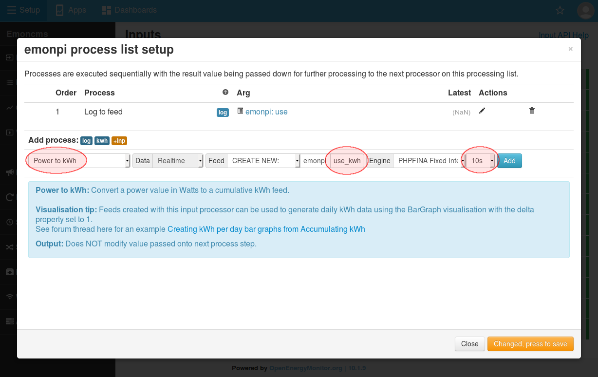

```{note}
The feed interval logging time should not be less (faster) then the default node update rate. Choosing a longer (slower) update rate is fine and will conserve disk space

| **Node** | **Recommended Interval**  |
| ------ | --- |
| emonPi | 10s |
| emonTx3/4 | 10s |
| emonTH | 60s |

```


4\. Once complete, click the `Changed, Press to Save` button. Then `Close` the input list window.

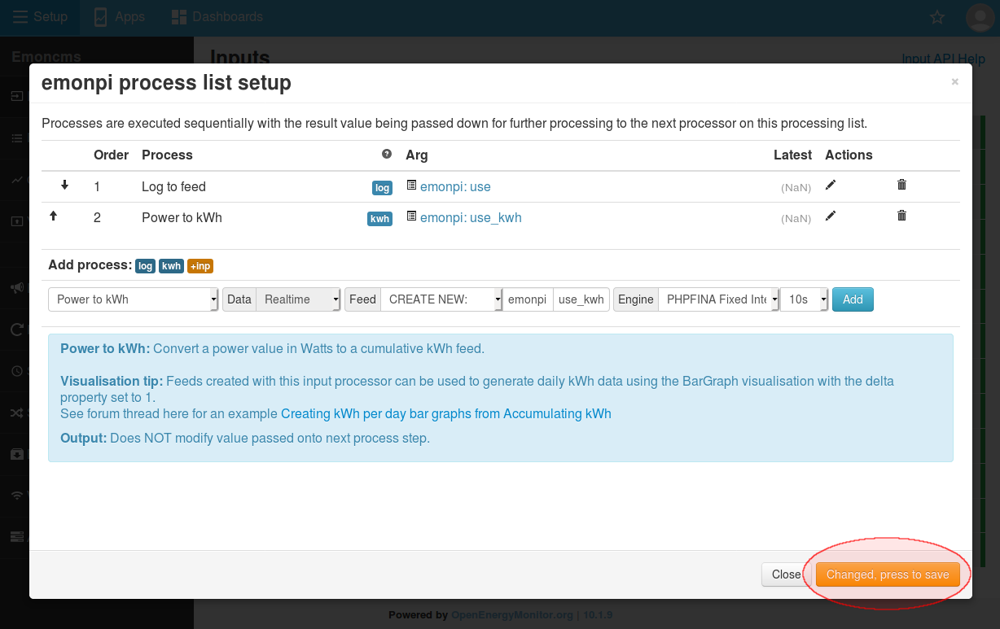

5\. The Inputs page should now display the input processes next to the configured input as small short hand labels e.g `log` and `kwh` in our example so far:

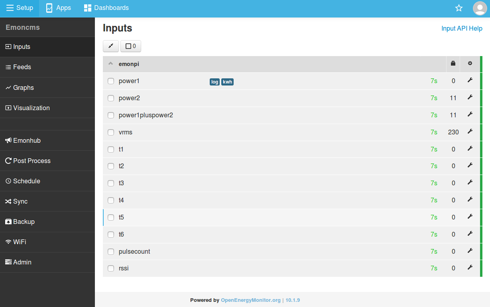

6\. We can now check the feeds that have been created.

- Navigate to `Setup > Feeds`
- Updating feeds should now be visible


7\. To view the feed data click on the feed row to open the graph view. As we have only just created the feed there will not be much data to see yet. If you zoom in to the last few minutes you should start to see a couple of datapoints. You may need to click on the `Reload` button to see these appear - alternatively check back in a few minutes when there are more datapoints.

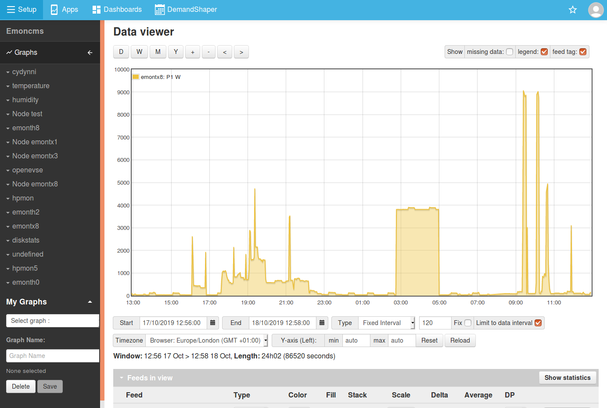

```{tip}
- Multiple feeds can be overlayed on the same graph by selecting feeds in the right hand side
- To view daily data see [Emoncms > Daily kWh](daily-kwh) (this requires a couple of days of data).
```

<!--
Using standard feed names such as `use`, `use_kwh`, `solar`, `solar_kwh` `import` and `import_kwh` (**case sensitive**) will automate the setup of MyElectric, MySolar PV and Android app dashboards. See [Setup > Dashboards](/emoncms/dashboards) and [Home Energy](/applications/home-energy) and [Solar PV](/applications/solar-pv) applications pages for more info.
-->

## Posting data to a remote server

The following provides a quick overview of how to configure your emonPi/base to post to emoncms.org. The same mostly applies when posting data to a self hosted emoncms server as well.

1\. Open the [emoncms.org](https://emoncms.org) front page and click `register` to create a new account. Enter a valid email address (verification required) and a suitable username and password.


2\. Once logged in, navigate to the My Account page, either via the Setup menu or the top-right dropdown. Copy the `Read & Write API Key`.

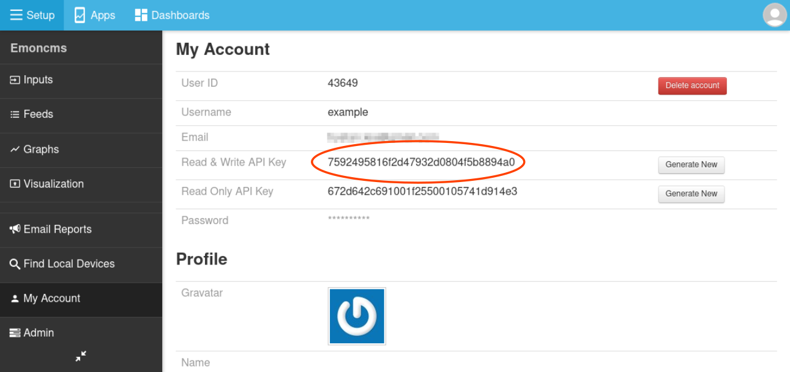

3\. Back on your emonPi/Base. Navigate to Setup > EmonHub. Click `Edit Config` to bring up the emonHub configuration editor. Scroll down to find the `[[emoncmsorg]]` interfacer and replace the `apikey = xxxxxxxxxxxxxxxxxxxxxxxxxxxxxxxx` with the read & write api key copied in step 2.
Click `Save` to complete.

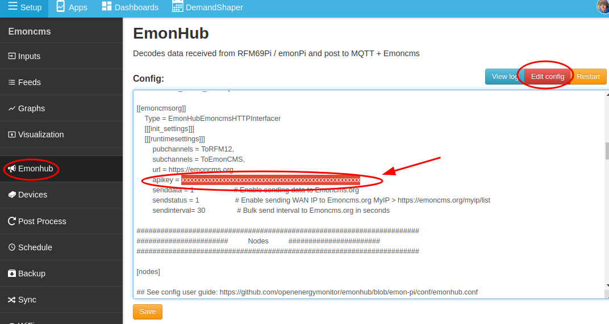

4\. If you can see input data on your local emonPi/Base inputs page you should now start to see the same inputs come through on emoncms.org. These can be configured in the same way as covered in the 'Logging data locally' section.
