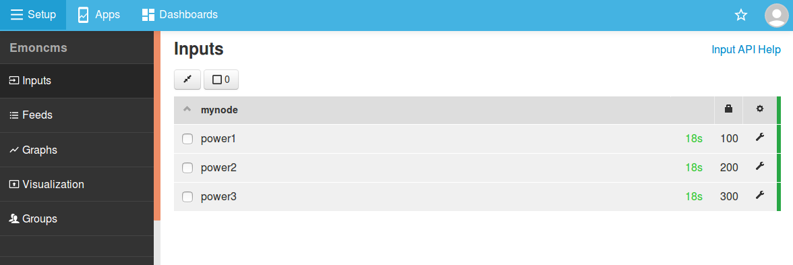

# Posting data

It's possible to post data to emoncms using either the HTTP API or via MQTT. This guide covers the basics of sending data to emoncms and may be useful when writing custom scripts that record data from different devices or interfacing with 3rd party software such as NodeRed.

## The Emoncms HTTP Input API

The full input API is available from the emoncms inputs page, see top right "Input API Help".

If you're starting out with EmonCMS, 'input/post' is a good starting point for testing. Login to your emoncms account and paste the following into your browsers address bar:

http://emonpi.local/input/post?node=mynode&fulljson={"power1":100,"power2":200,"power3":300}

 

This should return: `{"success": true}`

Navigate now to the Emoncms inputs page, you should see a new node with inputs as above:

*Once inputs have been created the next step is to record the inputs to feeds using input processing. See [Log Locally](../emoncms/intro-rpi.md) for an example of how to do this.*

**Authentication:** 
The example above relied on being logged into emoncms to provide authentication. For devices or scripts posting to the API it's possible to authenticate with an API KEY.

An emoncms account has two api keys a read-only apikey and a read & write apikey. Both are listed on the 'My Account' page or from the 'Input API Helper' page. 

To post data to emoncms the read & write apikey needs to be used - and can be appended to the API request as follows (here given with an example key):

http://emonpi.local/input/post?node=mynode&fulljson={"power1":100,"power2":200,"power3":300}&<b>apikey=fc9c9ae50942b35f8a1baa67649e301b</b>

 

Logout of emoncms and paste the above into your browsers address bar. This should again return: `{"success": true}`

**Using HTTP POST method:**
 All the request parameters above can also be included in the POST body:

<b>URL:</b> http://emonpi.local/input/post 
<b>BODY:</b> node=mynode&fulljson={"power1":100,"power2":200,"power3":300}&apikey=fc9c9ae50942b35f8a1baa67649e301b

 

**CSV format:**
 It is also possible to send data in CSV format:

http://emonpi.local/input/post?node=mynode&<b>csv=100,200,300</b>

 

**Specifying a timestamp:**
 A timestamp can be attached to the request to specify the input update time:

http://emonpi.local/input/post?<b>time=1581112821</b>&node=1&csv=100,200,300

 

**Bulk upload of data:**
 The input/bulk API can be used to bulk upload historic data from multiple nodes in a single update. See the Input API Helper for full details on this API option.

## Sending data to Emoncms using MQTT

Both the emonPi and emonBase running the emonSD software stack have a local Mosquitto MQTT server running as standard. This server is accessible with authentication on port 1883. Find the MQTT Service Credentials for your image on [emonSD Download](../emonsd/download.md)

The standard base topic to which emoncms subscribes is: **emon/**. The following publish example posts the power1 input associated with node: mynode.

<b>topic:</b> emon/mynode/power1 
<b>message:</b> 100

 

emonSD uses MQTT internally to pass data from emonHub to Emoncms. It's possible to subscribe to these messages by subscribing to the emon/* base topic.

