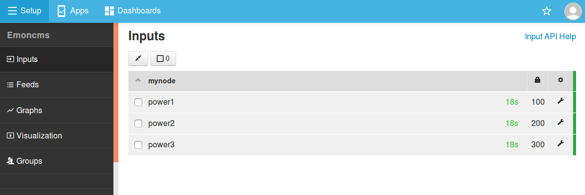

# Posting data

Send data to Emoncms from your own scripts, devices or other software, such as Node-RED or Home Assistant. Use the HTTP input API or MQTT.

For the full input API, click **API Help** on the **Inputs** page.

## HTTP input API

### API key

Scripts and devices authenticate with the **Read & Write API Key**. Find it on the **My Account** page or the input API help page.

The examples below use `emonpi.local` as the host and `APIKEY` in place of your key.

### Send a test value

Paste this into a browser address bar:

```
http://emonpi.local/input/post?node=mynode&fulljson={"power1":100,"power2":200,"power3":300}&apikey=APIKEY
```

Emoncms returns `{"success": true}`. The inputs appear under the node `mynode` on the **Inputs** page.



To record the inputs, add input processing. See [Inputs](inputs.md).

### Send the key in a header

Keeping the key out of the URL stops it appearing in server logs:

```
curl -H "Authorization: Bearer APIKEY" \
  "http://emonpi.local/input/post?node=mynode&fulljson={\"power1\":100}"
```

### Use POST

All parameters can go in the POST body:

```
curl -X POST http://emonpi.local/input/post \
  -H "Authorization: Bearer APIKEY" \
  -d 'node=mynode&fulljson={"power1":100,"power2":200}'
```

### CSV values

Values without names are numbered from 1:

```
http://emonpi.local/input/post?node=mynode&csv=100,200,300&apikey=APIKEY
```

### Set the time

Add a Unix timestamp to set the input time:

```
http://emonpi.local/input/post?time=1581112821&node=mynode&csv=100,200,300&apikey=APIKEY
```

### Bulk upload

`input/bulk` sends many readings from several nodes in one request. Use it for historic data or buffered readings. See the input API help page.

## MQTT

The emonPi and emonBase run a Mosquitto MQTT server on port 1883. Find the MQTT username and password on the [emonSD download](../emonsd/download.md) page.

Emoncms subscribes to the base topic `emon/`. Publish a value to `emon/<node>/<key>`:

```
topic:   emon/mynode/power1
message: 100
```

See [MQTT](mqtt.md) for more.
