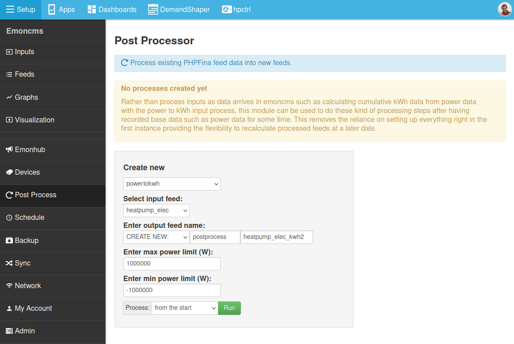
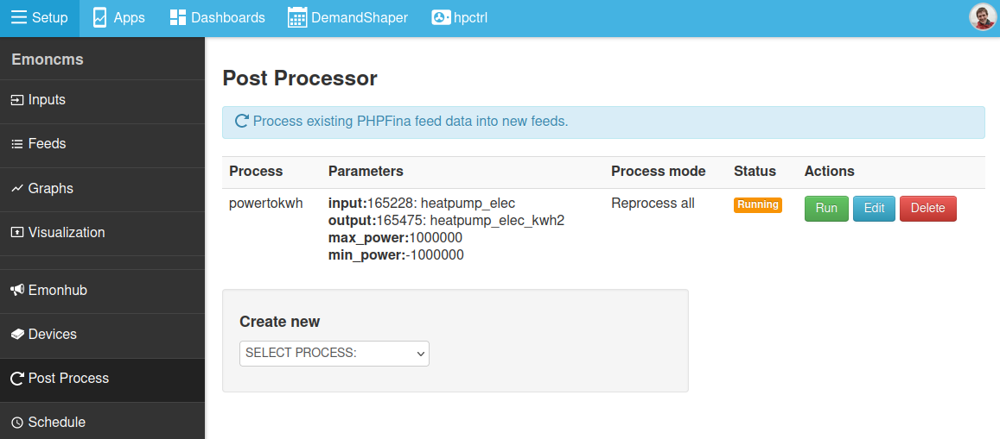

# Post Process module

While emoncms is designed around 'input processing' the processing of data (e.g calibration, summing inputs, calculating kWh data)  before it is recorded to a feed. Sometimes it is useful to be able to manipulate feed data after it has been recorded, removing the reliance on setting everything up right in the first time.

This guide gives an overview of how to use the Emoncms post processing module to do this. Including examples of commonly used post processors. The post process module is installed by default and available under the **Setup** menu on the emonSD software stack running on the emonPi and emonBase.

## Example 1: Creating a cumulative kWh feed from a power feed

Cumulative kWh feeds are useful for calculating kWh consumption per half hour/hourday/month & year. They are used by many of the emoncms apps. See the guide here on [Creating Daily kWh](/emoncms/daily-kwh/).

Typically a cumulative kWh feed is created from a power input using input processing. The **power_to_kwh** input processor is used. But lets say we forgot to create this feed at original setup - or that as is still sometimes an issue the cumulative kWh value resets as a result of a power failure to the Pi. We can use the post process module to create or re-build the feed.

1\. Navigate to the post process module under the emoncms setup menu.

2\. Select the **powertokwh** process in the process selection dropdown.

3\. Select the source power feed, in the example below I have selected P1 (the power value of CT1 on an EmonTx).

4\. Enter a suitable name for the new cumulative kWh feed. The name needs to be unique. 

5\. A 'Run' button will appear below the feed output name input box. Select 'Run from start'.

*There is an option here to set a positive and negative limit to the allowed power values this can be helpful for producing e.g import or export only kWh feeds or filtering out invalid spikes.* 

6\. Click on 'Run' to start the post processing operation. The process will now list in the process list and should show as 'Running':

Depending on the size of the source feed the processing time could be short (couple of seconds) to quite long (several minutes). After completion it will show as 'Finished'. Hover over the status tag to see further information about the process state.

After completion the new feed **will not** automatically update as new data is added to the original power feed. To automatically update the feed: use input processing on the original power input to update the feed - in this case we would add a **power_to_kwh** input process and select the feed that we have created with the post processing module.

## Example 2: The 'importcalc' post processor

The Emoncms MySolar app requires 3 power feeds: solar, use & import and 3 cumulative kWh feeds: solar_kwh, use_kwh & import_kwh. It's easy to miss setting up the input processing to calculate the import feeds when doing initial setup. We can use this post process to calculate the import power feed at a later point.

To configure: select the relevant solar power feed and house consumption feed, create a feed called 'import' as the output feed and click Create.

As a second step we can create a cumulative kWh feed from this newly created import feed using example 1 above. The newly created import and import_kwh feed can now be used by the MySolar app to show proportion of self consumption and quantity of imported electricity from the grid.

## Example 3: The formula post processor

The basic_formula processor is a versatile post processor that can be used to add, subtract, multiply and divide feeds with each other as well as applying multiplication factors and offsets.

An example formula might look like this:

    f1+2*f2-f3/12

Here the feed id is the number appended to the 'f' identifier. f1 = feed id 1. 

Use the feed selection helper to select feeds when entering the formula.

## Full post processor list

**Calibration**

- scalefeed: scale a feed by the value given
- offsetfeed: add an offset to a feed

**Power & Energy**

- powertokwh: calculate a cumulative kwh feed from a power feed

**Limits**

- allowpositive: Either create a new feed with only positive values or remove negative values from the source feed.
- allownegative: Either create a new feed with only negative values or remove positive values from the source feed.
- remove\_morethan\_lessthan: Remove values from a feed if they are more than or less than the set limits.

**Misc**

- accumulator: calculate a cumulative sum of the source feed
- constantflow_tokwh: calculate kWh from flow, return temperature, flow rate constant and specific heat
- liquidairflow_tokwh: calculate kWh from flow, return temperature, flow rate feed and specific heat
- to_signed: convert unsigned values in a feed to a signed values

**Feeds**

- addfeeds: add multiple feeds together (see basic_formula to add more than 2 feeds)
- average: average and downsample effectively do the same thing. Take feed at a higher resolution e.g 10s interval and reduce to the set output interval e.g 60s
- downsample: same as above.
- mergefeeds: calculates the average of both feeds where data is available 

**Formula**

- basic_formula: Vesatile formula post processor for custom calculations

**Simulation**

- batterysimulator
- carnot\_cop\_simulator

**Solar**

- exportcalc: calculate grid export from house consumption and solar generation (ignores any import values)
- importcalc: calculate grid import from house consumption and solar generation (ignores any export values)
- solardirectcalc: calculate solar generation used directly from a solar generation feed and house consumption feed.

**Data cleanup**

- removeresets: remove resets in a accumulating feed
- removenan: join across missing data points with a straight line

## Open Source

The post process module is available on github here: [https://github.com/emoncms/postprocess](https://github.com/emoncms/postprocess) 
See also open bugs and enhancement requests: [https://github.com/emoncms/postprocess/issues](https://github.com/emoncms/postprocess/issues)
