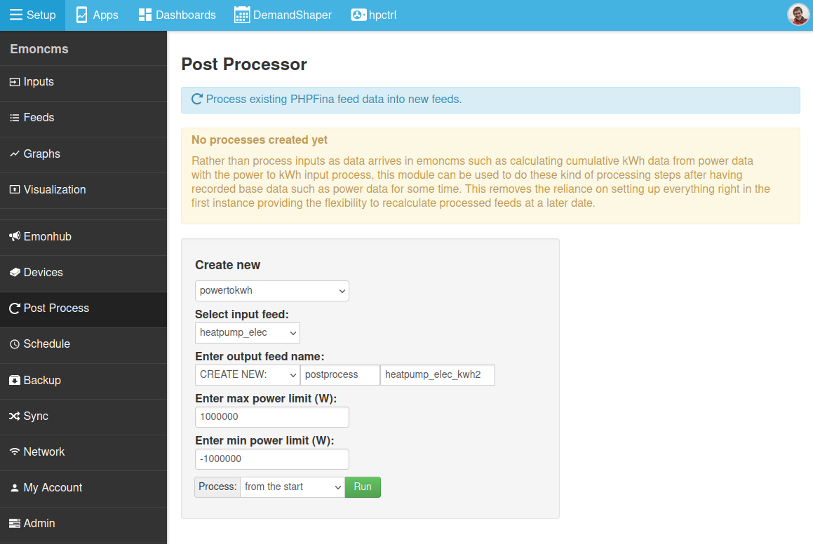

# Post process

Input processing acts on data as it arrives. The post process module acts on feed data that is already recorded. Use it to create a feed you forgot to set up, rebuild a feed after a fault, or clean up bad data.

The module is installed on the emonPi and emonBase. Open it from **Setup > Post Process**.

## Create a process

1. Go to **Setup > Post Process**.
2. Select a process from **Process**. A description appears below it.
3. Fill in the parameters. For an output feed, choose **Create new** and enter a tag and name, or select an existing feed.
4. Set **Run on** to **All data, from the start** or **New data only**.
5. Click **Create and run**.

The process appears in the **Processes** list. **Status** shows **Queued**, **Running**, **Finished** or **Error**. Hover over the status for details. A large feed can take several minutes.

An output feed does not update by itself when new data arrives. To update it once, run the process again with **New data only**. To keep it updated, add an input process that writes to the same feed. See [Example: cumulative kWh from power](#example-cumulative-kwh-from-power).



## Example: cumulative kWh from power

Many apps and daily kWh graphs need a cumulative kWh feed. Use this example if you only have the power feed.

1. Select **Power to kWh**.
2. Select the power feed.
3. Choose **Create new** and name the output feed, for example `use_kwh`.
4. Set **Run on** to **All data, from the start** and click **Create and run**.
5. To keep the feed updated, go to **Setup > Inputs**. On the power input, add a **Power to kWh** process that writes to the new feed.

Optional limits on power values can remove spikes, or create import only or export only feeds.

## Example: grid import from solar and use

**Import calculation** calculates grid import from a solar feed and a use feed. Run **Power to kWh** on the result to get a cumulative import feed.

## Example: formula

**Basic Formula** combines feeds with `+`, `-`, `*` and `/`, constants and brackets, for example:

```
f1+2*f2-f3/12
```

`f1` is the feed with id 1. Use **Feed finder** to look up feed ids.

## Processes

| Group | Process | Description |
|---|---|---|
| Calibration | Scale feed | Multiply a feed by a constant |
| Calibration | Offset feed | Add a constant to a feed |
| Power & Energy | Power to kWh | Create a cumulative kWh feed from a power feed |
| Limits | Allow positive | Keep only positive values |
| Limits | Allow negative | Keep only negative values |
| Limits | Limit more than/less than | Limit values above or below a set value |
| Limits | Remove more than/less than | Remove values above or below a set value |
| Feeds | Add feeds | Add two feeds together |
| Feeds | Average | Average a feed to a longer interval |
| Feeds | Downsample | Reduce a feed to a longer interval |
| Feeds | Upsample | Increase a feed to a shorter interval |
| Feeds | Merge feeds | Fill gaps in one feed from another. Average where both have data |
| Formula | Basic Formula | Combine feeds with a formula |
| Solar | Import calculation | Grid import from use and solar |
| Solar | Export calculation | Grid export from use and solar |
| Solar | Solar direct calculation | Solar used directly from use and solar |
| Solar | Solar battery kWh flows | Energy flows between solar, battery, grid and home. Used by [My Electric Flow](apps.md#my-electric-flow) |
| Simulation | Battery simulator | Simple solar battery simulation |
| Simulation | Carnot COP simulator | Heat pump heat output and COP from flow and outside temperature |
| Data cleanup | Remove resets | Remove resets from a cumulative feed, such as a pulse count |
| Data cleanup | Remove missing values | Fill gaps by interpolation |
| Data cleanup | Replace missing values with last value | Fill gaps with the last value |
| Misc | Accumulator | Running total of a feed |
| Misc | Constant flow to kWh | Heat from flow and return temperature at a constant flow rate |
| Misc | Liquid or airflow to kWh | Heat from flow and return temperature and a flow rate feed |
| Misc | To signed | Convert unsigned values to signed values |

## Source code

[emoncms/postprocess](https://github.com/emoncms/postprocess) on GitHub.
