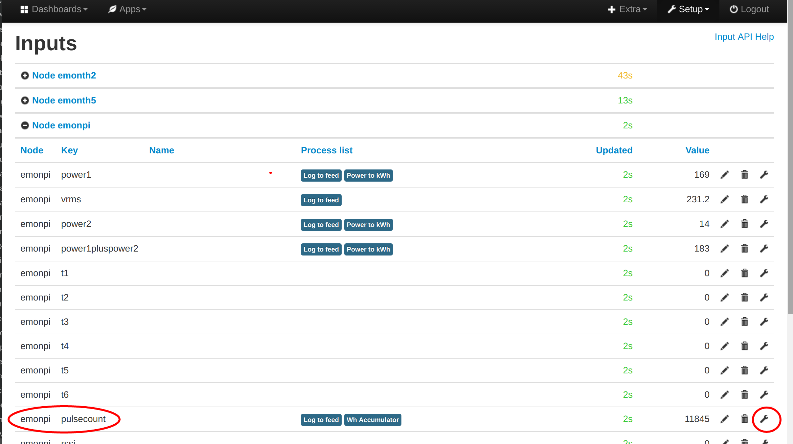
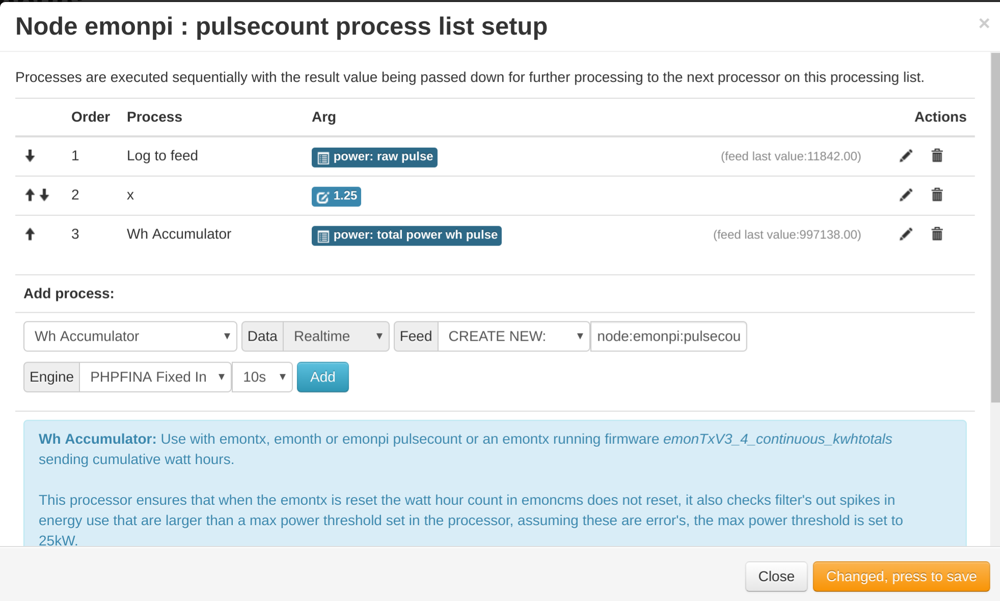
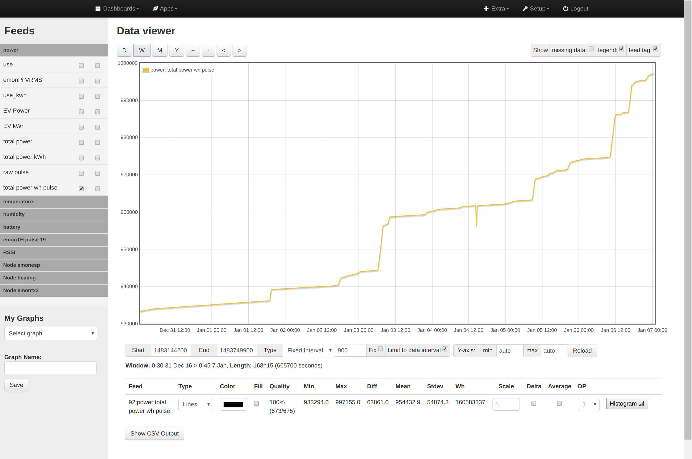
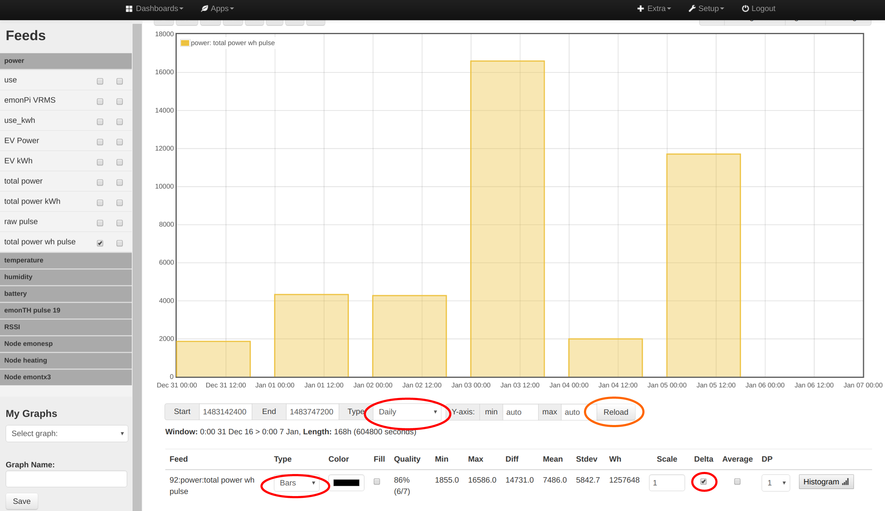

# Pulse counting

The following guide details how to configure emoncms to record and visualise a pulse counting input from an emonPi, emonTx or emonTH and follows on from the hardware setup guide.

1\. With the hardware up and running, navigate to the Setup > Inputs page, you should see the node for your device listed here. The pulse input will either be named **pulsecount** or just **pulse**:

2\. Click on the spanner icon on the right hand side of the input to configure input processing for this input:

3\. It's a good idea to start with to log the raw pulse count to a feed so that you have a copy of the original values. 

4\. The pulse count needs to be multiplied by a scale process to convert the pulses to kWh. The scale factor will depend on your meter, see the table in Appendix A below. 

5\. Next add a **kWh Accumulator** process, this process both removes resets in the pulse count caused when then emonTx/emonPi or emonTH is reset or power cycles and records the result to a feed.

Viewing the Wh accumulator feed:

To convert the Wh accumulator feed to daily kWh bargraph using the graph tool select Window `type-daily` feed `type=Bars` and `delta = 1` then click `reload`

See Emoncms [daily kWh guide](/emoncms/daily-kwh) for more info.
