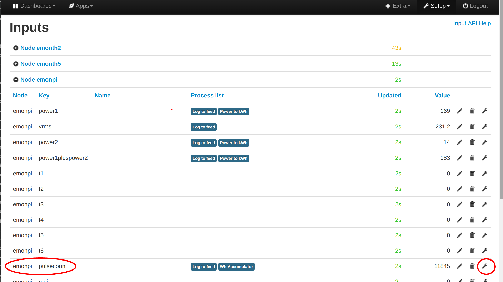
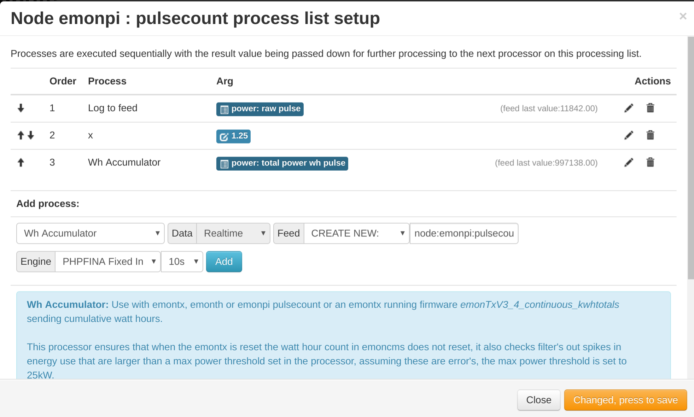
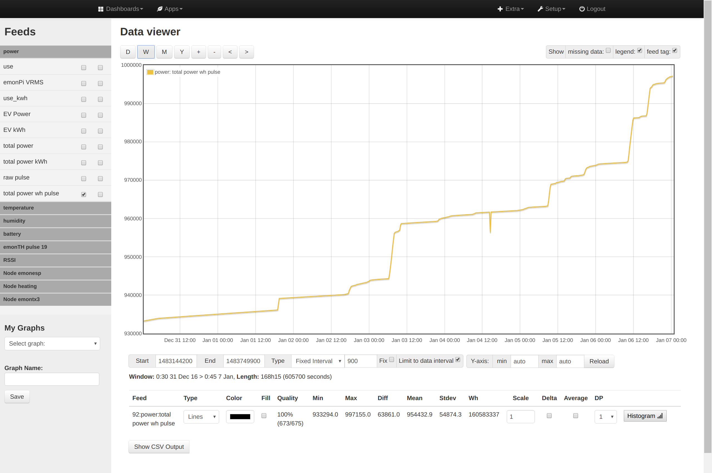
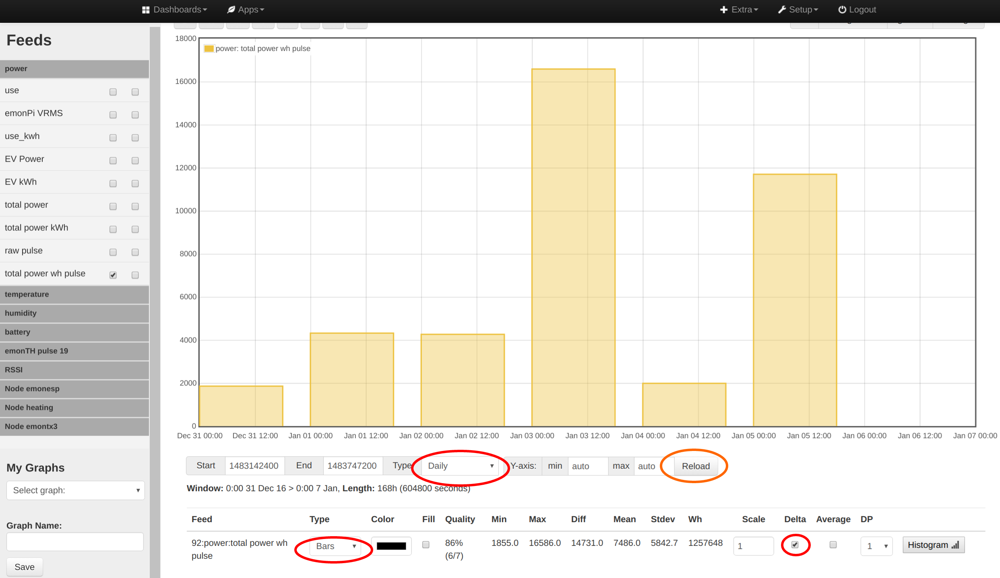

# Pulse counting

Record and view a pulse count input from an emonPi, emonTx or emonTH. Set up the hardware first, see [emonPi pulse counting](../emonpi/pulse_counting.md).

## Set up input processing

1. Go to **Setup > Inputs**. The pulse input for your device is named `pulse` or `pulsecount`.

   

2. Click the spanner icon on the pulse input.

   

3. Add **Log to feed** to keep a copy of the raw pulse count. This step is optional.
4. Add a **x** process to convert pulses to kWh. The value depends on your meter. For a meter with 1000 pulses per kWh, enter `0.001`.
5. Add **kWh Accumulator** and create a new feed, for example `import_kwh`. It removes the reset in the count when the device restarts.
6. Click **Changed, press to save**.

## View the data

The accumulated feed rises steadily:

For daily totals, open the feed in the graph view, set **Type** to **Daily**, set the feed **Type** to **Bars** and tick **Delta**. See [Daily kWh](daily-kwh.md).

