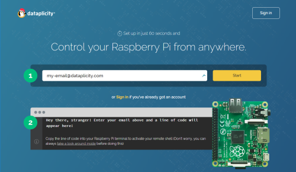
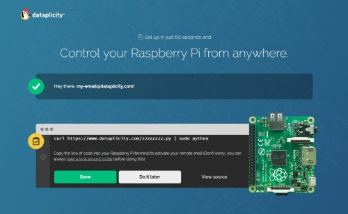
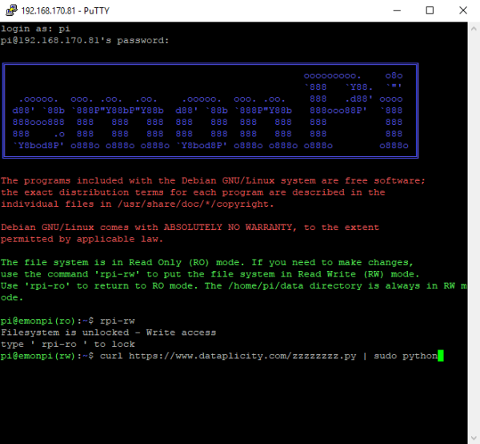
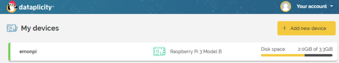
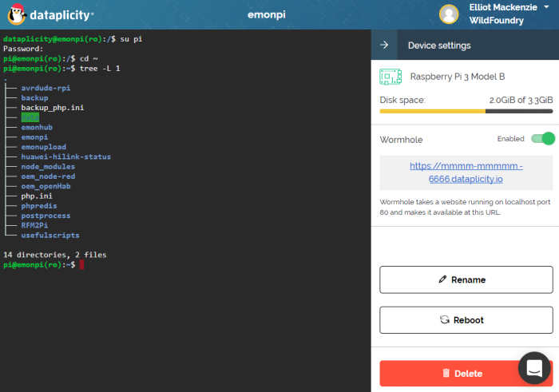
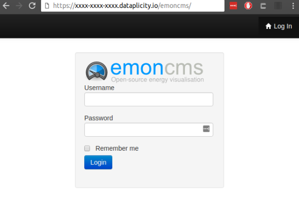

# Remote Access

Sometimes for convenience or troubleshooting it's useful to be able to access the emonPi / emonBase remotely e.g from outside the local network.

## Dataplicity

**This is the easiest and most secure method of obtaining remote access (SSH/HTTP) to the emonPi or emonBase**

[Dataplicity](https://www.dataplicity.com) offers a easy to setup web service to enable secure remote access to RaspberryPi devices. The free tier allows free access to a single RaspberryPi device.

Follow these steps to setup Dataplicity on an emonPi

1\. Find the SSH Credentials for your image on [emonSD Download](../emonsd/download.md)

2\. Create an account with dataplicity.

  

  

Copy the Dataplicity installation command.

3\. Paste and run the installation command on the emonPi/emonBase:

Once setup is complete the emonPi/emonBase will appear in the Dataplicity dashboard:

4\. Log in to your account and access your device remotely:

5\. Dataplicity 'wormhole' feature  can be enabled to enable https access to Emoncms running on the emonPi:

Wormhole creates a secure tunnel to the emonPi port 80 http over a https connection.

If you encounter any issues using Dataplicity please post on the [Community Forum](https://community.openenergymonitor.org) using the `dataplicity` tag.

## Port Forwarding / Dynamic DNS

Network devices such as an emonPi connected to a local network are secured behind a firewall, often integrated into a router.

The conventional way for obtaining access remotely is to open a port in the firewall and 'port-forward' requests to this port to the local emonPi. This method works but is cumbersome and insecure. It's cumbersome because most users connect to the internet via their ISP using a non-static IP. Therefore the WAN IP address often changes, a dynamic DNS service such as [Duck DNS](https://www.duckdns.org/), or [noIP](https://www.noip.com) can be used to link a dynamic IP to a static domain name, however this is cumbersome to set up and often requires purchasing a domain name, dynamic DNS Subscription and handling the dynamic DNS IP address updates.

The port forwarding method of remote access is also insecure since by default the emonPi uses an insecure http connections, this is not a problem on a secure local network but not recommend for use over the internet.
