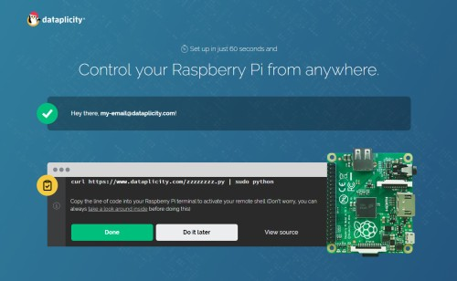
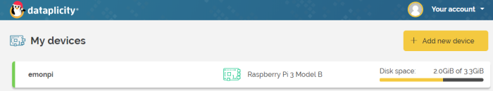

# Remote access

Reach your emonPi or emonBase from outside your home network, for example to view Emoncms or to connect via SSH.

## Dataplicity

[Dataplicity](https://www.dataplicity.com) is the simplest secure option. It gives remote SSH access and a secure web address for Emoncms, with no router changes. The free tier covers one device.

1. Enable SSH and find the credentials for your image on [emonSD download](../emonsd/download.md).
2. Create a Dataplicity account and copy the installation command.

   

   

3. Connect to the emonPi or emonBase via SSH and run the installation command.

   

4. The device appears in your Dataplicity dashboard.

   

5. Open the device to get a remote terminal.

   

6. Turn on **Wormhole** to reach Emoncms over HTTPS. Wormhole tunnels to port 80 on the emonPi.

   

For help, post on the [community forum](https://community.openenergymonitor.org) with the `dataplicity` tag.

## Port forwarding

Port forwarding opens a port on your router to the emonPi. We do not recommend it:

- Emoncms on the emonPi uses HTTP, so passwords and data cross the internet unencrypted.
- Most home connections change IP address. You need a dynamic DNS service, such as [Duck DNS](https://www.duckdns.org), to keep a fixed name.
