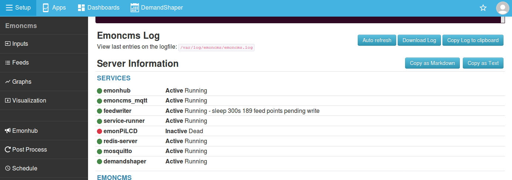

# Troubleshooting

## Community Forum FAQ

**Community Forum:** [Frequently asked Questions](https://community.openenergymonitor.org/t/frequently-asked-questions/3005)

## Feeds / Inputs not Updating

There are a number of things to check if inputs or feeds are not updating. The first is to check the status of emoncms services on the `Emoncms > Admin` page:



Services: `emonhub`, `emoncms_mqtt`, `feedwriter`, `redis-server` and `mosquitto` should all be '**Active** Running'.

Service status can also be checked via SSH command, e.g:

    sudo systemctl status emoncms_mqtt.service

Potential causes of services not running may be: 

- Incorrect configuration
- Incorrect installation
- Full /tmp partition
- Full /var/log partition
- Unclean power cycle / power-cut related SD card corruption 

`redis-server` is a dependency of `emoncms_mqtt` and `feedwriter`.<br>
`mosquitto` is a dependency of `emonhub` and `emoncms_mqtt`

**All services are running but there are still no inputs on the emoncms inputs page**<br>
This may be caused by incorrect emonhub configuration. Navigate to `Emoncms > Setup > Emonhub > View Log`. A valid log should look similar to the example log below. 

1\. If you do not see any `DEBUG    RFM2Pi     8 NEW FRAME : OK` lines, this suggests that the RaspberryPi is not receiving any data from the emonPi measurement board or RFM69Pi adapter board. Potential causes of missing 'NEW FRAME' lines:

- Issue with emonPi measurement board itself
- Issue with any wireless nodes sending data to the rfm69pi adapter on an emonBase
- Invalid radio settings on the emonBase such as frequency or network group

The emonPi and emonBase receiver radio module settings are set in emonhub.conf, see:<br> `Emoncms > Setup > Emonhub > Edit Config`. The default RFM2Pi emonhub interfacer on an unmodifed system should look like this: [emonhub.conf#L21](https://github.com/openenergymonitor/emonhub/blob/emon-pi/conf/emonpi.default.emonhub.conf#L21).

2\. If you don not see any lines that look like: `DEBUG    MQTT       Publishing: emon/emontx1/power1 623` but do see `NEW FRAME : OK` this suggests an issue with the MQTT interfacer. Default configuration should look like this [emonhub.conf#L38](https://github.com/openenergymonitor/emonhub/blob/emon-pi/conf/emonpi.default.emonhub.conf#L38).


**Example of valid emonhub.log posting via MQTT to local emoncms:**

```
2020-02-21 16:02:33,236 INFO     MainThread EmonHub emonHub emon-pi variant v3-beta
2020-02-21 16:02:33,236 INFO     MainThread Opening hub...
2020-02-21 16:02:33,237 INFO     MainThread Logging level set to DEBUG
2020-02-21 16:02:33,237 INFO     MainThread Creating EmonHubJeeInterfacer 'RFM2Pi' 
2020-02-21 16:02:33,238 DEBUG    MainThread Opening serial port: /dev/ttyAMA0 @ 38400 bits/s
2020-02-21 16:02:35,243 INFO     MainThread RFM2Pi device firmware version: [RF12demo.14]
2020-02-21 16:02:35,244 INFO     MainThread RFM2Pi device current settings:  E i5 g210 @ 433 MHz q1
2020-02-21 16:02:35,245 INFO     MainThread Setting RFM2Pi calibration: 230V (1p)
2020-02-21 16:02:36,247 DEBUG    MainThread Setting RFM2Pi interval: 60
2020-02-21 16:02:36,247 DEBUG    MainThread Setting RFM2Pi pubchannels: ['ToEmonCMS']
2020-02-21 16:02:36,248 DEBUG    MainThread Setting RFM2Pi subchannels: ['ToRFM12']
2020-02-21 16:02:36,249 INFO     MainThread Creating EmonHubMqttInterfacer 'MQTT' 
2020-02-21 16:02:36,251 DEBUG    RFM2Pi     acknowledged command: > 1p
2020-02-21 16:02:36,253 DEBUG    MainThread Setting MQTT subchannels: ['ToEmonCMS']
2020-02-21 16:02:36,254 INFO     MainThread Setting MQTT node_format_enable: 1
2020-02-21 16:02:36,254 INFO     MainThread Setting MQTT nodevar_format_enable: 1
2020-02-21 16:02:36,255 INFO     MainThread Setting MQTT nodevar_format_basetopic: emon/
2020-02-21 16:02:36,256 INFO     MainThread Creating EmonHubEmoncmsHTTPInterfacer 'emoncmsorg' 
2020-02-21 16:02:36,257 DEBUG    MainThread Setting emoncmsorg pubchannels: ['ToRFM12']
2020-02-21 16:02:36,258 DEBUG    MainThread Setting emoncmsorg subchannels: ['ToEmonCMS']
2020-02-21 16:02:36,258 WARNING  MainThread Setting emoncmsorg apikey: obscured
2020-02-21 16:02:36,258 INFO     MainThread Setting emoncmsorg url: https://emoncms.org
2020-02-21 16:02:36,259 INFO     MainThread Setting emoncmsorg senddata: 0
2020-02-21 16:02:36,259 INFO     MainThread Setting emoncmsorg sendstatus: 1
2020-02-21 16:02:36,352 DEBUG    RFM2Pi     RFM2Pi broadcasting time: 16:02
2020-02-21 16:02:38,456 DEBUG    RFM2Pi     device settings updated: E i5 g210 @ 433 MHz q1
2020-02-21 16:02:38,559 DEBUG    RFM2Pi     7 NEW FRAME : OK 24 164 0 0 0 151 2 27 0 1 0 0 0 (-45)
2020-02-21 16:02:38,561 DEBUG    RFM2Pi     7 Timestamp : 1582300958.5596843
2020-02-21 16:02:38,561 DEBUG    RFM2Pi     7 From Node : 24
2020-02-21 16:02:38,562 DEBUG    RFM2Pi     7    Values : [16.400000000000002, 0, 66.3, 2.7, 1]
2020-02-21 16:02:38,562 DEBUG    RFM2Pi     7      RSSI : -45
2020-02-21 16:02:38,563 DEBUG    RFM2Pi     7 Sent to channel(start)' : ToEmonCMS
2020-02-21 16:02:38,563 DEBUG    RFM2Pi     7 Sent to channel(end)' : ToEmonCMS
2020-02-21 16:02:38,665 DEBUG    RFM2Pi     acknowledged command: > 0,16,2,0,0s
2020-02-21 16:02:38,763 INFO     MQTT       Connecting to MQTT Server
2020-02-21 16:02:38,767 DEBUG    RFM2Pi     confirmed sent packet size: -> 4 b
2020-02-21 16:02:38,866 INFO     MQTT       connection status: Connection successful
2020-02-21 16:02:38,867 DEBUG    MQTT       CONACK => Return code: 0
2020-02-21 16:02:38,871 DEBUG    RFM2Pi     8 NEW FRAME : OK 19 181 0 0 0 37 2 28 0 1 0 0 0 (-49)
2020-02-21 16:02:38,872 DEBUG    RFM2Pi     8 Timestamp : 1582300958.87131
2020-02-21 16:02:38,873 DEBUG    RFM2Pi     8 From Node : 19
2020-02-21 16:02:38,873 DEBUG    RFM2Pi     8    Values : [18.1, 0, 54.900000000000006, 2.8000000000000003, 1]
2020-02-21 16:02:38,874 DEBUG    RFM2Pi     8      RSSI : -49
2020-02-21 16:02:38,874 DEBUG    RFM2Pi     8 Sent to channel(start)' : ToEmonCMS
2020-02-21 16:02:38,874 DEBUG    RFM2Pi     8 Sent to channel(end)' : ToEmonCMS
2020-02-21 16:02:38,881 DEBUG    emoncmsorg Buffer size: 1
2020-02-21 16:02:38,969 INFO     MQTT       on_subscribe
2020-02-21 16:02:38,970 DEBUG    MQTT       Publishing: emon/emonth1/temperature 18.1
2020-02-21 16:02:38,977 DEBUG    MQTT       Publishing: emon/emonth1/external temperature 0
2020-02-21 16:02:38,978 DEBUG    MQTT       Publishing: emon/emonth1/humidity 54.900000000000006
2020-02-21 16:02:38,980 DEBUG    MQTT       Publishing: emon/emonth1/battery 2.8000000000000003
2020-02-21 16:02:38,981 DEBUG    MQTT       Publishing: emon/emonth1/pulsecount 1
2020-02-21 16:02:38,982 DEBUG    MQTT       Publishing: emon/emonth1/rssi -49
2020-02-21 16:02:38,984 INFO     MQTT       Publishing: emonhub/rx/19/values 18.1,0,54.900000000000006,2.8000000000000003,1,-49
2020-02-21 16:02:39,480 DEBUG    RFM2Pi     9 NEW FRAME : OK 22 175 0 0 0 47 2 28 0 1 0 0 0 (-44)
2020-02-21 16:02:39,481 DEBUG    RFM2Pi     9 Timestamp : 1582300959.4804919
2020-02-21 16:02:39,482 DEBUG    RFM2Pi     9 From Node : 22
2020-02-21 16:02:39,482 DEBUG    RFM2Pi     9    Values : [17.5, 0, 55.900000000000006, 2.8000000000000003, 1]
2020-02-21 16:02:39,483 DEBUG    RFM2Pi     9      RSSI : -44
2020-02-21 16:02:39,483 DEBUG    RFM2Pi     9 Sent to channel(start)' : ToEmonCMS
2020-02-21 16:02:39,484 DEBUG    RFM2Pi     9 Sent to channel(end)' : ToEmonCMS
2020-02-21 16:02:39,594 DEBUG    MQTT       Publishing: emon/emonth4/temperature 17.5
2020-02-21 16:02:39,595 DEBUG    MQTT       Publishing: emon/emonth4/external temperature 0
2020-02-21 16:02:39,597 DEBUG    MQTT       Publishing: emon/emonth4/humidity 55.900000000000006
2020-02-21 16:02:39,598 DEBUG    MQTT       Publishing: emon/emonth4/battery 2.8000000000000003
2020-02-21 16:02:39,600 DEBUG    MQTT       Publishing: emon/emonth4/pulsecount 1
2020-02-21 16:02:39,601 DEBUG    MQTT       Publishing: emon/emonth4/rssi -44
2020-02-21 16:02:39,602 INFO     MQTT       Publishing: emonhub/rx/22/values 17.5,0,55.900000000000006,2.8000000000000003,1,-44
2020-02-21 16:02:41,904 DEBUG    RFM2Pi     10 NEW FRAME : OK 10 111 2 226 1 0 0 0 0 220 90 84 220 1 0 155 5 1 0 0 0 0 0 0 0 0 0 (-53)
2020-02-21 16:02:41,905 DEBUG    RFM2Pi     10 Timestamp : 1582300961.904312
2020-02-21 16:02:41,906 DEBUG    RFM2Pi     10 From Node : 10
2020-02-21 16:02:41,906 DEBUG    RFM2Pi     10    Values : [623, 482, 0, 0, 232.6, 121940, 66971, 0, 0]
2020-02-21 16:02:41,907 DEBUG    RFM2Pi     10      RSSI : -53
2020-02-21 16:02:41,907 DEBUG    RFM2Pi     10 Sent to channel(start)' : ToEmonCMS
2020-02-21 16:02:41,908 DEBUG    RFM2Pi     10 Sent to channel(end)' : ToEmonCMS
2020-02-21 16:02:42,019 DEBUG    MQTT       Publishing: emon/emontx1/power1 623
2020-02-21 16:02:42,020 DEBUG    MQTT       Publishing: emon/emontx1/power2 482
2020-02-21 16:02:42,021 DEBUG    MQTT       Publishing: emon/emontx1/power3 0
2020-02-21 16:02:42,022 DEBUG    MQTT       Publishing: emon/emontx1/power4 0
2020-02-21 16:02:42,023 DEBUG    MQTT       Publishing: emon/emontx1/vrms 232.6
2020-02-21 16:02:42,023 DEBUG    MQTT       Publishing: emon/emontx1/e1 121940
2020-02-21 16:02:42,024 DEBUG    MQTT       Publishing: emon/emontx1/e2 66971
2020-02-21 16:02:42,025 DEBUG    MQTT       Publishing: emon/emontx1/e3 0
2020-02-21 16:02:42,026 DEBUG    MQTT       Publishing: emon/emontx1/e4 0
2020-02-21 16:02:42,028 DEBUG    MQTT       Publishing: emon/emontx1/rssi -53
2020-02-21 16:02:42,029 INFO     MQTT       Publishing: emonhub/rx/10/values 623,482,0,0,232.6,121940,66971,0,0,-53
```

**emonHub is not running**<br>
Check the result of `Emoncms > Setup > Emonhub > View Log`, make sure that the log level is set to ERROR in `Edit Config`. 

A potential causes of errors could be invalid emonhub.conf configuration: double check emonhub.conf and consider restoring from default config [emonhub.conf](https://github.com/openenergymonitor/emonhub/blob/emon-pi/conf/emonpi.default.emonhub.conf).

**Emoncms MQTT Service is not running**<br>
Check the emoncms logfile for any errors: `Emoncms > Setup > Admin > Emoncms log` or via SSH:

    tail /var/log/emoncms/emoncms.log

A potential cause could be an issue with required services such as mysql, redis or mosquitto. Try rebooting.

Make a note of any error's shown in the logs, create a post on our [community forums](https://community.openenergymonitor.org/) to ask for further assistance, make sure to include in your post any errors seen in the logs and the content of the 'Server Information' section on the Admin page (click on copy as markdown or copy to clipboard and paste the result in your post).

## Disk space

Check available disk space in the data partition by looking at the table at the bottom of: **Emoncms > Setup > Admin**.


Make a note of any full partitions, create a post on our [community forums](https://community.openenergymonitor.org/) to ask for further assistance, make sure to include in your post the 'Server Information' section on the Admin page (click on copy as markdown or copy to clipboard and paste the result in your post).

## Incorrect system time

It's important that the emonPi/emonBase has the correct time (The time should reflect the UTC time). The emonPi requires an active Internet connection at boot to obtain the time from a NTP server. If using an emonPi for a long period with no web connection it's recommended to [add a hardware Real-Time-Clock (RTC)](https://docs.openenergymonitor.org/emonpi/modifications.html).


To check the time on the emonPi LCD display, press LCD push-button until `uptime` page is displayed.

To check the time via SSH type: `$ date`

## To Force NTP time update:

   - Check that the emonPi/emonBase has a connection to the internet
   - Try a reboot
   - If time is still incorrect, force a manual NTP update:
   - Connect Via SSH, [Find credentials here](../emonsd/download.md) and restart ntp:
   
```
sudo service ntp stop
sudo service ntp start
```

   -  Check time by typing: `$ date`

## Setting the Emoncms Timezone:

The emonPi/emonBase time shown via SSH is intended to be UTC time. Timezone's are taken into account seperately in Emoncms and via the internet browser. To set a user account timezone in emoncms; navigate to: `Emoncms > Setup > My Account > Timezone` and adjust as required.

## Vrms reporting as twice what it should be

For users in North America, please read through our ['Use in North America' setup guide](../emonpi/north-america.md). Software calibration is discussed in step 3.

## Emoncms Local Password Reset

If the password for the local Emoncms account has been forgotten this can be reset by connecting in via ssh (Find SSH credentials for your image download [here](../emonsd/download.md)) and running:

    php /opt/emoncms/modules/usefulscripts/resetpassword.php
    
It then asks for the userid (default:1) and for a new password or option to auto generate. Example:

```
=======================================
EMONCMS PASSWORD RESET
=======================================
Select userid, or press enter for default:
Using default user 1
Enter new password, or press enter to auto generate:
Auto generated password: 9f7599c8da
```

If the account username has also been forgotten this can be retrieved by connecting via ssh and looking at the MYSQL database entry :

When prompted enter the emonPi MYSQL root password (Find MYSQL credentials for your image download [here](../emonsd/download.md)).

```
$ mysql -u emoncms -p emoncms
SELECT * FROM users;
exit
```

## Factory Reset

**Caution: this will delete ALL Emoncms data**

```
sudo su
/opt/openenergymonitor/EmonScripts/other/factoryreset
reboot 
```
