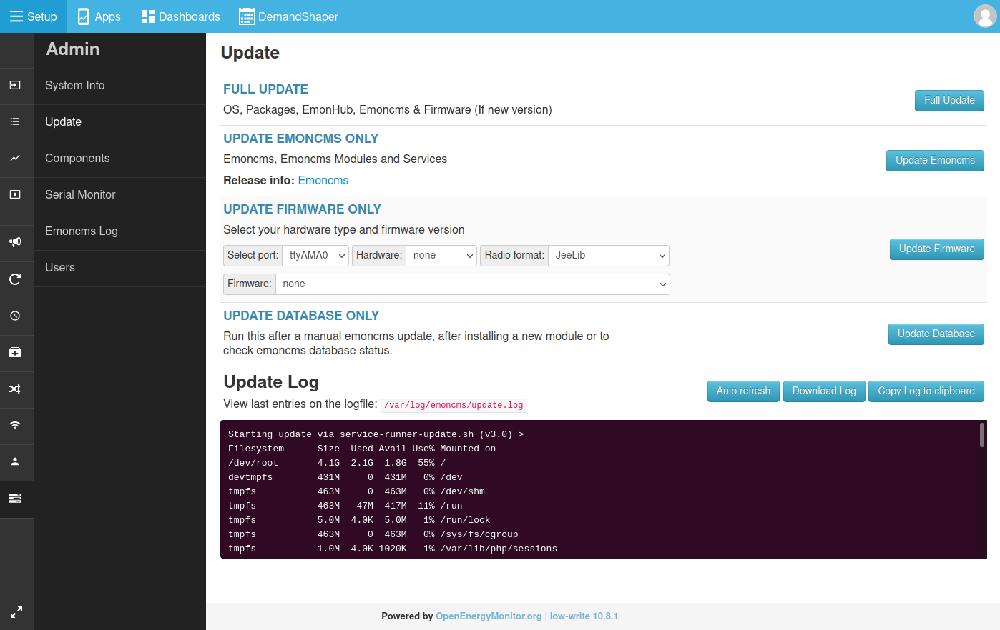

# Update & Upgrade

For most updates it's possible to use the emonCMS update mechanism available in the emonCMS Admin section. This downloads the latest version of emonCMS and all installed modules.

We also periodically release a [new emonSD image](https://github.com/openenergymonitor/emonpi/wiki/emonSD-pre-built-SD-card-Download-&-Change-Log) along with a fully updated version of the base OS and emonCMS software, new images sometimes include more substantial changes to partition and directory structure that are harder to update via the standard update method. We recommend upgrading to new images when they become available to ensure your system is fully up-to-date.

## emonPi/emonbase Update

1. Login to emonCMS and navigate to Setup > Admin > Update
2. To update all components click on 'Full Update'

**Troubleshooting**

If the update fails the first time, make a record of the update log and try again. If this does not solve the problem and you would like help to proceed further please let us know on the forums [http://community.openenergymonitor.org](http://community.openenergymonitor.org). Please provide as much information as possible including the update log and Server Information (Click on the button 'Copy as Markdown' next to Server Information on the Admin page and paste the result without further formatting in your post).

## Upgrading to a new emonSD image

The most straightforward method of upgrading to a new emonSD image is to start with a new SD card, keep your existing emonPi/emonBase SD card as a backup to which you can revert if needed and then plug the old SD card into the emonPi/emonBase using a USB SD card reader and import the data directly.

This process is documented in the import guide here: [Guide: Update SD Card](https://guide.openenergymonitor.org/setup/import/#update-sd-card-and-import-using-an-usb-sd-card-reader)

## Upgrading to a version producing a unique identifier

Emoncms produces a [unique identifier](https://en.wikipedia.org/wiki/Universally_unique_identifier) from version 11.5.7.

If you upgrade from a previous version, you have to migrate your emoncms database :

1. Login to Emoncms and navigate to Setup > Admin > Update
2. Click on `Update Database` to update the database only
3. Then click on `Apply Changes`:

