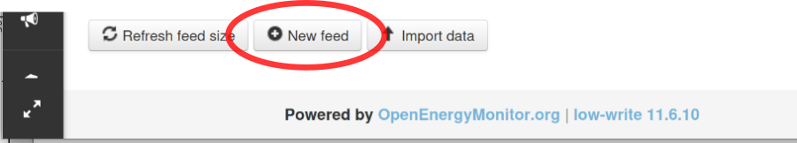
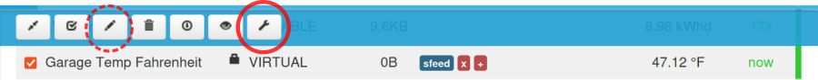
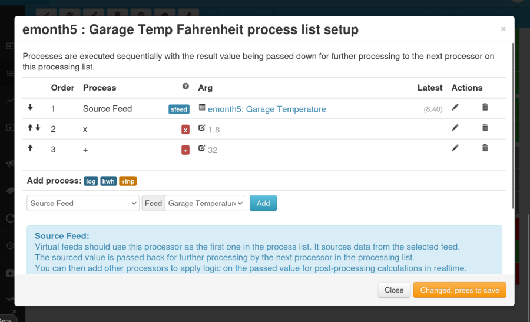
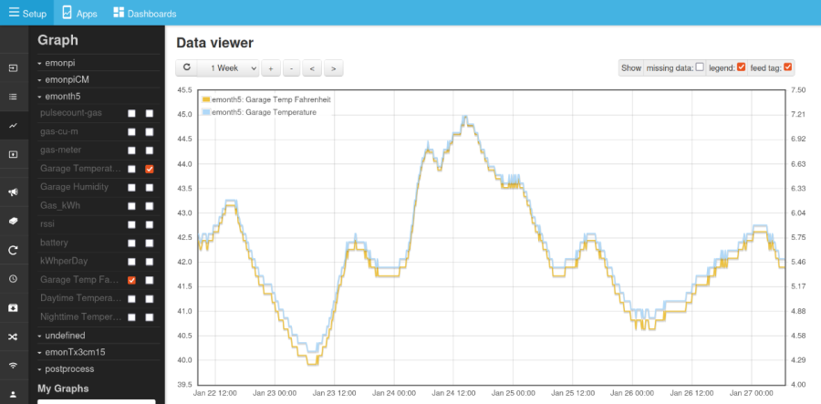
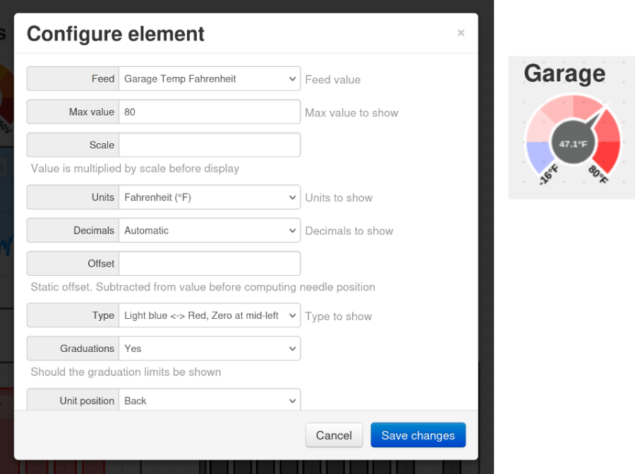
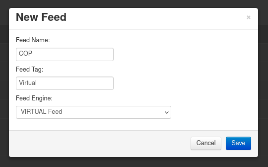
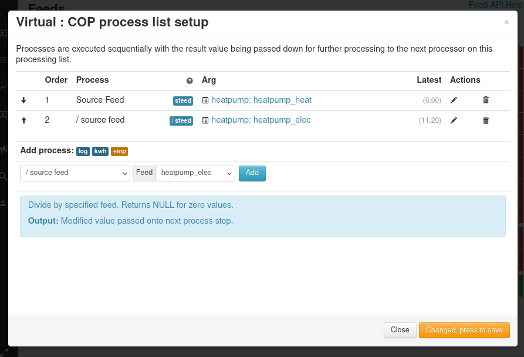
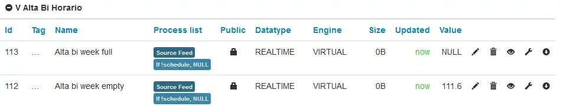
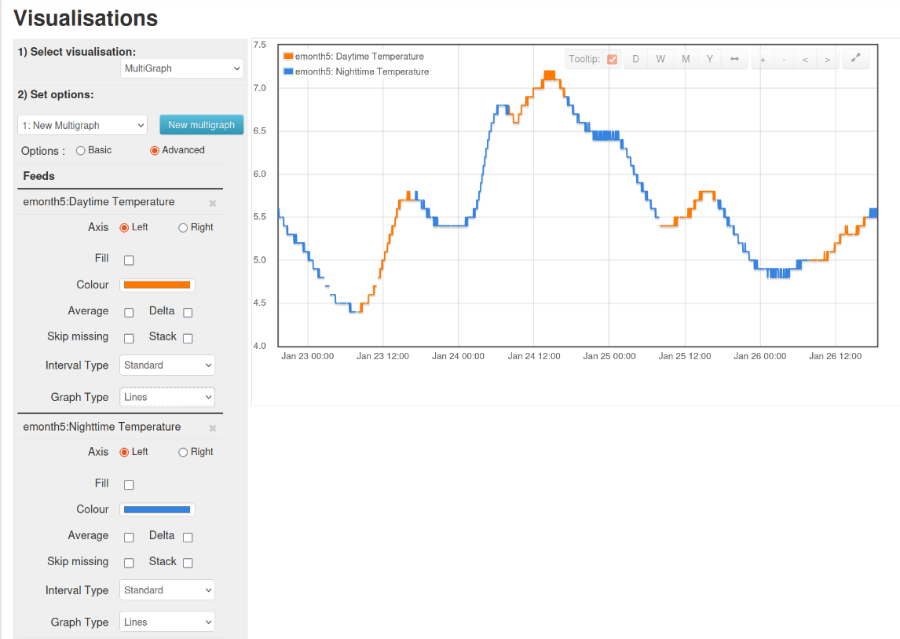

### The Virtual Feed - Post-processing data on the fly

#### *Introduction*

Although it is called a ‘Virtual’ feed, it should be thought of as an arithmetic plug-in for a feed, which enables the feed data to be processed as it is extracted from the feed. In many ways, it is more closely related to the Input process list. Unlike the Input process list, data from a Virtual Feed cannot be stored, it must be used – displayed – immediately.

#### *Features*

A Virtual Feed is used by naming it as the data source in places where you would use a Feed as the data source in a Graph, Dashboard, Visualisation or App. It fetches the data from one or more feeds, processes it and makes the transformed data available in place of the original version direct from the Feed.

The output from a Virtual Feed cannot be logged to another Feed, nor sent to MQTT – you must use the input process list for this.

A Virtual Feed uses no storage, therefore it costs nothing in terms of SD card, HDD or SSD storage capacity, and it is free of charge in emoncms.org

A Virtual Feed can be used to replace post-processing followed up by a change/addition to the input processor.

#### *Uses*

Typically, a Virtual Feed might be used for

* Scaling data, e.g. temperatures stored in °C to be displayed in °F
* Showing energy consumed on different tariffs at different times.

*Note: The averaging mentioned in early documents is now available in the source Feeds.*

#### *Creating a Virtual Feed*

This example will create a Virtual Feed to convert °C to °F.

On the Feeds page, scroll to the bottom and click “New feed”

In the box, give the new feed a suitable name and ensure the Feed engine is “VIRTUAL feed”. (Optionally, you can add a “Tag” – an extension to the feed name.) Click Save.

You will be returned to the Feeds page. Click the box in front of your new Virtual Feed and the menu at the top of the page will expand. At this point, you could if you wish click the Edit icon (a pencil) and enter the name of the node of the parent feed and add the units, saving each in turn. The new Virtual Feed will then be listed under that Node, with the units alongside.

To add the processes, choose the spanner icon.

You will be taken to the Process List Setup page, which is almost the same as the Inputs process list page.

We shall add steps to convert the numbers in the existing Feed, “emonth5: Garage Temperature” (in degrees Celsius) to degrees Fahrenheit, using the well-known formula **F = C × 1.8 + 32**. The steps to add are

1. Source Feed. Select the feed from the drop-down list, and Add. *[Note: you can’t set a feed engine or feed interval.]*
2. Calibration × . Enter the value 1.8 and Add [To divide, enter a fractional value]
3. Calibration + . Enter the value 32 and Add [To subtract, add a negative value]

*(Hint: Look in the blue box for a summary of the process’s actions.)*

It should look like this

Click “Changed, press to save” and close the box. The Virtual Feed is ready for use.

#### *Using the Virtual Feed which converts °C to °F*

Here is a graph showing, on the left-hand y-axis and in yellow, the temperature converted to degrees Fahrenheit, and on the right-hand y-axis and in blue, the temperature from the original Feed in degrees Celsius. The Virtual Feed is selected in exactly the same way as the other.

A widget on a Dashboard is configured by selecting the Virtual Feed in exactly the same way:

Each data point in degrees Fahrenheit exists only for as long as it takes to plot the point on the graph or change the dial. It is never stored on the SSD/HDD/SD card.

#### *Using a Virtual Feed on emoncms.org to show Heatpump CoP*

Here is an example of how to use a virtual feed to obtain the instantaneous CoP of a heat pump. The feeds for heat output and electricity consumption already exist and contain data.

On the emonCMS feeds page, scroll to the bottom and click on New feed. In the dialogue that opens, select the VIRTUAL Feed engine, enter a Feed Name and (optionally) a Feed Tag, e.g:

Save, and you should now see the new Virtual Feed in your feed list.

Click the box in front of your new Virtual Feed and the menu at the top of the page will expand. To add the processes, choose the spanner icon. The feed process list configuration dialogue appears:

Select the Source Feed process and select the “heatpump_heat” feed from the drop-down list, and Add.

Then select the ‘/ source feed’ process (divide by specified feed) and select the “heatpump_elec” feed and Add:

Click ‘Changed, press to save’ and then open the Virtual Feed in the graph view. If you are calculating CoP you may want to set minimum and maximum limits on the y-axis as the calculation can momentarily go off the scale when the compressor starts and stops:

The CoP calculation here is done on the fly from the underlying heat output and electricity consumption feeds. The Virtual Feed does not use any additional disk space, and because of this, Virtual feeds created on emoncms.org are free, they are not included in the pay-per-feed billing.

#### *Using a Virtual Feed to show energy used at different tariffs*

Here is an example of how to use a virtual feed and Multigraph to highlight energy used at different times of day. The feeds for measured power and the schedule already exist.

Create a virtual feed for each rate schedule, to receive data when the schedule is true, all using the same source feed data (measured power). The schedules should together exactly cover the time period (day, week etc) and not overlap:

And the resulting Multigraph shows the measured power for each schedule in a different colour :

The above example came from Chaveiro’s original post announcing Virtual Feeds, unfortunately without the Multigraph settings.

Here is another example, this time using a single schedule to indicate from 8 am until 5 pm is ‘daytime’ and everything else is ‘night time’. Take care with the negative logic. The Virtual Feeds look like this:

and the Multigraph visualisation settings and the graph they produce:

&nbsp;

*Acknowledgments.*

N Chaveiro for the original idea, the code and examples at https://openenergymonitor.github.io/forum-archive/node/10977.html

Trystan Lea for maintaining and extending the code and the Heatpump COP example at https://community.openenergymonitor.org/t/virtual-feed-support-on-emoncms-org/21712, and the many forum contributors who have used and commented on Virtual Feeds.
