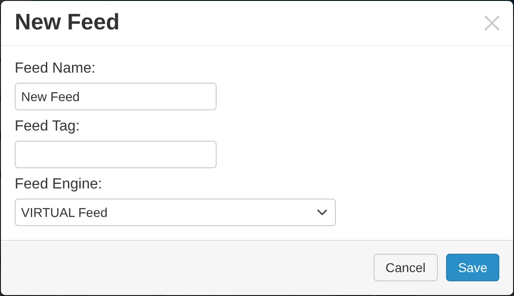
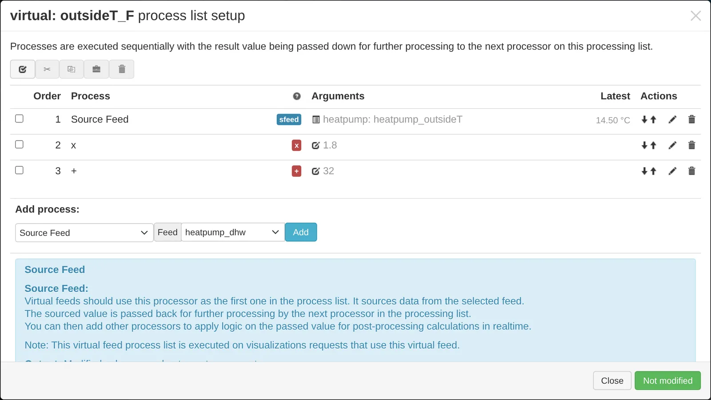
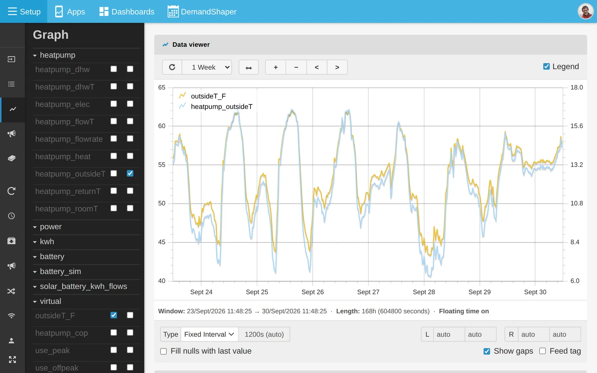
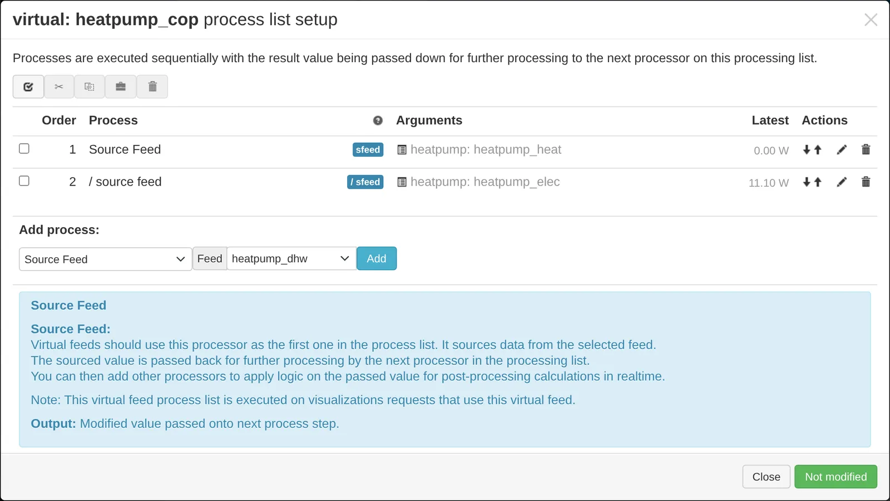
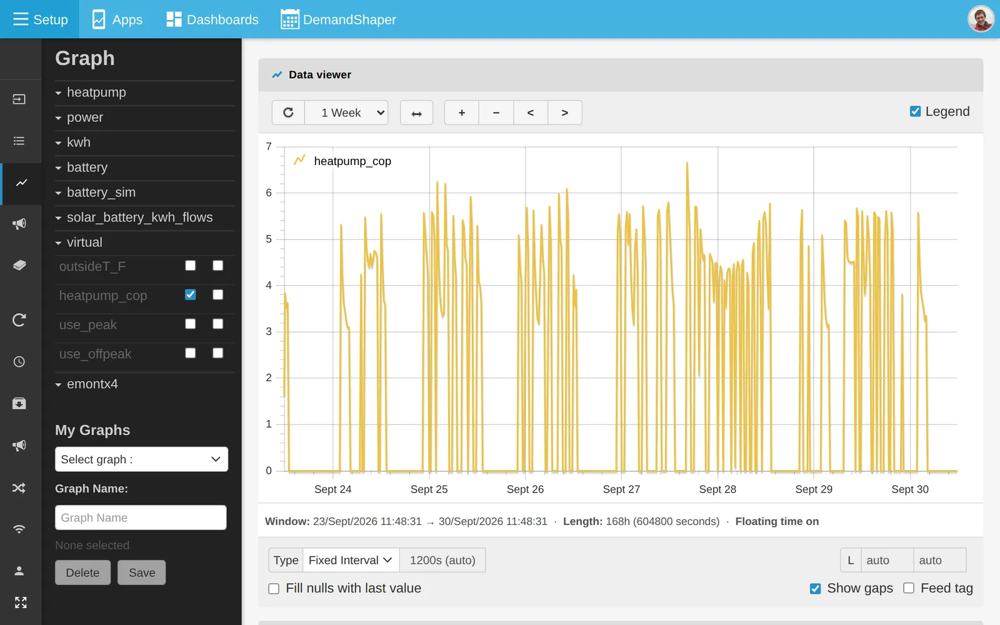
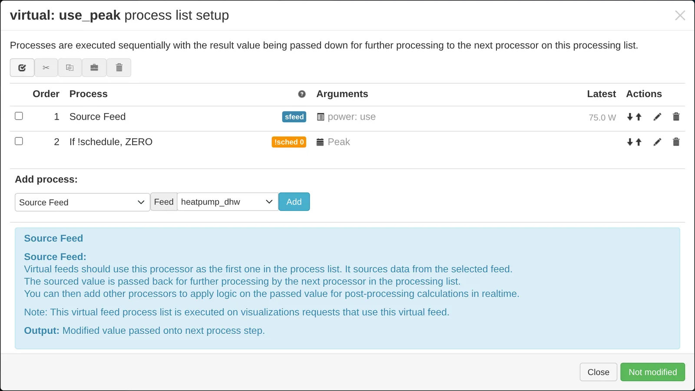
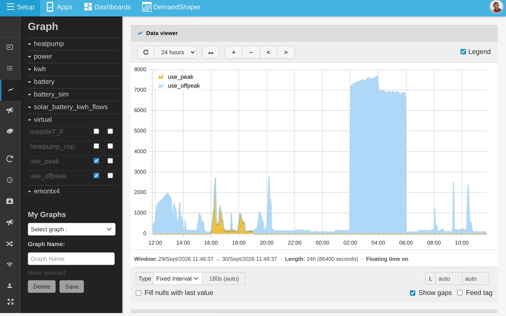

# Virtual feeds

A virtual feed calculates its values from other feeds each time it is read. It stores no data. Use it anywhere you would use a feed: graphs, dashboards and apps.

Common uses:

- Convert units, for example °C to °F.
- Calculate a ratio, such as heat pump COP.
- Split use by tariff period with a schedule.

A virtual feed uses no disk space. On emoncms.org, virtual feeds are free.

A virtual feed cannot be logged to another feed or published to MQTT. Use input processing for that.

## Create a virtual feed

1. On the **Feeds** page, click **New feed**.
2. Enter a **Feed Name** and **Feed Tag**. Leave **Feed Engine** set to **VIRTUAL Feed**. Click **Save**.

   

3. Tick the new feed and click the spanner icon (**Process config**) in the toolbar.
4. Add processes. The first must be **Source Feed**. The dialog works like the input process list. See [Inputs](inputs.md).
5. Click **Changed, press to save**.

## Example: °C to °F

F = C × 1.8 + 32. Add these processes:

1. **Source Feed**: the temperature feed in °C.
2. **x**: `1.8`.
3. **+**: `32`.



The virtual feed can be selected in the graph view and in dashboard widgets like any other feed.



## Example: heat pump COP

COP is heat output divided by electricity input. With feeds `heatpump_heat` and `heatpump_elec`:

1. Create a virtual feed, for example `heatpump_cop`.
2. Add **Source Feed**: `heatpump_heat`.
3. Add **/ source feed**: `heatpump_elec`.

   

4. Save and open the feed in the graph view. Set y-axis limits, because COP can spike when the compressor starts and stops.

   

## Example: use by tariff period

A [schedule](schedule.md) can split one power feed into one virtual feed for each tariff period.

For each period, create a virtual feed with:

1. **Source Feed**: the power feed.
2. **If !schedule, ZERO**: the schedule for that period. The value is set to zero outside the period.

The schedules must together cover the whole day with no overlap.



A single schedule also works. For example, with a `daytime` schedule of 08:00 to 17:00, use **If !schedule, ZERO** for the day feed and **If schedule, ZERO** for the night feed.

To view the result, open the virtual feeds together in the [graph view](graphs.md) and tick **Stack** in **Feed Config**.



```{note}
A virtual feed checks the schedule once for each value it returns. Use a fixed interval shorter than the schedule periods, for example 30 minutes or less. With **Daily**, **Weekly** or **Monthly**, the schedule is checked only at the start of each period, so the split is wrong. For daily peak and off-peak totals, split the energy with input processing. See [Schedules](schedule.md#use-a-schedule).
```

## Credits

Virtual feeds were created by N Chaveiro. See the [original forum post](https://openenergymonitor.github.io/forum-archive/node/10977.html) and the [emoncms.org announcement](https://community.openenergymonitor.org/t/virtual-feed-support-on-emoncms-org/21712).
