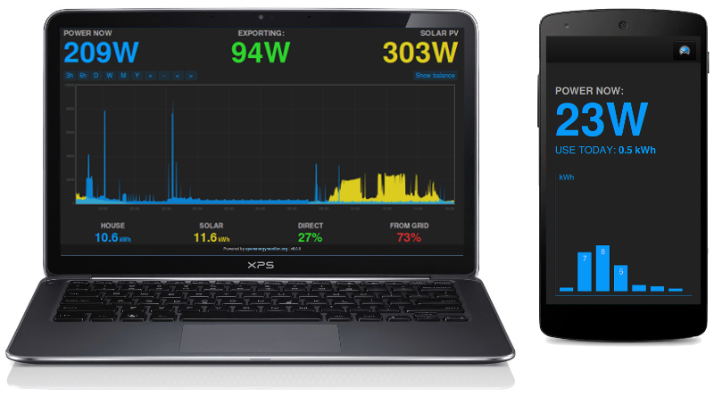

# Emoncms

Emoncms is an open-source web application for processing, logging and visualising energy, temperature and other environmental data and is part of the [OpenEnergyMonitor project](http://openenergymonitor.org).

## Requirements

- PHP (tested with 8.1.12) 
- MySQL or MariaDB (tested with 10.5.15) 
- Apache (tested with 2.4.54)
- Redis* (tested with 6.0.16)

_*Redis is recommended because it reduces the number of disk writes and therefore prolongs disk life (noticeably on SD cards e.g. Raspberry Pi). Some input-processors also require Redis and fail silently if Redis is not installed. Some environments such as shared hosting or as far as we have tried Windows servers don't support Redis hence why Emoncms has a fall back mode that allows core operation without Redis._

## Documentation

**View the Emoncms documentation at: [https://docs.openenergymonitor.org/emoncms](https://docs.openenergymonitor.org/emoncms)**

- [Getting started emonPi/Base](https://docs.openenergymonitor.org/emoncms/intro-rpi.html)
- [Getting started emoncms.org](https://docs.openenergymonitor.org/emoncms/intro-remote.html)
- [Emoncms Core Concepts](https://docs.openenergymonitor.org/emoncms/coreconcepts.html)
- [Posting data](https://docs.openenergymonitor.org/emoncms/postingdata.html)
- [MQTT](https://docs.openenergymonitor.org/emoncms/mqtt.html)
- [View Graphs](https://docs.openenergymonitor.org/emoncms/graphs.html)
- [Dashboard Builder](https://docs.openenergymonitor.org/emoncms/dashboards.html)
- [Application dashboards](https://docs.openenergymonitor.org/emoncms/dashboards.html)
- [Octopus Agile app](https://docs.openenergymonitor.org/emoncms/agileapp.html)
- [Calculating Daily kWh](https://docs.openenergymonitor.org/emoncms/daily-kwh.html)
- [Calculating Averages](https://docs.openenergymonitor.org/emoncms/daily-averages.html)
- [Pulse counting](https://docs.openenergymonitor.org/emoncms/pulse-counting.html)
- [Exporting CSV](https://docs.openenergymonitor.org/emoncms/export-csv.html)
- [Histograms](https://docs.openenergymonitor.org/emoncms/histograms.html)
- [Post Process module](https://docs.openenergymonitor.org/emoncms/postprocess.html)
- [DemandShaper module](https://docs.openenergymonitor.org/emoncms/demandshaper.html)
- [Import / Backup](https://docs.openenergymonitor.org/emoncms/import.html)
- [Update & Upgrade](https://docs.openenergymonitor.org/emoncms/update.html)
- [Remote Access](https://docs.openenergymonitor.org/emoncms/remoteaccess.html)
- [Troubleshooting](https://docs.openenergymonitor.org/emoncms/troubleshooting.html)

**Design**

- [Emoncms architecture](docs/design/architecture.md)
- [Input processing implementation](docs/design/input-processing.md)
- [Developing a new Module](docs/design/developing-a-new-module.md)
- [Global variables in Emoncms](docs/design/global-variables.md)

**Emoncms timeseries database design (feed storage)**

- [Emoncms time series database development history](docs/timeseries/History.md)
- [Fixed interval time series](docs/timeseries/Fixed-interval.md)
- [Variable interval time series](docs/timeseries/Variable-interval.md)
- [Improving write performance with buffering](docs/timeseries/Write-load-investigation.md)

**Other**

- [Backup](docs/Backup.md)
- [CLI](docs/CLI.md)
- [Encrypted Input](docs/input_encrypted.md)

**Emoncms Terminology**

- **Input:** An incoming datasource. Each input has an associated "node" identifier and a "key" sub-identifier. Inputs are entry points, only the last value and time of the input is recorded. To record historic data a feed needs to be created from an input.
- **Input: Node:** A grouping identifier for an input or feed.
- **Input: Key:** A sub-identifier for items within each Node.
- **Input process list (or input processing):** A list of processes* performed sequentially on each input value as it is received on that input.
- **Process:** A function that can be attached to the process list of an input to change the value or to save the value to a feed*.
- **Feed:** A place where data is recorded, a time-series of datapoints. The standard time-series databases used by Emoncms are PHPFina and PHPTimeSeries and were written as part of the Emoncms project.

* For a description of what each input process does in Emoncms, see the helper note within the Emoncms input processing configuration interface.

**Emoncms.org API Reference**

- [Input API reference](https://emoncms.org/site/api#input)
- [Feed API reference](https://emoncms.org/site/api#feed)

## Install

Emoncms is designed and tested to run on either Ubuntu Linux (Local, Dedicated machine or VPS) or RaspberryPi OS. It should work on other Debian Linux systems though we dont test or provide documentation for installation on these. 

We do not recommend and are unable to support installation on shared hosting or XAMPP servers, shared hosting in particular has no or limited capabilities for running some of the scripts used by emoncms. There is now a large choice of low cost miniature Linux VPS hosting solutions that provide a much better installation environment at similar cost.

Recommended: 

* [New: Debian build script](https://github.com/openenergymonitor/EmonScripts/tree/master/install/readme.md)
* [Pre built emonSD SD-card Image Download](https://docs.openenergymonitor.org/emonsd/download.html)
* [Purchase pre-loaded SD card](http://shop.openenergymonitor.com/emonsd-pre-loaded-raspberry-pi-sd-card/)

Experimental (not currently up to date):

* [Multi-platform using Docker Container](https://github.com/emoncms/emoncms-docker)

## Modules

Modules can be installed by downloading or git cloning into the emoncms/Modules folder. Be sure to check for database updates in Administration menu after installing new modules. The following core modules are included on the emonSD image:

- [Graph module](https://github.com/emoncms/graph) - Advanced graphing module that integrates with the emoncms feed list, highly recommended; examples of use can be found in emoncms guide [[1]](http://guide.openenergymonitor.org/setup/daily-kwh)[[2]](http://guide.openenergymonitor.org/setup/daily-averages/)[[3]](http://guide.openenergymonitor.org/setup/export-csv/)[[4]](http://guide.openenergymonitor.org/setup/histograms).

- [Device module](https://github.com/emoncms/device) - Automatically configure inputs and feeds using device templates.

- [Dashboards module](https://github.com/emoncms/dashboard) - Required for creating, viewing and publishing dashboards.

- [App module](https://github.com/emoncms/app.git) - Application specific dashboards e.g. MyElectric, MySolar.

- [Config]( https://github.com/emoncms/config.git) - In-browser emonhub.conf editor and emonhub.log log viewer. Use `git clone` to install.

- [Wifi module]( https://github.com/emoncms/wifi.git) - [Wifi configuration interface designed for use on the emonPi](https://guide.openenergymonitor.org/setup/connect/)

- [Raspberry Pi Backup / Restore module](https://github.com/emoncms/backup) (emonPi / emonBase)

- [Sync module](https://github.com/emoncms/sync)

- [Usefulscripts](https://github.com/emoncms/usefulscripts): Not strictly a module, more a collection of useful scripts for use with emoncms.

- [DemandShaper module]( http://github.com/emoncms/demandshaper) - Schedule smartplugs, EmonEVSE smart EV chargers, heatpumps to run at best time in terms of: carbon, cost, grid strain. Based on day ahead forecasts.

There are many other available modules such as the event module and openbem (open source building energy modelling module): check out the [Emoncms repo list](https://github.com/emoncms).

## Branches

* [master](https://github.com/emoncms/emoncms) - The latest and greatest developments. Potential bugs, use at your own risk! All pull-requests should be made to the *master* branch.

* [stable](https://github.com/emoncms/emoncms/tree/stable) - emonPi/emonBase release branch, regularly merged from master. Slightly more tried and tested. [See release change log](https://github.com/emoncms/emoncms/releases).

## Tools

* [PHPFina data file viewer](https://github.com/trystanlea/phpfinaview) - Easily explore phpfina timeseries feed engine data files directly without a full Emoncms installation. Useful for checking backups and archived data.

#### Android App

[Google Play](https://play.google.com/store/apps/details?id=org.emoncms.myapps&hl=en_GB)

[GitHub Repo](https://github.com/emoncms/AndroidApp)

[Development Forum](https://community.openenergymonitor.org/c/emoncms/mobile-app)

## More information

- Cloud hosted platform - http://emoncms.org
- [OpenEnergyMonitor Forums](https://community.openenergymonitor.org)
- [OpenEnergyMonitor Homepage](https://openenergymonitor.org)
