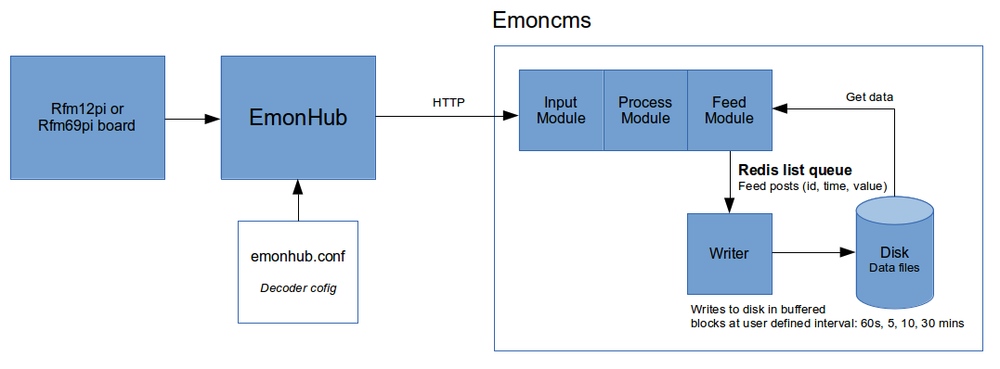

## How to setup a raspberrypi running emonhub + this 'bufferedwrite' development branch of emoncms

This guide details how to setup a raspberry pi basestation that can be used to either forward data to a remote server or record data locally or both. 

It uses the bufferedwrite branch of emoncms which is part of the investigation and development work into a version of emoncms that has a reduced disk write load with the view of enabling the use of SD cards for long term logging. Its early days yet to know whether this approach will succeed, however monitoring of disk activity shows that the write load on a busy system can be several hundred times less with this modified version of emoncms.

[Full investigation into improving write performance with write buffering](https://github.com/openenergymonitor/documentation/blob/master/BuildingBlocks/TimeSeries/writeloadinvestigation.md)

The build uses the latest version of [EmonHub](https://github.com/emonhub/) to provide a flexible input stage and ability to forward data to other remote servers. EmonHub is also used to decode the byte data recieved from the rfm12pi adapter board. The result of which is passed to the input interface in emoncms.

The writer process writes the feed data to disk step periodically. The writing step involves first reading all the items out of the redis queue placing the individual feed datapoints into individual buffers which are again in memory. Then at the end of this process each block of data accumulated for each feed is written to the disk in a single write operation (per feed)

- [Download ready-to-go image: emonSD-21-7-14.img.zip](http://files.openenergymonitor.org/emonSD-21-7-14.img.zip)
- [Full installation guide](docs/install.md)
- [Using the Ready to go image](docs/setup.md)
- [Optional: modifications to emonhub for connection to emoncms node module and emoncms packetgen module](docs/emonhubmod.md)
- [Optional: Using a harddrive instead of an SD Card](docs/hddsetup.md)

