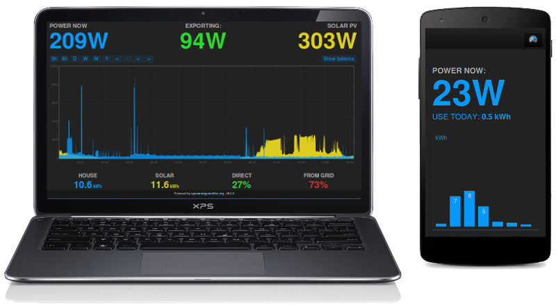

# Emoncms

Emoncms is an open-source web application for processing, logging and visualising energy, temperature and other environmental data and is part of the [OpenEnergyMonitor project](http://openenergymonitor.org).

## Requirements

- PHP (tested with 7.0.30) 
- MYSQL or MariaDB (tested with 15.1) 
- Apache (tested with 2.4.25)
- Redis* (tested with 3.2.6)

_*Redis is recommended because it reduces the number of disk writes and therefore prolongs disk life (noticeably on SD cards e.g. RaspberryPi). Some input-processors also require redis and fail silently if redis is not installed. Some environments such as shared hosting or as far as we have tried windows servers don't support redis hence why emoncms has a fall back mode that allows core operation without redis._

## Using Emoncms

### Important: Standard Emoncms and Emoncms.org

There are differences between the standard version of emoncms and the version of emoncms running on emoncms.org. This repository contains the code for the standard version of emoncms. This is the version installed on the OpenEnergyMonitor SD Card that comes with the EmonPi and EmonBase and is recommended for all self-install versions of emoncms.

The emoncms.org version [Github: emoncms/emoncmsorg](http://github.com/emoncms/emoncmsorg) is a fork that is specific for multi-server installations. While both versions share the same roots, the code for emoncms.org differs significantly from the standard version of emoncms, the user experience is intended to be similar but there are currently a number of differences in the API and look of the inputs and feeds interfaces as well as a reduced feature set in general on emoncms.org in order to ensure stability. In general development on emoncms.org moves slower than the standard emoncms for this reason.

**1. From the Guide**

- [Guide: Core Concepts](http://guide.openenergymonitor.org/emoncms/coreconcepts) - Core Emoncms concepts including inputs, input processing and feeds.
- [Guide: Creating daily kWh graphs](http://guide.openenergymonitor.org/emoncms/daily-kwh) - How to create daily kWh graphs from cumulative kWh electricity/heat energy feeds.
- [Guide: Daily Averages](http://guide.openenergymonitor.org/emoncms/daily-averages) - How to extract daily averages from temperature, humidity & power feeds.
- [Guide: Exporting CSV](http://guide.openenergymonitor.org/emoncms/export-csv) - How to use the graph module and feeds interface to export CSV data for use in 3rd party programs such as OpenOffice Calc or Excel.
- [Guide: Histograms](http://guide.openenergymonitor.org/emoncms/histograms) - How to use the histogram tool in the graph module.
- [Guide: Home Energy Monitor](https://guide.openenergymonitor.org/applications/home-energy) - Example of configuring the MyElectric dashboard.
- [Guide: Solar PV Monitor](https://guide.openenergymonitor.org/applications/solar-pv/) - Example of configuring the MySolar dashboard.

**2. Emoncms Terminology**

- **Input:** An incoming datasource. Each input has an associated "node" identifier and a "key" sub-identifier. Inputs are entry points, only the last value and time of the input is recorded. To record historic data a feed needs to be created from an input.
- **Input: Node:** A grouping identifier for an input or feed.
- **Input: Key:** A sub-identifier for items within each Node.
- **Input process list (or input processing):** A list of processes* performed sequentially on each input value as it is received on that input.
- **Process:** A function that can be attached to the process list of an input to change the value or to save the value to a feed*.
- **Feed:** A place where data is recorded, a time-series of datapoints. The standard time-series databases used by emoncms are PHPFina and PHPTimeSeries and were written as part of the emoncms project.

* For a description of what each input process does in emoncms, see the helper note within the emoncms input processing configuration interface.

**3. Emoncms.org API Reference**

The following API references apply to emoncms.org. They differ slightly to the API available on EmonPI/EmonBase installs, the API refrence for which can be found from the inputs and feed pages when logged in locally.

- [Input API reference](https://emoncms.org/site/api#input)
- [Feed API reference](https://emoncms.org/site/api#feed)

## Install

Recommended: 

* [New: Debian build script](https://github.com/openenergymonitor/EmonScripts/tree/master/install/readme.md)
* [Pre built emonSD SD-card Image Download](https://github.com/openenergymonitor/emonpi/wiki/emonSD-pre-built-SD-card-Download-&-Change-Log)
* [Purchase pre-loaded SD card](http://shop.openenergymonitor.com/emonsd-pre-loaded-raspberry-pi-sd-card/)

Experimental (not currently up to date):

* [Multi-platform using Docker Container](https://github.com/emoncms/emoncms-docker)

Other (less supported, not tested on latest versions of emoncms)

* [Shared Linux Hosting](docs/SharedLinuxHostingInstall.md)
* [Windows](docs/WindowsInstall.md) Emoncms is developed and tested on Linux only and so additional research, steps may be required that are not covered in this guide.

## Modules

Modules can be installed by downloading or git cloning into the emoncms/Modules folder. Be sure to check for database updates in Administration menu after installing new modules:

- [Graph module](https://github.com/emoncms/graph) - Advanced graphing module that integrates with the emoncms feed list, highly recommended; examples of use can be found in emoncms guide [[1]](http://guide.openenergymonitor.org/setup/daily-kwh)[[2]](http://guide.openenergymonitor.org/setup/daily-averages/)[[3]](http://guide.openenergymonitor.org/setup/export-csv/)[[4]](http://guide.openenergymonitor.org/setup/histograms).

- [Device module](https://github.com/emoncms/device) - Automatically configure inputs and feeds using device templates.

- [Dashboards module](https://github.com/emoncms/dashboard) - Required for creating, viewing and publishing dashboards.

- [App module](https://github.com/emoncms/app.git) - Application specific dashboards e.g. MyElectric, MySolar.

- [Config]( https://github.com/emoncms/config.git) - In-browser emonhub.conf editor and emonhub.log log viewer. Use `git clone` to install.

- [Wifi module]( https://github.com/emoncms/wifi.git) - [Wifi configuration interface designed for use on the emonPi](https://guide.openenergymonitor.org/setup/connect/)

- [DemandShaper module]( http://github.com/emoncms/demandshaper) - Schedule smartplugs, EmonEVSE smart EV chargers, heatpumps to run at best time in terms of: carbon, cost, grid strain. Based on day ahead forecasts.

- [RemoteAccess module](http://github.com/emoncms/remoteaccess-client) - Emoncms Remote Access client (Beta)

There are many other available modules such as the event module and openbem (open source building energy modelling module): check out the [Emoncms repo list](https://github.com/emoncms).

**3rd party modules**

- [CarbonCoop: ServiceAPI module](https://github.com/carboncoop/emonCMS_serviceapi)
- [CarbonCoop: Auth0 module](https://github.com/carboncoop/emonCMS_auth0)

## Branches

* [master](https://github.com/emoncms/emoncms) - The latest and greatest developments. Potential bugs, use at your own risk! All pull-requests should be made to the *master* branch.

* [stable](https://github.com/emoncms/emoncms/tree/stable) - emonPi/emonBase release branch, regularly merged from master. Slightly more tried and tested. [See release change log](https://github.com/emoncms/emoncms/releases).

* ARCHIVE [low-write (v8.5)](https://github.com/emoncms/emoncms/tree/low-write) - Old emonpi/emonbase emoncms version ([July 15 emonSD ready-to-go SD card image](https://github.com/openenergymonitor/emonpi/wiki/emonSD-pre-built-SD-card-Download-&-Change-Log)). Low-write mode is now available in v9.0. The low write version of emoncms is designed for running on SD cards. This is a cut down version of emoncms supporting only the phpfina and phptimeseries feed engines (no in built feed averaging or histograms) and a reduced input processor set. **Archived branch**

## Upgrade

* [Upgrading emoncms](docs/Upgrading.md)

## Data Backup

* [Backup](docs/Backup.md)
* [Raspberry Pi Backup / Restore module](https://github.com/emoncms/backup) (emonPi / emonBase)

## Development

* [Emoncms Community Forum](https://community.openenergymonitor.org/c/emoncms)

### Documentation development

For developers: The following lists the locations of the files that define emoncms's inbuilt documentation for the input and feed API's and input process descriptions:

* The input API helper page [emoncms/Modules/input/Views/input_api.php](https://github.com/emoncms/emoncms/blob/master/Modules/input/Views/input_api.php)
* The feed API helper page [emoncms/Modules/feed/Views/feedapi_view.php](https://github.com/emoncms/emoncms/blob/master/Modules/feed/Views/feedapi_view.php)
* Input process descriptions are defined in the process list definition object at the top of the process list definition file here: [emoncms/Modules/process/process_processlist.php](https://github.com/emoncms/emoncms/blob/master/Modules/process/process_processlist.php)

## Tools

* [PHPFina data file viewer](https://github.com/trystanlea/phpfinaview) - Easily explore phpfina timeseries feed engine data files directly without a full emoncms installation. Useful for checking backups and archived data.

#### Design

*Note: due to ongoing development some docs may now be outdated*

- [Emoncms architecture](https://learn.openenergymonitor.org/electricity-monitoring/emoncms-internals/architecture)
- [Input processing implementation](https://learn.openenergymonitor.org/electricity-monitoring/emoncms-internals/input-processing)
- [Developing a new Module](https://learn.openenergymonitor.org/electricity-monitoring/emoncms-internals/developing-a-new-module)
- [Global variables in Emoncms](https://learn.openenergymonitor.org/electricity-monitoring/emoncms-internals/global-variables)

**Emoncms timeseries database design (feed storage)**

- [Emoncms time series database development history](https://learn.openenergymonitor.org/electricity-monitoring/timeseries/History)
- [Variable interval time series](https://learn.openenergymonitor.org/electricity-monitoring/timeseries/Variable-interval)
- [Fixed interval time series](https://learn.openenergymonitor.org/electricity-monitoring/timeseries/Fixed-interval)
- [Fixed interval with averaging time series](https://learn.openenergymonitor.org/electricity-monitoring/timeseries/Fixed-interval-averaging)
- [Improving write performance with buffering](https://learn.openenergymonitor.org/electricity-monitoring/timeseries/Write-load-investigation)

#### Android App

[Google Play](https://play.google.com/store/apps/details?id=org.emoncms.myapps&hl=en_GB)

[GitHub Repo](https://github.com/emoncms/AndroidApp)

[Development Forum](https://community.openenergymonitor.org/c/emoncms/mobile-app)

## More information

- Cloud hosted platform - http://emoncms.org
- [OpenEnergyMonitor Forums](https://community.openenergymonitor.org)
- [OpenEnergyMonitor Homepage](https://openenergymonitor.org)
