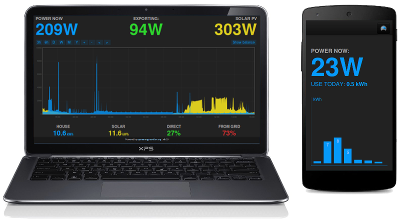

# Emoncms

Emoncms is an open-source web application for processing, logging and visualising energy, temperature and other environmental data and is part of the [OpenEnergyMonitor project](http://openenergymonitor.org).



---

### Contributing

***Please read the [project state of development and contributing page](CONTRIBUTING.md) before investing significant development time**. If after reading this you see an oppertunity to make a change, please discuss this with us first in the issue list, via email (hello@openenergymonitor.zendesk.com) or via a call (drop us an email to arrange) before submitting a pull request. The process of development on github can often feel quite impersonal and honestly we are also more than happy to have a call to get to know each other and help refine ideas from the outset - Trystan & Glyn, OpenEnergyMonitor.*

## Requirements

- PHP (tested with 8.1.12) 
- MySQL or MariaDB (tested with 10.5.15) 
- Apache (tested with 2.4.54)
- Redis* (tested with 6.0.16)

_*Redis is recommended because it reduces the number of disk writes and therefore prolongs disk life (noticeably on SD cards e.g. Raspberry Pi). Some input-processors also require Redis and fail silently if Redis is not installed. Some environments such as shared hosting or as far as we have tried Windows servers don't support Redis hence why Emoncms has a fall back mode that allows core operation without Redis._

## Documentation

- User guide: [docs.openenergymonitor.org/emoncms](https://docs.openenergymonitor.org/emoncms)
- Developer documentation: [docs/README.md](docs/README.md)

For terms such as input, node, feed and process, see the [glossary](https://docs.openenergymonitor.org/emoncms/glossary.html).

**Emoncms.org API Reference**

- [Input API reference](https://emoncms.org/site/api#input)
- [Feed API reference](https://emoncms.org/site/api#feed)

## Install

Emoncms is designed and tested to run on either Ubuntu Linux (Local, Dedicated machine or VPS) or RaspberryPi OS. It should work on other Debian Linux systems though we dont test or provide documentation for installation on these. 

We do not recommend and are unable to support installation on shared hosting or XAMPP servers, shared hosting in particular has no or limited capabilities for running some of the scripts used by emoncms. There is now a large choice of low cost miniature Linux VPS hosting solutions that provide a much better installation environment at similar cost.

Recommended: 

* [Install with emonScripts](https://docs.openenergymonitor.org/emonsd/install.html)
* [Pre built emonSD SD-card Image Download](https://docs.openenergymonitor.org/emonsd/download.html)
* [Purchase pre-loaded SD card](http://shop.openenergymonitor.com/emonsd-pre-loaded-raspberry-pi-sd-card/)

## docker standalone container

An easy way to start with emoncms is to use the [all-in-one docker container](https://hub.docker.com/r/alexjunk/emoncms) 

A pipeline using github actions is producing builds with latest emoncms stable version for different architectures : amd64, arm64, arm/v7 

These docker images, based on the [alpine linux](https://www.alpinelinux.org) distribution, are designed for iot. Images are tagged using alpine and emoncms versions, for example alpine3.19_emoncms11.4.11. 

The images have onboard :
- the mariadb and redis databases,
- the mosquitto mqtt broker,
- the main modules : graph, sync, backup, dashboard and app,
- the workers : emoncms_mqtt, service-runner and feedwriter. 

You can easily : 
* deactivate the low-write
* use an external broker. 

To pull the latest image for testing : 

```
sudo docker pull alexjunk/emoncms
```
More on https://emoncms-docker.github.io


### Experimental

not currently up to date

[Multi-platform using Docker Container](https://github.com/emoncms/emoncms-docker)

## Modules

Install a module by cloning it into the `Modules` folder, or into `/opt/emoncms/modules` with a symlink for modules that have background scripts. Run **Update Database** on the **Admin** page after installing a module.

Modules installed on the emonSD image:

- [Graph](https://github.com/emoncms/graph): feed viewer.
- [Device](https://github.com/emoncms/device): set up inputs and feeds from device templates.
- [Dashboard](https://github.com/emoncms/dashboard): dashboard builder.
- [App](https://github.com/emoncms/app): ready-made dashboards such as My Electric Flow and My Heatpump.
- [Config](https://github.com/emoncms/config): emonHub configuration editor and log viewer.
- [Network](https://github.com/emoncms/network): WiFi and network settings.
- [Backup](https://github.com/emoncms/backup): backup, restore and SD card import.
- [Sync](https://github.com/emoncms/sync): upload or download feeds between servers.
- [Post Process](https://github.com/emoncms/postprocess): process recorded feed data.
- [Usefulscripts](https://github.com/emoncms/usefulscripts): maintenance scripts.

Other modules include [Email reports](https://github.com/emoncms/emailreport) and the [DemandShaper](https://github.com/emoncms/demandshaper). See the [Emoncms repositories](https://github.com/emoncms).

## Branches

* [master](https://github.com/emoncms/emoncms) - The latest and greatest developments. Potential bugs, use at your own risk! All pull-requests should be made to the *master* branch.

* [stable](https://github.com/emoncms/emoncms/tree/stable) - emonPi/emonBase release branch, regularly merged from master. Slightly more tried and tested. [See release change log](https://github.com/emoncms/emoncms/releases).

## Tools

* [PHPFina data file viewer](https://github.com/trystanlea/phpfinaview) - Easily explore phpfina timeseries feed engine data files directly without a full Emoncms installation. Useful for checking backups and archived data.

#### Android App

[Google Play](https://play.google.com/store/apps/details?id=org.emoncms.myapps&hl=en_GB)

[GitHub Repo](https://github.com/emoncms/AndroidApp)

[Development Forum](https://community.openenergymonitor.org/c/emoncms/mobile-app)

## More information

- Cloud hosted platform - http://emoncms.org
- [OpenEnergyMonitor Forums](https://community.openenergymonitor.org)
- [OpenEnergyMonitor Homepage](https://openenergymonitor.org)
