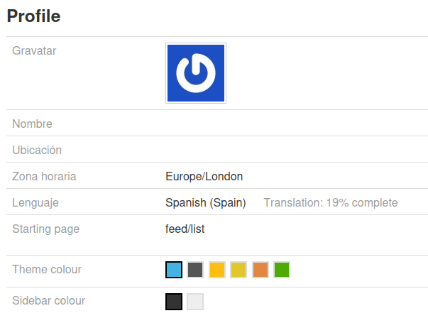

# Translation Scripts

This directory contains utilities for managing internationalization (i18n) translations in the application. The scripts support a JSON-based translation system with tools for maintaining translation keys and migrating from legacy gettext PO files.

## Helping with translation

We very much welcome help with translation. Here's the translation work flow that we have found works quite well.

**Tip:** Select the language and translation that you would like to contribute to on the Emoncms, My Account page. Notice that it indicates the % completion of the translation for the selected language. In general a full translation reaches about 94%.



1\. Run the `extract_translation_keys.php` to extract any new translation keys for your chosen language:

    php scripts/translation/extract_translation_keys.php es_ES

2\. Run the translation status script via command line to see translation status in a bit more detail e.g:

```
php scripts/translation/status.php es_ES --detailed
Translation progress:
- es_ES     19% ( 281/1464) Removed: 148
    - schedule              84% (  43/51  ) Removed:   0
    - user                  50% (  38/76  ) Removed:  10
    - input                 36% (  38/107 ) Removed:  18
    - vis                   33% (  66/198 ) Removed:  25
    - dashboard             23% (  61/271 ) Removed:  50
    - feed                  19% (  25/135 ) Removed:  30
    - admin                  7% (  10/139 ) Removed:  15
    - backup                 0% (   0/39  ) Removed:   0
    - device                 0% (   0/84  ) Removed:   0
    - eventp                 0% (   0/12  ) Removed:   0
    - graph                  0% (   0/109 ) Removed:   0
    - postprocess            0% (   0/0   ) Removed:   0
    - process                0% (   0/199 ) Removed:   0
    - sync                   0% (   0/0   ) Removed:   0
    - theme                  0% (   0/4   ) Removed:   0
    - lib                    0% (   0/40  ) Removed:   0

```

3\. Each of the above module has it's own language file e.g:

    Modules/user/locale/es_ES.json

Open this file in your favorite editor and apply translations, e.g:

```
{
    "Email": "Correo",
    "Username": "Nombre de usuario",
    "Password": "Contraseña",
    "Confirm password": "Confirmar contraseña",
    "Remember me": "Recordarme",
```

**Tip:** You can drop this translation file into an LLM service such as ChatGPT or Claude and ask the LLM to translate the strings for you. In certain cases you many need to give context as to the meaning of words e.g 'Feed' does not mean food. It is a time series feed engine which often translates better as 'Stream'. It can be effective to include other existing translation files to provide translation context to the LLM. This process of using an LLM to translate is also straight forward within many IDE's such as VS Code.

**Removed translations:** When changes are made to the English source text this will often break existing translations as they source text which is used as a key no longer matches the corresponding key in the translation file. These keys and translations that no longer have a corresponding source text are saved to a separate file for reference e.g:

    Modules/user/locale/es_ES_removed.json

Use these removed translation's as a reference for either manual translation or attach as added context when using LLM's.

4\. After completing translation work, run `php scripts/translation/status.php --detailed` again, this will update the translation progress status shown on the user account page.

5\. Commit your translation changes via a GitHub pull request for review and inclusion and thanks for your help!


## How Translation Works

The application uses a JSON-based internationalization system with two main translation functions:

### Translation Functions

**`tr("text")`** - Default context, e.g feeds module related text while in the feed module context.
```php
echo tr("Hello World");
echo tr("Welcome to our application");
```

**`ctx_tr("context", "text")`** - Contextual translation function, e.g process descriptions are loaded from the process module to "process_messages" and are used on the inputs and feeds pages.
```php
echo ctx_tr("user_messages", "Welcome");
echo ctx_tr("error_messages", "User not found");
```

### Translation Lookup

When these functions are called, the system:
1. Determines the current language (e.g., `fr_FR`, `de_DE`)
2. Loads the appropriate JSON file from the module's locale directory
3. Returns the translated text if found, or the original text as fallback

For example, `tr("Hello World")` with French locale would:
1. Look for the key "Hello World" in `Modules/example/locale/fr_FR.json`
2. Return "Bonjour le monde" if the translation exists
3. Return "Hello World" if no translation is found

## File Structure

The translation system organizes files in a modular structure:

```
Modules/
├── user/
│   ├── locale/
│   │   ├── fr_FR.json          # French translations
│   │   ├── de_DE.json          # German translations
│   │   └── es_ES.json          # Spanish translations
│   ├── login_block.php         # PHP template with tr() calls
│   └── ...
Theme/
├── locale/
│   ├── fr_FR.json              # Theme-specific translations
│   └── de_DE.json
Lib/
├── locale/
│   ├── fr_FR.json              # Library translations
│   └── de_DE.json
```

## JSON Translation Format

Translation files use a simple key-value structure:

```json
{
    "Hello World": "Bonjour le monde",
    "Welcome to our site": "Bienvenue sur notre site",
    "User not found": "Utilisateur introuvable",
    "Save": "Sauvegarder"
}
```

For untranslated keys, the value defaults to the key itself:

```json
{
    "Hello World": "Bonjour le monde",
    "New feature": "New feature",
    "Save": "Sauvegarder"
}
```

## Script 1: extract_translation_keys.php - Translation Key Generator

**Purpose**: The primary tool for ongoing translation maintenance. Scans PHP source code to extract translation function calls and generates/updates JSON language files.

**Usage**:
```bash
# Generate translations for a specific language
php extract_translation_keys.php fr_FR

# Generate translations for German
php extract_translation_keys.php de_DE

# Default to en_GB if no language specified (will skip generation)
php extract_translation_keys.php
```

**What it does**:
- Scans all PHP files in the `Modules/` directory
- Extracts translation keys from:
  - `tr("text")` - Default context translation function calls
  - `ctx_tr("context", "text")` - Contextual translation function calls
- Generates JSON files for each module: `Modules/{ModuleName}/locale/{lang}.json`
- Preserves existing translations while adding new keys
- Orders keys logically (existing translations first, then new keys)

**Key Features**:
- **Preserves existing translations**: Won't overwrite your translated text
- **Adds new keys automatically**: Discovers new translation calls in code
- **Maintains key order**: Keeps existing translations in their original order
- **Context handling**: Groups contextual translations appropriately
- **Duplicate detection**: Automatically removes duplicate keys

**Example output**:
```
Processing module: UserManagement
Found 25 translation keys in UserManagement
Generating language file: Modules/UserManagement/locale/fr_FR.json

Processing module: ProductCatalog
Found 18 translation keys in ProductCatalog
Generating language file: Modules/ProductCatalog/locale/fr_FR.json
```

**When to use**:
- After adding new translatable text to your PHP code
- To initialize translation files for new languages
- Regular maintenance to keep translation files up-to-date
- As part of your development workflow

## Translation Workflow

### Ongoing Development
1. Add translation calls in your PHP code using `tr()` or `ctx_tr()`
2. Run `extract_translation_keys.php` for each target language
3. Translate the new keys in the generated JSON files
4. Commit the updated translation files

### Example Development Cycle
```bash
# 1. Add translatable text to your PHP code
echo 'echo tr("New feature message");' >> Modules/MyModule/controllers/MyController.php

# 2. Extract keys for all supported languages
php extract_translation_keys.php fr_FR
php extract_translation_keys.php de_DE
php extract_translation_keys.php es_ES

# 3. Edit the JSON files to add translations
# Edit: Modules/MyModule/locale/fr_FR.json
# Edit: Modules/MyModule/locale/de_DE.json
# etc.

# 4. Test your translations in the application
```

### Context Guidelines

For contextual translations, use the naming convention `{module_name}_messages`:

```php
// In process module
ctx_tr("process_messages", "Log to feed");
ctx_tr("process_messages", "Power to kWh");
```

## Script 2: po2json.php - PO to JSON Converter (Migration Tool)

**Purpose**: Converts existing GNU gettext PO files to JSON format. This is a migration tool maintained during the transition from gettext to JSON-based translations.

**Usage**:
```bash
php po2json.php
```

**What it does**:
- Automatically scans for PO files in:
  - `Modules/*/locale/*/LC_MESSAGES/*.po`
  - `Theme/locale/*/LC_MESSAGES/*.po`
  - `Lib/locale/*/LC_MESSAGES/*.po`
- Converts each PO file to a corresponding JSON file
- Handles multi-line translations and escape sequences
- Detects and reports duplicate translation keys
- Outputs JSON files in the same locale directory (e.g., `locale/fr_FR.json`)

**Example output**:
```
 - Modules/UserManagement/locale/fr_FR/LC_MESSAGES/messages.po -> Modules/UserManagement/locale/fr_FR.json
 - Theme/locale/en_US/LC_MESSAGES/theme.po -> Theme/locale/en_US.json
```

**When to use**: 
- During initial migration from PO to JSON format
- When importing translations from external gettext tools
- Maintained for compatibility during transition period

### Initial Migration (One-time)
1. Run `po2json.php` to convert existing PO files to JSON format
2. Verify the converted JSON files are correct
3. Update your application to use JSON translations instead of gettext

## Notes

- **English (en_GB)**: Considered the source language; no JSON file is generated by extract_translation_keys.php
- **Context naming**: Use `{module_name}_messages` for contextual translations
- **Encoding**: All JSON files use UTF-8 with unescaped Unicode characters
- **Formatting**: Pretty-printed JSON for easy manual editing
- **Backward compatibility**: `po2json.php` is maintained during migration period

## Troubleshooting

**Missing translations**: Run `extract_translation_keys.php` to ensure all translation calls are captured in your JSON files.

**"Duplicate msgid found" error**: Your PO file contains duplicate translation keys. Fix the PO file before conversion.

**"Could not parse" message**: File path doesn't match expected directory structure. Ensure files are in the correct `locale/*/LC_MESSAGES/` structure.

**Context warnings**: If you see warnings about unexpected contexts, ensure your `ctx_tr()` calls use the `{module_name}_messages` naming convention.
